# fermi-liquid-effective-mass-gaia

Gaia knowledge package for a connected YbRh2Si2 effective-mass graph generated from LKM evidence chains.

> [!NOTE]
> This May 4 regeneration starts from exactly one chain-backed LKM root, `gcn_2741cdef209a457a`, and grows only through connected YbRh2Si2 extensions. Raw LKM JSON is the only science evidence. The overview Mermaid graph below is the generated Gaia summary, not necessarily the full topology; use [`docs/starmap.html`](docs/starmap.html) for the interactive graph artifact.

<!-- badges:start -->
<!-- badges:end -->

## Overview

> [!TIP]
> **Reasoning graph information gain: `2.2 bits`**
>
> Total mutual information between leaf premises and exported conclusions — measures how much the reasoning structure reduces uncertainty about the results.

```mermaid
---
config:
  flowchart:
    rankSpacing: 80
    nodeSpacing: 30
---
graph TB
    gcn_677c6c_landau_integral_relation["gcn_677c6c_landau_integral_relation\n(0.82 → 0.85)"]:::premise
    gcn_03614e9b_homogeneous_isotropic_model["gcn_03614e9b_homogeneous_isotropic_model\n(0.68 → 0.74)"]:::premise
    gcn_e0c364ff_inflection_fcqpt_condition["gcn_e0c364ff_inflection_fcqpt_condition\n(0.78 → 0.95)"]:::premise
    gcn_6bbfeb95_stable_landau_solutions["gcn_6bbfeb95_stable_landau_solutions\n(0.70 → 0.75)"]:::premise
    gcn_ecddfefa_fermion_entropy_formula["gcn_ecddfefa_fermion_entropy_formula\n(0.90 → 0.92)"]:::premise
    gcn_2741cdef_practical_effective_mass_scheme["★ gcn_2741cdef_practical_effective_mass_scheme\n(0.50 → 0.91)"]:::exported
    gcn_f82c178_fcqpt_inflection_cubic_spectrum["gcn_f82c178_fcqpt_inflection_cubic_spectrum\n(0.80 → 0.95)"]:::premise
    gcn_58746c_fcqpt_homogeneous_mass_equation["gcn_58746c_fcqpt_homogeneous_mass_equation\n(0.78 → 0.80)"]:::premise
    gcn_45f24d_fcqpt_t_minus_two_thirds["★ gcn_45f24d_fcqpt_t_minus_two_thirds\n(0.50 → 0.87)"]:::exported
    gcn_c243dcb_rbc_phase_shift_parametrization["gcn_c243dcb_rbc_phase_shift_parametrization\n(0.82 → 0.86)"]:::premise
    gcn_48bba377_specific_heat_calibration["gcn_48bba377_specific_heat_calibration\n(0.76 → 0.87)"]:::premise
    gcn_42a4ff_rbc_hall_dos_values["★ gcn_42a4ff_rbc_hall_dos_values\n(0.50 → 0.92)"]:::exported
    gcn_5501e18a_high_field_dhva_scope["gcn_5501e18a_high_field_dhva_scope\n(0.84 → 0.88)"]:::premise
    gcn_f20b1f42_itinerant_4f_lda_sensitivity["gcn_f20b1f42_itinerant_4f_lda_sensitivity\n(0.78 → 0.83)"]:::premise
    gcn_c38f8ce_ybrh2si2_dhva_spectrum_lda_mismatch["★ gcn_c38f8ce_ybrh2si2_dhva_spectrum_lda_mismatch\n(0.50 → 0.93)"]:::exported
    gcn_c131e014_ybrh2si2_midband_harmonic_assignment["gcn_c131e014_ybrh2si2_midband_harmonic_assignment\n(0.78 → 0.84)"]:::premise
    gcn_3dc248d_ybrh2si2_14kt_not_small_fs["gcn_3dc248d_ybrh2si2_14kt_not_small_fs\n(0.74 → 0.81)"]:::premise
    gcn_3a8394c_lurh2si2_small_fs_reference["gcn_3a8394c_lurh2si2_small_fs_reference\n(0.84 → 0.92)"]:::premise
    gcn_2b8dd97_lurh2si2_reference_reanalysis["★ gcn_2b8dd97_lurh2si2_reference_reanalysis\n(0.50 → 0.95)"]:::exported
    gcn_021fb1_high_field_a_gamma_scaling_assumption["gcn_021fb1_high_field_a_gamma_scaling_assumption\n(0.62 → 0.67)"]:::premise
    gcn_24ebf8_ybrh2si2_t2_resistivity_fit_reliability["gcn_24ebf8_ybrh2si2_t2_resistivity_fit_reliability\n(0.76 → 0.79)"]:::premise
    gcn_b4093_ybrh2si2_resistivity_mass_drop["★ gcn_b4093_ybrh2si2_resistivity_mass_drop\n(0.50 → 0.84)"]:::exported
    gcn_fb2747_ybrh2si2_tp_tcoh_ratio["gcn_fb2747_ybrh2si2_tp_tcoh_ratio\n(0.78 → 0.86)"]:::premise
    gcn_3a1514_ybrh2si2_kondo_lattice_hierarchy["★ gcn_3a1514_ybrh2si2_kondo_lattice_hierarchy\n(0.50 → 0.98)"]:::exported
    gcn_a76225_ybrh2si2_esr_collective_mode_assumption["gcn_a76225_ybrh2si2_esr_collective_mode_assumption\n(0.68 → 0.75)"]:::premise
    gcn_d8b1_ybrh2si2_esr_heavy_quasiparticles["★ gcn_d8b1_ybrh2si2_esr_heavy_quasiparticles\n(0.50 → 0.93)"]:::exported
    gcn_dbe6ec_ybrh2si2_cef_anisotropic_hybridization["gcn_dbe6ec_ybrh2si2_cef_anisotropic_hybridization\n(0.78 → 0.85)"]:::premise
    gcn_8f49e0_periodic_kondo_lattice_lifshitz_dos["gcn_8f49e0_periodic_kondo_lattice_lifshitz_dos\n(0.76 → 0.83)"]:::premise
    gcn_4d206_ybrh2si2_kondo_lifshitz_interplay["★ gcn_4d206_ybrh2si2_kondo_lifshitz_interplay\n(0.50 → 0.99)"]:::exported
    gcn_6ca2b_ybrh2si2_hall_compensation_scenario["gcn_6ca2b_ybrh2si2_hall_compensation_scenario\n(0.62 → 0.66)"]:::premise
    gcn_3ba45e_ybrh2si2_thermopower_corrob_lifshitz["gcn_3ba45e_ybrh2si2_thermopower_corrob_lifshitz\n(0.78 → 0.81)"]:::premise
    gcn_b5d9_ybrh2si2_lifshitz_derenormalization["★ gcn_b5d9_ybrh2si2_lifshitz_derenormalization\n(0.50 → 0.83)"]:::exported
    gcn_848945_ybrh2si2_lusmall_fs_lda_assumption["gcn_848945_ybrh2si2_lusmall_fs_lda_assumption\n(0.74 → 0.76)"]:::premise
    gcn_5090f8_dhva_orbit_assignment_reliability["gcn_5090f8_dhva_orbit_assignment_reliability\n(0.70 → 0.73)"]:::premise
    gcn_d10f91_ybrh2si2_small_fs_mass_enhancement["★ gcn_d10f91_ybrh2si2_small_fs_mass_enhancement\n(0.50 → 0.82)"]:::exported
    gcn_b01616_ybrh2si2_lda_inadequate_dynamic_correlations["gcn_b01616_ybrh2si2_lda_inadequate_dynamic_correlations\n(0.82 → 0.90)"]:::premise
    gcn_34ce9_ybrh2si2_many_body_methods_required["★ gcn_34ce9_ybrh2si2_many_body_methods_required\n(0.50 → 1.00)"]:::exported
    eq_fcqpt_inflection_condition["eq_fcqpt_inflection_condition\n(0.93 → 1.00)"]:::premise
    strat_0(["infer\n0.16 bits"]):::weak
    gcn_021fb1_high_field_a_gamma_scaling_assumption --> strat_0
    gcn_24ebf8_ybrh2si2_t2_resistivity_fit_reliability --> strat_0
    strat_0 --> gcn_b4093_ybrh2si2_resistivity_mass_drop
    strat_1(["infer\n0.31 bits"]):::weak
    gcn_03614e9b_homogeneous_isotropic_model --> strat_1
    gcn_42a4ff_rbc_hall_dos_values --> strat_1
    gcn_45f24d_fcqpt_t_minus_two_thirds --> strat_1
    gcn_48bba377_specific_heat_calibration --> strat_1
    gcn_677c6c_landau_integral_relation --> strat_1
    gcn_6bbfeb95_stable_landau_solutions --> strat_1
    gcn_b4093_ybrh2si2_resistivity_mass_drop --> strat_1
    gcn_d8b1_ybrh2si2_esr_heavy_quasiparticles --> strat_1
    gcn_e0c364ff_inflection_fcqpt_condition --> strat_1
    gcn_ecddfefa_fermion_entropy_formula --> strat_1
    strat_1 --> gcn_2741cdef_practical_effective_mass_scheme
    strat_2(["infer\n0.14 bits"]):::weak
    gcn_2b8dd97_lurh2si2_reference_reanalysis --> strat_2
    gcn_42a4ff_rbc_hall_dos_values --> strat_2
    gcn_b01616_ybrh2si2_lda_inadequate_dynamic_correlations --> strat_2
    gcn_c38f8ce_ybrh2si2_dhva_spectrum_lda_mismatch --> strat_2
    strat_2 --> gcn_34ce9_ybrh2si2_many_body_methods_required
    strat_3(["infer\n0.20 bits"]):::weak
    gcn_3a1514_ybrh2si2_kondo_lattice_hierarchy --> strat_3
    gcn_8f49e0_periodic_kondo_lattice_lifshitz_dos --> strat_3
    gcn_b4093_ybrh2si2_resistivity_mass_drop --> strat_3
    gcn_b5d9_ybrh2si2_lifshitz_derenormalization --> strat_3
    gcn_dbe6ec_ybrh2si2_cef_anisotropic_hybridization --> strat_3
    strat_3 --> gcn_4d206_ybrh2si2_kondo_lifshitz_interplay
    strat_4(["infer\n0.19 bits"]):::weak
    gcn_3a8394c_lurh2si2_small_fs_reference --> strat_4
    gcn_3dc248d_ybrh2si2_14kt_not_small_fs --> strat_4
    gcn_c131e014_ybrh2si2_midband_harmonic_assignment --> strat_4
    gcn_d10f91_ybrh2si2_small_fs_mass_enhancement --> strat_4
    strat_4 --> gcn_2b8dd97_lurh2si2_reference_reanalysis
    strat_5(["infer\n0.18 bits"]):::weak
    gcn_3ba45e_ybrh2si2_thermopower_corrob_lifshitz --> strat_5
    gcn_6ca2b_ybrh2si2_hall_compensation_scenario --> strat_5
    strat_5 --> gcn_b5d9_ybrh2si2_lifshitz_derenormalization
    strat_6(["infer\n0.17 bits"]):::weak
    gcn_48bba377_specific_heat_calibration --> strat_6
    gcn_c243dcb_rbc_phase_shift_parametrization --> strat_6
    strat_6 --> gcn_42a4ff_rbc_hall_dos_values
    strat_7(["infer\n0.21 bits"]):::weak
    gcn_5090f8_dhva_orbit_assignment_reliability --> strat_7
    gcn_848945_ybrh2si2_lusmall_fs_lda_assumption --> strat_7
    strat_7 --> gcn_d10f91_ybrh2si2_small_fs_mass_enhancement
    strat_8(["infer\n0.12 bits"]):::weak
    gcn_5501e18a_high_field_dhva_scope --> strat_8
    gcn_f20b1f42_itinerant_4f_lda_sensitivity --> strat_8
    strat_8 --> gcn_c38f8ce_ybrh2si2_dhva_spectrum_lda_mismatch
    strat_9(["infer\n0.28 bits"]):::weak
    gcn_58746c_fcqpt_homogeneous_mass_equation --> strat_9
    gcn_f82c178_fcqpt_inflection_cubic_spectrum --> strat_9
    strat_9 --> gcn_45f24d_fcqpt_t_minus_two_thirds
    strat_10(["infer\n0.12 bits"]):::weak
    gcn_a76225_ybrh2si2_esr_collective_mode_assumption --> strat_10
    strat_10 --> gcn_d8b1_ybrh2si2_esr_heavy_quasiparticles
    strat_11(["infer\n0.13 bits"]):::weak
    gcn_d8b1_ybrh2si2_esr_heavy_quasiparticles --> strat_11
    gcn_fb2747_ybrh2si2_tp_tcoh_ratio --> strat_11
    strat_11 --> gcn_3a1514_ybrh2si2_kondo_lattice_hierarchy
    oper_0{{"≡"}}
    gcn_e0c364ff_inflection_fcqpt_condition --- oper_0
    gcn_f82c178_fcqpt_inflection_cubic_spectrum --- oper_0
    oper_0 --- eq_fcqpt_inflection_condition

    classDef premise fill:#ddeeff,stroke:#4488bb,color:#333
    classDef exported fill:#d4edda,stroke:#28a745,stroke-width:2px,color:#333
    classDef weak fill:#fff9c4,stroke:#f9a825,stroke-dasharray: 5 5,color:#333
    classDef contra fill:#ffebee,stroke:#c62828,color:#333
```



## Conclusions

| Label | Belief |
|-------|--------|
| `gcn_2741cdef_practical_effective_mass_scheme` | 0.91 |
| `gcn_2b8dd97_lurh2si2_reference_reanalysis` | 0.95 |
| `gcn_34ce9_ybrh2si2_many_body_methods_required` | 1.00 |
| `gcn_3a1514_ybrh2si2_kondo_lattice_hierarchy` | 0.98 |
| `gcn_42a4ff_rbc_hall_dos_values` | 0.92 |
| `gcn_45f24d_fcqpt_t_minus_two_thirds` | 0.87 |
| `gcn_4d206_ybrh2si2_kondo_lifshitz_interplay` | 0.99 |
| `gcn_b4093_ybrh2si2_resistivity_mass_drop` | 0.84 |
| `gcn_b5d9_ybrh2si2_lifshitz_derenormalization` | 0.83 |
| `gcn_c38f8ce_ybrh2si2_dhva_spectrum_lda_mismatch` | 0.93 |
| `gcn_d10f91_ybrh2si2_small_fs_mass_enhancement` | 0.82 |
| `gcn_d8b1_ybrh2si2_esr_heavy_quasiparticles` | 0.93 |

## May 4 Audit Summary

- Final compiled graph: 89 total knowledge nodes, 31 strategies, 1 operator, 0 prior holes.
- Science-facing source graph: 46 source claims in 1 connected component after excluding generated `__*` helper nodes.
- Starmap: `docs/starmap.html` with 79 rendered nodes and 82 edges.
- Rejected branches: He-3, TiS2, Brinkman-Rice/Mott/NiS2, and CeMo2Si2C branches remain documented but are not executable imports because no chain-backed bridge to the YbRh2Si2 graph was found.
- Banned synthesis provenance: removed from executable DSL; bridge/scope judgments live in audit files.

## Verification

Run from this package with the workspace Gaia project:

```bash
uv run --project /home/rsw/ThisIsDP/dev/test_lkm2gaia gaia compile .
uv run --project /home/rsw/ThisIsDP/dev/test_lkm2gaia gaia check --brief .
uv run --project /home/rsw/ThisIsDP/dev/test_lkm2gaia gaia check --hole .
uv run --project /home/rsw/ThisIsDP/dev/test_lkm2gaia gaia infer .
uv run --project /home/rsw/ThisIsDP/dev/test_lkm2gaia gaia inquiry review --strict .
uv run --project /home/rsw/ThisIsDP/dev/test_lkm2gaia gaia render . --target github
uv run --project /home/rsw/ThisIsDP/dev/test_lkm2gaia gaia render . --target docs
uv run --project /home/rsw/ThisIsDP/dev/test_lkm2gaia gaia starmap . --out docs/starmap.html
```
