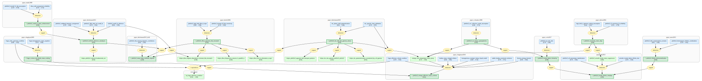

# fermi-liquid-effective-mass-gaia

Gaia knowledge package for a connected YbRh2Si2 effective-mass graph generated from LKM evidence chains.

> [!NOTE]
> This May 4 regeneration starts from exactly one chain-backed LKM root, `gcn_2741cdef209a457a`, and grows only through connected YbRh2Si2 extensions. Raw LKM JSON is the only science evidence. The overview Mermaid graph below is the generated Gaia summary, not necessarily the full topology; use [`docs/starmap.html`](docs/starmap.html) for the interactive graph artifact.

<!-- badges:start -->
<!-- badges:end -->

## Overview

> [!TIP]
> **Reasoning graph information gain: `2.2 bits`**
>
> Total mutual information between leaf premises and exported conclusions — measures how much the reasoning structure reduces uncertainty about the results.

For the interactive graph, open [`docs/starmap.html`](docs/starmap.html).

## Conclusions

| Label | Content | Prior | Belief |
|-------|---------|-------|--------|
| fcqpt_t_minus_two_thirds_mass_scaling | At FCQPT, where the zero-temperature effective mass diverges and the Landau e... | 0.50 | 0.87 |
| ybrh2si2_dhva_spectrum_lda_mismatch | For high-quality YbRh2Si2 single crystals measured by de Haas-van Alphen torq... | 0.50 | 0.93 |
| ybrh2si2_entropy_effective_mass_scheme | For YbRh2Si2 in the homogeneous isotropic heavy-electron liquid model of Shag... | 0.50 | 0.91 |
| ybrh2si2_esr_heavy_quasiparticles | In YbRh2Si2, the anisotropic persistent ESR line, g-factor behavior tracking ... | 0.50 | 0.93 |
| ybrh2si2_kondo_lattice_hierarchy | In stoichiometric YbRh2Si2, lattice Kondo correlations are detectable around ... | 0.50 | 0.98 |
| ybrh2si2_kondo_lifshitz_interplay | YbRh2Si2 high-field phenomenology is explained by the interplay of CEF-induce... | 0.50 | 0.99 |
| ybrh2si2_lifshitz_derenormalization | Combining magnetoresistance and Hall data on YbRh2Si2 down to 50 mK and up to... | 0.50 | 0.83 |
| ybrh2si2_lurh2si2_reference_reanalysis | Re-examining published YbRh2Si2 de Haas-van Alphen measurements with the refi... | 0.50 | 0.95 |
| ybrh2si2_many_body_methods_required | Density-functional LDA calculations of YbRh2Si2 in both f-core small-FS and i... | 0.50 | 1.00 |
| ybrh2si2_rbc_hall_dos_gamma_values | Renormalized-band calculations constrained by experimental CEF energies and l... | 0.50 | 0.92 |
| ybrh2si2_resistivity_mass_drop | For YbRh2Si2 with B perpendicular to c and B>0.06 T, low-temperature resistiv... | 0.50 | 0.84 |
| ybrh2si2_small_fs_mass_enhancement | LDA+SOC calculations for LuRh2Si2 as the small-Fermi-surface analogue produce... | 0.50 | 0.82 |

<!-- content:start -->
<!-- content:end -->
