# Fermi-Liquid Effective Mass Gaia

> **Original LKM roots:** T. A. Alvesalo, T. Haavasoja, P. C. Main, M. T. Manninen, J. Ray, and Leila M. M. Rehn, "Observation of Anomalous Heat Capacity in Liquid He 3 near the Superfluid Transition." *Physical Review Letters* (1979), DOI: `10.1103/physrevlett.43.1509`; V. R. Shaginyan, M. Ya. Amusia, K. G. Popov, and S. A. Artamonov, "Energy scales and the non-Fermi liquid behavior in YbRh2Si2." arXiv (2010), DOI: `10.48550/arXiv.1002.3706`.

> [!NOTE]
> This README is an AI-generated analysis based on a [Gaia](https://github.com/SiliconEinstein/Gaia) reasoning graph formalization of LKM evidence chains. Belief values reflect the graph's probabilistic assessment of support, not the original authors' confidence. See [ANALYSIS.md](ANALYSIS.md) for verification details.

This package is a two-root pilot graph for Fermi-liquid effective-mass reasoning. One root formalizes how Alvesalo et al. infer a liquid He-3 quasiparticle mass ratio from the low-temperature linear specific-heat coefficient. The other formalizes how Shaginyan et al. compute a temperature- and field-dependent heavy-electron effective mass in YbRh2Si2 from a Landau integral equation and an entropy-over-temperature construction. The synthesis deliberately links these as thermodynamic routes to effective mass while preserving the fact that they apply to different systems and regimes.

## Reasoning Graph

> [!TIP]
> **Reasoning graph information gain: `0.8 bits`**

```mermaid
graph TB
    gcn_2ee995fe1e674e2a["He-3 gamma measurement premise\n0.78"]:::premise
    gcn_1587257a956f4d18["He-3 Landau mapping premise\n0.82"]:::premise
    gcn_800070efac5e476d["He-3 gamma -> m*/m and F1\n0.80"]:::exported
    gcn_677c6c_landau_integral_relation["YbRh2Si2 Landau equation premise\n0.82"]:::premise
    gcn_03614e9b_homogeneous_isotropic_model["YbRh2Si2 isotropic model premise\n0.68"]:::premise
    gcn_e0c364ff_inflection_fcqpt_condition["FCQPT inflection condition\n0.78"]:::premise
    gcn_6bbfeb95_stable_landau_solutions["Numerical solution stability\n0.70"]:::premise
    gcn_ecddfefa_fermion_entropy_formula["Fermi-Dirac entropy formula\n0.90"]:::premise
    gcn_2e693115_entropy_over_temperature_mass["M*(T,B) = S(T,B)/T premise\n0.72"]:::premise
    gcn_2741cdef_practical_effective_mass_scheme["YbRh2Si2 effective-mass scheme\n0.59"]:::exported
    cross_thermodynamic_routes_to_effective_mass["Thermodynamic routes to effective mass\n0.77"]:::exported
    cross_scope_caution_standard_fl_vs_fcqpt["Scope caution: standard FL vs FCQPT crossover\n0.64"]:::exported

    gcn_2ee995fe1e674e2a --> gcn_800070efac5e476d
    gcn_1587257a956f4d18 --> gcn_800070efac5e476d
    gcn_677c6c_landau_integral_relation --> gcn_2741cdef_practical_effective_mass_scheme
    gcn_03614e9b_homogeneous_isotropic_model --> gcn_2741cdef_practical_effective_mass_scheme
    gcn_e0c364ff_inflection_fcqpt_condition --> gcn_2741cdef_practical_effective_mass_scheme
    gcn_6bbfeb95_stable_landau_solutions --> gcn_2741cdef_practical_effective_mass_scheme
    gcn_ecddfefa_fermion_entropy_formula --> gcn_2741cdef_practical_effective_mass_scheme
    gcn_2e693115_entropy_over_temperature_mass --> gcn_2741cdef_practical_effective_mass_scheme
    gcn_800070efac5e476d --> cross_thermodynamic_routes_to_effective_mass
    gcn_2e693115_entropy_over_temperature_mass --> cross_thermodynamic_routes_to_effective_mass
    gcn_800070efac5e476d --> cross_scope_caution_standard_fl_vs_fcqpt
    gcn_2741cdef_practical_effective_mass_scheme --> cross_scope_caution_standard_fl_vs_fcqpt
    gcn_03614e9b_homogeneous_isotropic_model --> cross_scope_caution_standard_fl_vs_fcqpt

    classDef premise fill:#ddeeff,stroke:#4488bb,color:#333
    classDef exported fill:#d4edda,stroke:#28a745,stroke-width:2px,color:#333
```

> [!NOTE]
> **[Per-module reasoning graphs with full claim details ->](docs/detailed-reasoning.md)**

## Reasoning Structure

### Liquid He-3 heat capacity implies an effective-mass ratio (belief: 0.80)

The He-3 root claims that, in the normal-state liquid He-3 setting reported by Alvesalo et al. 1979, the measured linear specific-heat coefficient `gamma = 2.11 K^-1` implies `m*/m approximately 2.12` and `F1 approximately 3.36` under standard Landau Fermi-liquid relations. The graph treats this as a derived conclusion from two premises: the calorimetric observation and the validity of the Landau mapping from `gamma` to effective mass and `F1`.

The main support is direct and compact. The calorimetric premise has belief `0.78`, limited by the extrapolation from the observed `T >= about 3 mK` linear region to the `T -> 0` Fermi-liquid coefficient. The mapping premise has belief `0.82`; it is standard, but the LKM chain reports the numeric conversion rather than reproducing the derivation. The conclusion is therefore relatively strong but still tied to the validity of the extrapolation and mapping.

### YbRh2Si2 effective mass is computed from a Landau/entropy scheme (belief: 0.59)

The YbRh2Si2 root formalizes Shaginyan et al.'s practical computation of `M*(T,B)`: solve a Landau effective-mass integral equation, tune the interaction amplitude to an FCQPT inflection condition, compute entropy from quasiparticle occupations, and estimate effective mass by `M*(T,B) = S(T,B)/T`. This is a more complex chain than the He-3 result, with six independent premises feeding one conclusion.

The weakest premise is the homogeneous isotropic heavy-electron model (`0.68`). It deliberately neglects crystal anisotropy, Brillouin-zone structure, multiple bands, and anisotropic effective masses. The numerical-stability claim is also moderate (`0.70`) because the root evidence reports convergence but not an independent numerical audit. These scope and numerical assumptions pull the final belief down to `0.59`.

### Both roots use thermodynamic routes to effective mass (belief: 0.77)

The synthesis claim connects the two selected roots only at a cautious conceptual level. In the He-3 chain, `gamma` is used as a low-temperature thermodynamic route to `m*/m`; in the YbRh2Si2 chain, `S(T,B)/T` is used as a density-of-states-like operational route to `M*(T,B)`. The graph does not assert that these quantities, materials, or theoretical regimes are equivalent.

This cross-paper conclusion is supported by the He-3 decomposed claim and the YbRh2Si2 `S/T` premise. Its belief (`0.77`) is higher than the YbRh2Si2 root because it claims only a scoped analogy in role, not the full correctness of the FCQPT computational scheme.

### The two roots should not be merged as equivalent claims (belief: 0.64)

The second synthesis claim is a guardrail: He-3 uses a standard low-temperature Landau Fermi-liquid mapping, while YbRh2Si2 uses a homogeneous isotropic heavy-electron model near FCQPT and applies `S/T` through crossover or non-Fermi-liquid regimes. This prevents the final graph from over-merging claims just because both mention effective mass.

The belief is moderate (`0.64`) because it depends on both roots and on the YbRh2Si2 model-scope premise. It is best read as an audit conclusion: the graph has found a real thematic bridge, but not an equivalence.

## Key Findings

| Claim | Belief | Assessment |
|---|---:|---|
| He-3 `gamma -> m*/m, F1` | 0.80 | Strongest root; limited mainly by extrapolation and reported numeric mapping. |
| YbRh2Si2 `M*(T,B)` scheme | 0.59 | Useful but assumption-heavy; sensitive to isotropic-model adequacy and numerical robustness. |
| Thermodynamic routes synthesis | 0.77 | Well-grounded as a scoped cross-paper theme. |
| Scope caution | 0.64 | Prevents false equivalence between standard FL and FCQPT/crossover reasoning. |

## Weak Points

The most important weak link is the YbRh2Si2 homogeneous isotropic model premise (`0.68`). It is not obviously false, but it is a modeling compression of a real heavy-fermion material. If anisotropy or band structure controls the relevant low-energy response, the practical `M*(T,B)` scheme could remain internally coherent while becoming less directly applicable to the material.

The He-3 root has a narrower weakness: the calorimetric measurement is mapped from a finite-temperature linear region to a `T -> 0` Fermi-liquid coefficient. The graph preserves this as a review point rather than a contradiction because the LKM evidence does not surface a same-condition counterclaim.

## Evidence Gaps

The most useful follow-up for the He-3 subgraph would be an explicit derivation or independent source for the numeric mapping from `gamma = 2.11 K^-1` to `m*/m approximately 2.12` and `F1 approximately 3.36`. For YbRh2Si2, the next evidence should test the homogeneous isotropic approximation against more material-specific, anisotropic, or band-resolved analyses. A natural next Gaia extension would add the NiS2 and TiS2 candidates from the discovery checkpoint to see whether correlated-metal and model-failure cases sharpen the scope boundary around effective-mass reasoning.

## Package Contents

- `src/fermi_liquid_effective_mass/` contains the Gaia DSL source.
- `.gaia/ir.json` and `.gaia/beliefs.json` contain the compiled graph and inference results.
- `docs/detailed-reasoning.md` contains per-module Mermaid graphs and full claim details.
- `artifacts/lkm-discovery/` preserves the LKM discovery audit trail and raw JSON inputs.
- `artifacts/subgraphs/` preserves the two audited single-root subgraphs used to build the final graph.
