# Fermi-Liquid Effective Mass Gaia

> **LKM roots now synthesized:** Alvesalo 1979 He-3 heat capacity, Shaginyan 2010 YbRh2Si2 FCQPT effective mass, Friedemann 2010 YbRh2Si2 RBC/Hall/DOS, Knebel 2006 YbRh2Si2 high-field dHvA, Friedemann 2013 LuRh2Si2 small-FS reference, Anderson 1984 Kondo-lattice Brinkman-Rice, Capone-Fabrizio-Tosatti 2001 Mott entropy/Z/T_K boundary, Friedemann 2016 NiS2 Brinkman-Rice quantum oscillations, and Paramanik 2013 CeMo2Si2C Kadowaki-Woods/Wilson ratios.

> [!NOTE]
> This README is an AI-generated analysis based on a [Gaia](https://github.com/SiliconEinstein/Gaia) reasoning graph formalization of LKM evidence chains. Belief values reflect the graph's probabilistic assessment of support, not the original authors' confidence. See [ANALYSIS.md](ANALYSIS.md) for verification details.

This package is a nine-root graph for effective-mass reasoning across Fermi-liquid, heavy-fermion, Brinkman-Rice, Mott-boundary, and correlated-FL phenomenology. The new synthesis keeps material and regime boundaries explicit: YbRh2Si2 dHvA/RBC/Lu-reference evidence is wired as material-specific constraint and scope caution, while Kondo-lattice, singlet-Mott, and NiS2 Brinkman-Rice claims are grouped only as a Mott-boundary heavy-quasiparticle theme.

## Overview

> [!TIP]
> **Reasoning graph information gain: `3.7 bits`**
>
> Total mutual information between leaf premises and exported conclusions — measures how much the reasoning structure reduces uncertainty about the results.

```mermaid
---
config:
  flowchart:
    rankSpacing: 80
    nodeSpacing: 30
---
graph TB
    gcn_2ee995fe1e674e2a["gcn_2ee995fe1e674e2a\n(0.78 → 0.78)"]:::premise
    gcn_1587257a956f4d18["gcn_1587257a956f4d18\n(0.82 → 0.82)"]:::premise
    gcn_800070efac5e476d["★ gcn_800070efac5e476d\n(0.50 → 0.80)"]:::exported
    gcn_40f111_nozieres_local_fl_kondo_sites["gcn_40f111_nozieres_local_fl_kondo_sites\n(0.78 → 0.78)"]:::premise
    gcn_8f275a_brinkman_rice_scope_condition["gcn_8f275a_brinkman_rice_scope_condition\n(0.72 → 0.72)"]:::premise
    gcn_7ae79f_kondo_brinkman_rice_fixed_point["★ gcn_7ae79f_kondo_brinkman_rice_fixed_point\n(0.50 → 0.77)"]:::exported
    gcn_31bc66ca16a44508["gcn_31bc66ca16a44508\n(0.82 → 0.82)"]:::premise
    gcn_795699f572b24ed5["gcn_795699f572b24ed5\n(0.78 → 0.78)"]:::premise
    gcn_dd12256615264dfb["gcn_dd12256615264dfb\n(0.80 → 0.80)"]:::premise
    gcn_e4ecd721edd14d3f["★ gcn_e4ecd721edd14d3f\n(0.50 → 0.74)"]:::exported
    gcn_c243dcb_rbc_phase_shift_parametrization["gcn_c243dcb_rbc_phase_shift_parametrization\n(0.82 → 0.82)"]:::premise
    gcn_48bba377_specific_heat_calibration["gcn_48bba377_specific_heat_calibration\n(0.76 → 0.76)"]:::premise
    gcn_42a4ff_rbc_hall_dos_values["★ gcn_42a4ff_rbc_hall_dos_values\n(0.50 → 0.80)"]:::exported
    gcn_c131e014_ybrh2si2_midband_harmonic_assignment["gcn_c131e014_ybrh2si2_midband_harmonic_assignment\n(0.78 → 0.78)"]:::premise
    gcn_3dc248d_ybrh2si2_14kt_not_small_fs["gcn_3dc248d_ybrh2si2_14kt_not_small_fs\n(0.74 → 0.74)"]:::premise
    gcn_3a8394c_lurh2si2_small_fs_reference["gcn_3a8394c_lurh2si2_small_fs_reference\n(0.84 → 0.84)"]:::premise
    gcn_2b8dd97_lurh2si2_reference_reanalysis["★ gcn_2b8dd97_lurh2si2_reference_reanalysis\n(0.50 → 0.73)"]:::exported
    gcn_8a1a2748_alternative_mechanisms_assumption["gcn_8a1a2748_alternative_mechanisms_assumption\n(0.58 → 0.58)"]:::premise
    gcn_29401e42_nis2_brinkman_rice["★ gcn_29401e42_nis2_brinkman_rice\n(0.50 → 0.77)"]:::exported
    gcn_5501e18a_high_field_dhva_scope["gcn_5501e18a_high_field_dhva_scope\n(0.84 → 0.84)"]:::premise
    gcn_f20b1f42_itinerant_4f_lda_sensitivity["gcn_f20b1f42_itinerant_4f_lda_sensitivity\n(0.78 → 0.78)"]:::premise
    gcn_c38f8ce_ybrh2si2_dhva_spectrum_lda_mismatch["★ gcn_c38f8ce_ybrh2si2_dhva_spectrum_lda_mismatch\n(0.50 → 0.81)"]:::exported
    gcn_2dc55af_kw_empirical_scale["gcn_2dc55af_kw_empirical_scale\n(0.82 → 0.82)"]:::premise
    gcn_7459a446_wilson_ratio_interpretation["gcn_7459a446_wilson_ratio_interpretation\n(0.74 → 0.74)"]:::premise
    gcn_bc46d7_cemo_kw_wilson_fl_consistency["★ gcn_bc46d7_cemo_kw_wilson_fl_consistency\n(0.50 → 0.79)"]:::exported
    gcn_677c6c_landau_integral_relation["gcn_677c6c_landau_integral_relation\n(0.82 → 0.82)"]:::premise
    gcn_03614e9b_homogeneous_isotropic_model["gcn_03614e9b_homogeneous_isotropic_model\n(0.68 → 0.68)"]:::premise
    gcn_e0c364ff_inflection_fcqpt_condition["gcn_e0c364ff_inflection_fcqpt_condition\n(0.78 → 0.78)"]:::premise
    gcn_6bbfeb95_stable_landau_solutions["gcn_6bbfeb95_stable_landau_solutions\n(0.70 → 0.70)"]:::premise
    gcn_ecddfefa_fermion_entropy_formula["gcn_ecddfefa_fermion_entropy_formula\n(0.90 → 0.90)"]:::premise
    gcn_2e693115_entropy_over_temperature_mass["gcn_2e693115_entropy_over_temperature_mass\n(0.72 → 0.72)"]:::premise
    gcn_2741cdef_practical_effective_mass_scheme["★ gcn_2741cdef_practical_effective_mass_scheme\n(0.50 → 0.59)"]:::exported
    cross_thermodynamic_routes_to_effective_mass["★ cross_thermodynamic_routes_to_effective_mass\n(0.50 → 0.77)"]:::exported
    cross_scope_caution_standard_fl_vs_fcqpt["★ cross_scope_caution_standard_fl_vs_fcqpt\n(0.50 → 0.64)"]:::exported
    cross_ybrh2si2_rbc_qualifies_homogeneous_isotropic_scope["★ cross_ybrh2si2_rbc_qualifies_homogeneous_isotropic_scope\n(0.50 → 0.71)"]:::exported
    cross_ybrh2si2_material_specific_fs_constraints["★ cross_ybrh2si2_material_specific_fs_constraints\n(0.50 → 0.67)"]:::exported
    cross_ybrh2si2_field_method_scope_caution["★ cross_ybrh2si2_field_method_scope_caution\n(0.50 → 0.62)"]:::exported
    cross_brinkman_rice_mott_boundary_family["★ cross_brinkman_rice_mott_boundary_family\n(0.50 → 0.68)"]:::exported
    cross_brinkman_rice_scope_caution["★ cross_brinkman_rice_scope_caution\n(0.50 → 0.66)"]:::exported
    cross_thermo_transport_correlated_fl_consistency["★ cross_thermo_transport_correlated_fl_consistency\n(0.50 → 0.65)"]:::exported
    strat_0(["infer\n0.12 bits"]):::weak
    gcn_03614e9b_homogeneous_isotropic_model --> strat_0
    gcn_1587257a956f4d18 --> strat_0
    gcn_2741cdef_practical_effective_mass_scheme --> strat_0
    gcn_800070efac5e476d --> strat_0
    strat_0 --> cross_scope_caution_standard_fl_vs_fcqpt
    strat_1(["infer\n0.10 bits"]):::weak
    gcn_03614e9b_homogeneous_isotropic_model --> strat_1
    gcn_2b8dd97_lurh2si2_reference_reanalysis --> strat_1
    gcn_5501e18a_high_field_dhva_scope --> strat_1
    gcn_c38f8ce_ybrh2si2_dhva_spectrum_lda_mismatch --> strat_1
    gcn_f20b1f42_itinerant_4f_lda_sensitivity --> strat_1
    strat_1 --> cross_ybrh2si2_field_method_scope_caution
    strat_2(["infer\n0.24 bits"]):::weak
    gcn_03614e9b_homogeneous_isotropic_model --> strat_2
    gcn_42a4ff_rbc_hall_dos_values --> strat_2
    strat_2 --> cross_ybrh2si2_rbc_qualifies_homogeneous_isotropic_scope
    strat_3(["infer\n0.16 bits"]):::weak
    gcn_03614e9b_homogeneous_isotropic_model --> strat_3
    gcn_2e693115_entropy_over_temperature_mass --> strat_3
    gcn_677c6c_landau_integral_relation --> strat_3
    gcn_6bbfeb95_stable_landau_solutions --> strat_3
    gcn_e0c364ff_inflection_fcqpt_condition --> strat_3
    gcn_ecddfefa_fermion_entropy_formula --> strat_3
    strat_3 --> gcn_2741cdef_practical_effective_mass_scheme
    strat_4(["infer\n0.31 bits"]):::weak
    gcn_1587257a956f4d18 --> strat_4
    gcn_2ee995fe1e674e2a --> strat_4
    strat_4 --> gcn_800070efac5e476d
    strat_5(["infer\n0.10 bits"]):::weak
    gcn_29401e42_nis2_brinkman_rice --> strat_5
    gcn_31bc66ca16a44508 --> strat_5
    gcn_7ae79f_kondo_brinkman_rice_fixed_point --> strat_5
    gcn_e4ecd721edd14d3f --> strat_5
    strat_5 --> cross_brinkman_rice_mott_boundary_family
    strat_6(["infer\n0.07 bits"]):::weak
    gcn_29401e42_nis2_brinkman_rice --> strat_6
    gcn_7ae79f_kondo_brinkman_rice_fixed_point --> strat_6
    gcn_8f275a_brinkman_rice_scope_condition --> strat_6
    gcn_dd12256615264dfb --> strat_6
    gcn_e4ecd721edd14d3f --> strat_6
    strat_6 --> cross_brinkman_rice_scope_caution
    strat_7(["infer\n0.09 bits"]):::weak
    gcn_2b8dd97_lurh2si2_reference_reanalysis --> strat_7
    gcn_3a8394c_lurh2si2_small_fs_reference --> strat_7
    gcn_42a4ff_rbc_hall_dos_values --> strat_7
    gcn_c38f8ce_ybrh2si2_dhva_spectrum_lda_mismatch --> strat_7
    strat_7 --> cross_ybrh2si2_material_specific_fs_constraints
    strat_8(["infer\n0.31 bits"]):::weak
    gcn_2dc55af_kw_empirical_scale --> strat_8
    gcn_7459a446_wilson_ratio_interpretation --> strat_8
    strat_8 --> gcn_bc46d7_cemo_kw_wilson_fl_consistency
    strat_9(["infer\n0.09 bits"]):::weak
    gcn_2e693115_entropy_over_temperature_mass --> strat_9
    gcn_42a4ff_rbc_hall_dos_values --> strat_9
    gcn_800070efac5e476d --> strat_9
    gcn_bc46d7_cemo_kw_wilson_fl_consistency --> strat_9
    strat_9 --> cross_thermo_transport_correlated_fl_consistency
    strat_10(["infer\n0.20 bits"]):::weak
    gcn_2e693115_entropy_over_temperature_mass --> strat_10
    gcn_800070efac5e476d --> strat_10
    strat_10 --> cross_thermodynamic_routes_to_effective_mass
    strat_11(["infer\n0.30 bits"]):::weak
    gcn_31bc66ca16a44508 --> strat_11
    gcn_795699f572b24ed5 --> strat_11
    gcn_dd12256615264dfb --> strat_11
    strat_11 --> gcn_e4ecd721edd14d3f
    strat_12(["infer\n0.30 bits"]):::weak
    gcn_3a8394c_lurh2si2_small_fs_reference --> strat_12
    gcn_3dc248d_ybrh2si2_14kt_not_small_fs --> strat_12
    gcn_c131e014_ybrh2si2_midband_harmonic_assignment --> strat_12
    strat_12 --> gcn_2b8dd97_lurh2si2_reference_reanalysis
    strat_13(["infer\n0.31 bits"]):::weak
    gcn_40f111_nozieres_local_fl_kondo_sites --> strat_13
    gcn_8f275a_brinkman_rice_scope_condition --> strat_13
    strat_13 --> gcn_7ae79f_kondo_brinkman_rice_fixed_point
    strat_14(["infer\n0.31 bits"]):::weak
    gcn_48bba377_specific_heat_calibration --> strat_14
    gcn_c243dcb_rbc_phase_shift_parametrization --> strat_14
    strat_14 --> gcn_42a4ff_rbc_hall_dos_values
    strat_15(["infer\n0.31 bits"]):::weak
    gcn_5501e18a_high_field_dhva_scope --> strat_15
    gcn_f20b1f42_itinerant_4f_lda_sensitivity --> strat_15
    strat_15 --> gcn_c38f8ce_ybrh2si2_dhva_spectrum_lda_mismatch
    strat_16(["infer\n0.31 bits"]):::weak
    gcn_8a1a2748_alternative_mechanisms_assumption --> strat_16
    strat_16 --> gcn_29401e42_nis2_brinkman_rice

    classDef premise fill:#ddeeff,stroke:#4488bb,color:#333
    classDef exported fill:#d4edda,stroke:#28a745,stroke-width:2px,color:#333
    classDef weak fill:#fff9c4,stroke:#f9a825,stroke-dasharray: 5 5,color:#333
    classDef contra fill:#ffebee,stroke:#c62828,color:#333
```

> [!NOTE]
> **[Per-module reasoning graphs with full claim details ->](docs/detailed-reasoning.md)**
>
> **[Interactive starmap ->](docs/starmap.html)**

## Reasoning Structure

### What the graph now covers

This package now formalizes a coherent 121-node graph about how effective mass is inferred, modeled, constrained, and qualified across Fermi-liquid and strongly correlated systems. The graph starts from classic thermodynamic mass proxies, then expands into material-specific YbRh2Si2 Fermi-surface evidence, Brinkman-Rice/Mott-boundary mass renormalization, and correlated-Fermi-liquid transport diagnostics. The synthesis deliberately keeps scopes separate: similar vocabulary such as "heavy quasiparticles", "large Fermi surface", and "effective mass" is not merged across different materials or regimes unless the claims really assert the same proposition.

### YbRh2Si2 material-specific constraints

The YbRh2Si2 branch now combines three compatible but non-equivalent surfaces. Friedemann 2010 supplies thermodynamically calibrated RBC/Hall/DOS values, Knebel 2006 supplies high-field dHvA frequencies and cyclotron masses with an itinerant-4f LDA mismatch, and Friedemann 2013 supplies a LuRh2Si2 small-FS reference and harmonic reassignment of published YbRh2Si2 peaks. The graph records these as constraints and scope cautions, not contradictions.

### Brinkman-Rice and Mott-boundary branch

The Anderson, Capone-Fabrizio-Tosatti, and NiS2 roots share heavy-quasiparticle/Mott-boundary vocabulary, but their claims are not interchangeable. Anderson addresses screened Kondo-lattice fixed points with finite Stoner enhancement, Capone et al. give a conditional entropy obstruction for a singlet-Mott endpoint, and Friedemann 2016 reports NiS2 quantum-oscillation evidence consistent with Brinkman-Rice large-FS heavy quasiparticles.

### Thermodynamic and transport consistency

CeMo2Si2C adds a transport/susceptibility consistency check through Kadowaki-Woods and Wilson/Sommerfeld ratios. This complements the existing gamma-based He-3 effective-mass extraction and YbRh2Si2 entropy/RBC thermodynamic constraints without implying a common material mechanism.

## Node Statistics

| Count | Value | Meaning |
|---|---:|---|
| Total knowledge nodes | 121 | All compiled Gaia knowledge nodes in `.gaia/ir.json`. |
| Science-facing claims | 63 | Non-internal claims declared by source modules. |
| Internal helper claims | 58 | Compiler-generated conjunction/implication helper claims. |
| Strategies | 40 | Source-level deduction/support links. |
| Operators | 0 | No equivalence or contradiction operators were promoted. |
| Independent premises | 23 | All have priors assigned in `priors.py`. |

The interactive starmap in `docs/starmap.html` renders 103 visual nodes and 132 edges. It is smaller than the full 121-node IR because the starmap rendering focuses on visible graph elements rather than every internal compiler helper.

## Duplicate Audit

A Turn-3 duplicate audit was run after reaching the 100-node target. It found no exact duplicate science-facing claim content. Four same-paper helper restatements were merged into canonical claims:

- Friedemann 2013 5-7 kT harmonic helper -> `gcn_c131e014_ybrh2si2_midband_harmonic_assignment`
- Friedemann 2013 14 kT high-field itinerant-4f helper -> `gcn_3dc248d_ybrh2si2_14kt_not_small_fs`
- Capone 2001 entropy-at-`T_K` helper -> `gcn_31bc66ca16a44508`
- Capone 2001 entropy-mismatch-instability helper -> `gcn_dd12256615264dfb`

`gaia inquiry review --strict` still reports one possible duplicate, but it is between compiler-generated internal helper claims, not source science claims. This is logged in `artifacts/lkm-discovery/merge_audit.md`.

## Verification Summary

The final verification after synthesis and duplicate cleanup passed: `gaia compile .`, `gaia check --brief .`, `gaia check --hole .`, `gaia infer .`, `gaia render . --target github`, `gaia render . --target docs`, and `gaia starmap . --out docs/starmap.html`. The compiled graph has 121 total knowledge nodes: 63 science-facing claims and 58 internal strategy-helper claims, with 23 independent premises and 0 holes.

## Package Contents

- `src/fermi_liquid_effective_mass/` contains the Gaia DSL source.
- `.gaia/ir.json` and `.gaia/beliefs.json` contain the compiled graph and inference results.
- `docs/detailed-reasoning.md` contains per-module Mermaid graphs and full claim details.
- `docs/starmap.html` contains the interactive starmap. On GitHub, render it through Pages at `https://callo42.github.io/fermi-liquid-effective-mass-gaia/starmap.html`.
- `artifacts/lkm-discovery/` preserves the LKM discovery and synthesis audit trail.
- `artifacts/subgraphs/` preserves the audited subgraphs unchanged.

## Starmap Components

The starmap currently renders as two clusters. This is intentional after a focused bridge search:

- The main cluster covers He-3, YbRh2Si2 FCQPT/RBC/dHvA/Lu-reference evidence, and CeMo2Si2C correlated-Fermi-liquid ratios.
- The second cluster covers Kondo-lattice Brinkman-Rice, Mott entropy/Z/T_K boundary reasoning, and NiS2 Brinkman-Rice quantum-oscillation evidence.

A focused LKM bridge search was run and logged in `artifacts/lkm-discovery/bridge_search_2026-05-03.md`. It found useful YbRh2Si2-side Kondo-suppression candidates, but no chain-backed root strong enough to connect both clusters without adding a weak or agent-only bridge. The graph therefore keeps the two clusters separate.
