# Fermi-Liquid Effective Mass Gaia

> **Original LKM roots:** T. A. Alvesalo, T. Haavasoja, P. C. Main, M. T. Manninen, J. Ray, and Leila M. M. Rehn, "Observation of Anomalous Heat Capacity in Liquid He 3 near the Superfluid Transition." *Physical Review Letters* (1979), DOI: `10.1103/physrevlett.43.1509`; V. R. Shaginyan, M. Ya. Amusia, K. G. Popov, and S. A. Artamonov, "Energy scales and the non-Fermi liquid behavior in YbRh2Si2." arXiv (2010), DOI: `10.48550/arXiv.1002.3706`; S. Friedemann et al., "Hall effect measurements and electronic structure calculations on YbRh2Si2 and its reference compounds LuRh2Si2 and YbIr2Si2." *Physical Review B* (2010), DOI: `10.1103/physrevb.82.035103`.

> [!NOTE]
> This README is an AI-generated analysis based on a [Gaia](https://github.com/SiliconEinstein/Gaia) reasoning graph formalization of LKM evidence chains. Belief values reflect the graph's probabilistic assessment of support, not the original authors' confidence. See [ANALYSIS.md](ANALYSIS.md) for verification details.

This package is a three-root graph for Fermi-liquid effective-mass reasoning. One root formalizes how Alvesalo et al. infer a liquid He-3 quasiparticle mass ratio from the low-temperature linear specific-heat coefficient. A second formalizes how Shaginyan et al. compute a temperature- and field-dependent heavy-electron effective mass in YbRh2Si2 from a Landau integral equation and an entropy-over-temperature construction. The third adds Friedemann et al.'s material-specific YbRh2Si2 renormalized-band/Hall/DOS evidence, which qualifies the homogeneous isotropic FCQPT branch without forcing a contradiction.

## Reasoning Graph

> [!TIP]
> **Reasoning graph information gain: `1.3 bits`**
>
> Total mutual information between leaf premises and exported conclusions — measures how much the reasoning structure reduces uncertainty about the results.

```mermaid
---
config:
  flowchart:
    rankSpacing: 80
    nodeSpacing: 30
---
graph TB
    gcn_2ee995fe1e674e2a["gcn_2ee995fe1e674e2a\n(0.78 → 0.78)"]:::premise
    gcn_1587257a956f4d18["gcn_1587257a956f4d18\n(0.82 → 0.82)"]:::premise
    gcn_800070efac5e476d["★ gcn_800070efac5e476d\n(0.50 → 0.80)"]:::exported
    gcn_c243dcb_rbc_phase_shift_parametrization["gcn_c243dcb_rbc_phase_shift_parametrization\n(0.82 → 0.82)"]:::premise
    gcn_48bba377_specific_heat_calibration["gcn_48bba377_specific_heat_calibration\n(0.76 → 0.76)"]:::premise
    gcn_42a4ff_rbc_hall_dos_values["★ gcn_42a4ff_rbc_hall_dos_values\n(0.50 → 0.80)"]:::exported
    gcn_677c6c_landau_integral_relation["gcn_677c6c_landau_integral_relation\n(0.82 → 0.82)"]:::premise
    gcn_03614e9b_homogeneous_isotropic_model["gcn_03614e9b_homogeneous_isotropic_model\n(0.68 → 0.68)"]:::premise
    gcn_e0c364ff_inflection_fcqpt_condition["gcn_e0c364ff_inflection_fcqpt_condition\n(0.78 → 0.78)"]:::premise
    gcn_6bbfeb95_stable_landau_solutions["gcn_6bbfeb95_stable_landau_solutions\n(0.70 → 0.70)"]:::premise
    gcn_ecddfefa_fermion_entropy_formula["gcn_ecddfefa_fermion_entropy_formula\n(0.90 → 0.90)"]:::premise
    gcn_2e693115_entropy_over_temperature_mass["gcn_2e693115_entropy_over_temperature_mass\n(0.72 → 0.72)"]:::premise
    gcn_2741cdef_practical_effective_mass_scheme["★ gcn_2741cdef_practical_effective_mass_scheme\n(0.50 → 0.59)"]:::exported
    cross_thermodynamic_routes_to_effective_mass["★ cross_thermodynamic_routes_to_effective_mass\n(0.50 → 0.77)"]:::exported
    cross_scope_caution_standard_fl_vs_fcqpt["★ cross_scope_caution_standard_fl_vs_fcqpt\n(0.50 → 0.64)"]:::exported
    cross_ybrh2si2_rbc_qualifies_homogeneous_isotropic_scope["★ cross_ybrh2si2_rbc_qualifies_homogeneous_isotropic_scope\n(0.50 → 0.71)"]:::exported
    strat_0(["infer\n0.12 bits"]):::weak
    gcn_03614e9b_homogeneous_isotropic_model --> strat_0
    gcn_1587257a956f4d18 --> strat_0
    gcn_2741cdef_practical_effective_mass_scheme --> strat_0
    gcn_800070efac5e476d --> strat_0
    strat_0 --> cross_scope_caution_standard_fl_vs_fcqpt
    strat_1(["infer\n0.24 bits"]):::weak
    gcn_03614e9b_homogeneous_isotropic_model --> strat_1
    gcn_42a4ff_rbc_hall_dos_values --> strat_1
    strat_1 --> cross_ybrh2si2_rbc_qualifies_homogeneous_isotropic_scope
    strat_2(["infer\n0.16 bits"]):::weak
    gcn_03614e9b_homogeneous_isotropic_model --> strat_2
    gcn_2e693115_entropy_over_temperature_mass --> strat_2
    gcn_677c6c_landau_integral_relation --> strat_2
    gcn_6bbfeb95_stable_landau_solutions --> strat_2
    gcn_e0c364ff_inflection_fcqpt_condition --> strat_2
    gcn_ecddfefa_fermion_entropy_formula --> strat_2
    strat_2 --> gcn_2741cdef_practical_effective_mass_scheme
    strat_3(["infer\n0.31 bits"]):::weak
    gcn_1587257a956f4d18 --> strat_3
    gcn_2ee995fe1e674e2a --> strat_3
    strat_3 --> gcn_800070efac5e476d
    strat_4(["infer\n0.20 bits"]):::weak
    gcn_2e693115_entropy_over_temperature_mass --> strat_4
    gcn_800070efac5e476d --> strat_4
    strat_4 --> cross_thermodynamic_routes_to_effective_mass
    strat_5(["infer\n0.31 bits"]):::weak
    gcn_48bba377_specific_heat_calibration --> strat_5
    gcn_c243dcb_rbc_phase_shift_parametrization --> strat_5
    strat_5 --> gcn_42a4ff_rbc_hall_dos_values

    classDef premise fill:#ddeeff,stroke:#4488bb,color:#333
    classDef exported fill:#d4edda,stroke:#28a745,stroke-width:2px,color:#333
    classDef weak fill:#fff9c4,stroke:#f9a825,stroke-dasharray: 5 5,color:#333
    classDef contra fill:#ffebee,stroke:#c62828,color:#333
```

> [!NOTE]
> **[Per-module reasoning graphs with full claim details ->](docs/detailed-reasoning.md)**

## Reasoning Structure

### Liquid He-3 heat capacity implies an effective-mass ratio (belief: 0.80)

The He-3 root claims that, in the normal-state liquid He-3 setting reported by Alvesalo et al. 1979, the measured linear specific-heat coefficient `gamma = 2.11 K^-1` implies `m*/m approximately 2.12` and `F1 approximately 3.36` under standard Landau Fermi-liquid relations. The graph treats this as a derived conclusion from two premises: the calorimetric observation and the validity of the Landau mapping from `gamma` to effective mass and `F1`.

The main support is direct and compact. The calorimetric premise has belief `0.78`, limited by the extrapolation from the observed `T >= about 3 mK` linear region to the `T -> 0` Fermi-liquid coefficient. The mapping premise has belief `0.82`; it is standard, but the LKM chain reports the numeric conversion rather than reproducing the derivation. The conclusion is therefore relatively strong but still tied to the validity of the extrapolation and mapping.

### YbRh2Si2 effective mass is computed from a Landau/entropy scheme (belief: 0.59)

The YbRh2Si2 root formalizes Shaginyan et al.'s practical computation of `M*(T,B)`: solve a Landau effective-mass integral equation, tune the interaction amplitude to an FCQPT inflection condition, compute entropy from quasiparticle occupations, and estimate effective mass by `M*(T,B) = S(T,B)/T`. This is a more complex chain than the He-3 result, with six independent premises feeding one conclusion.

The weakest premise is the homogeneous isotropic heavy-electron model (`0.68`). It deliberately neglects crystal anisotropy, Brillouin-zone structure, multiple bands, and anisotropic effective masses. The numerical-stability claim is also moderate (`0.70`) because the root evidence reports convergence but not an independent numerical audit. These scope and numerical assumptions pull the final belief down to `0.59`.

### YbRh2Si2 renormalized-band calculations add material-specific Hall and DOS evidence (belief: 0.80)

The Friedemann et al. root formalizes a material-specific renormalized-band calculation for YbRh2Si2. The calculation uses CEF-constrained 4f resonance phase shifts and fixes a resonance-width parameter by reproducing the low-temperature specific-heat coefficient. It then predicts opposite-sign reduced transverse transport products for two dominant bands, `+0.0037675` and `-0.0041076`, causing strong cancellation in the Hall numerator. The same calculation gives `N(E_F) ~= 290 states/(eV unit cell)` and `gamma ~= 680 mJ mol^-1 K^-2` for YbRh2Si2.

The support is reasonably strong because the method premise has belief `0.82` and the specific-heat calibration premise has belief `0.76`. The calibration premise is the weaker link: reproducing `gamma_exp` constrains the DOS, but the selected LKM chain does not independently prove that the same parametrization uniquely fixes band occupations and Hall integrals.

### Both roots use thermodynamic routes to effective mass (belief: 0.77)

The synthesis claim connects the two selected roots only at a cautious conceptual level. In the He-3 chain, `gamma` is used as a low-temperature thermodynamic route to `m*/m`; in the YbRh2Si2 chain, `S(T,B)/T` is used as a density-of-states-like operational route to `M*(T,B)`. The graph does not assert that these quantities, materials, or theoretical regimes are equivalent.

This cross-paper conclusion is supported by the He-3 decomposed claim and the YbRh2Si2 `S/T` premise. Its belief (`0.77`) is higher than the YbRh2Si2 root because it claims only a scoped analogy in role, not the full correctness of the FCQPT computational scheme.

### The two roots should not be merged as equivalent claims (belief: 0.64)

The second synthesis claim is a guardrail: He-3 uses a standard low-temperature Landau Fermi-liquid mapping, while YbRh2Si2 uses a homogeneous isotropic heavy-electron model near FCQPT and applies `S/T` through crossover or non-Fermi-liquid regimes. This prevents the final graph from over-merging claims just because both mention effective mass.

The belief is moderate (`0.64`) because it depends on both roots and on the YbRh2Si2 model-scope premise. It is best read as an audit conclusion: the graph has found a real thematic bridge, but not an equivalence.

### Material-specific RBC evidence qualifies the homogeneous FCQPT approximation (belief: 0.71)

The new cross-paper synthesis claim connects the Friedemann et al. RBC/Hall/DOS branch to the Shaginyan et al. homogeneous isotropic FCQPT branch. It says the RBC evidence qualifies the scope of the homogeneous approximation because the RBC chain explicitly includes CEF splitting, band topology, multiple bands, band-resolved Hall cancellation, and DOS/gamma values that the universal-scaling premise deliberately omits.

The graph does not treat this as a contradiction. Both claims can be true: the homogeneous model may be useful for universal scaling, while the RBC calculation provides material-specific structure needed for Hall and band-resolved interpretation.

## Key Findings

| Claim | Belief | Assessment |
|---|---:|---|
| He-3 `gamma -> m*/m, F1` | 0.80 | Strongest root; limited mainly by extrapolation and reported numeric mapping. |
| YbRh2Si2 `M*(T,B)` scheme | 0.59 | Useful but assumption-heavy; sensitive to isotropic-model adequacy and numerical robustness. |
| YbRh2Si2 RBC Hall/DOS values | 0.80 | Material-specific evidence constraining the heavy-fermion branch. |
| Thermodynamic routes synthesis | 0.77 | Well-grounded as a scoped cross-paper theme. |
| Scope caution | 0.64 | Prevents false equivalence between standard FL and FCQPT/crossover reasoning. |
| RBC scope qualification | 0.71 | Records that material-specific RBC evidence narrows the homogeneous-model scope. |

## Weak Points

The most important weak link remains the YbRh2Si2 homogeneous isotropic model premise (`0.68`). It is not obviously false, but it is a modeling compression of a real heavy-fermion material. The Friedemann et al. RBC extension makes this weakness more concrete: material-specific CEF splitting, band topology, and Hall cancellations matter for YbRh2Si2 transport interpretation.

The He-3 root has a narrower weakness: the calorimetric measurement is mapped from a finite-temperature linear region to a `T -> 0` Fermi-liquid coefficient. The graph preserves this as a review point rather than a contradiction because the LKM evidence does not surface a same-condition counterclaim.

## Evidence Gaps

The most useful follow-up for the He-3 subgraph would be an explicit derivation or independent source for the numeric mapping from `gamma = 2.11 K^-1` to `m*/m approximately 2.12` and `F1 approximately 3.36`. For YbRh2Si2, the next evidence should add the dHvA candidate `gcn_c38f8ce989fd454a` to compare RBC-style material-specific electronic structure with direct quantum-oscillation effective masses and 4f-localization evidence. A later extension could add the NiS2 or TiS2 candidates to broaden the graph toward Brinkman-Rice/Mott physics or Fermi-liquid model-failure cases.

## Package Contents

- `src/fermi_liquid_effective_mass/` contains the Gaia DSL source.
- `.gaia/ir.json` and `.gaia/beliefs.json` contain the compiled graph and inference results.
- `docs/detailed-reasoning.md` contains per-module Mermaid graphs and full claim details.
- `artifacts/lkm-discovery/` preserves the LKM discovery audit trail and raw JSON inputs.
- `artifacts/subgraphs/` preserves the audited single-root subgraphs used to build the final graph.
