# fermi-liquid-effective-mass-gaia

Gaia knowledge package for a connected YbRh2Si2 effective-mass graph generated from LKM evidence chains.

## Overview

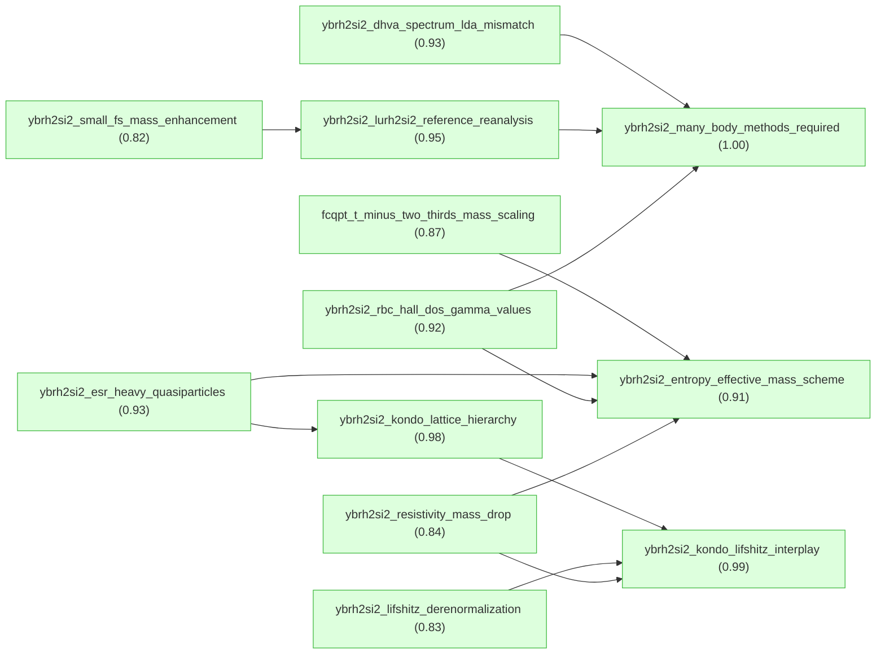

## Introduction

#### ybrh2si2_entropy_effective_mass_scheme ★

📌 `ybrh2si2_entropy_effective_mass_scheme`   |   Belief: **0.91**

> For YbRh2Si2 in the homogeneous isotropic heavy-electron liquid model of Shaginyan et al. 2010, a practical scheme for field- and temperature-dependent effective mass is to solve the Landau effective-mass integral equation for ε(p) and n(p,T,B), tune the Landau amplitude so ε(p) has an inflection point at p_F and realizes 1/M* = 0 at T = 0, compute entropy from the Fermi-Dirac occupation formula, and extract M*(T,B) = S(T,B)/T; this procedure yields the interpolating and scaling behavior used for the YbRh2Si2 comparison [@Shaginyan2010].

🔗 **support**([fcqpt_t_minus_two_thirds_mass_scaling](#fcqpt_t_minus_two_thirds_mass_scaling))

Reasoning

The Shaginyan 2009 LKM chain derives the FCQPT/NFL T^(-2/3) effective-mass solution from the same homogeneous Landau effective-mass equation and inflection condition used inside the Shaginyan 2010 YbRh2Si2 procedure. This supports the FCQPT scaling component of the starting root without adding a parent synthesis claim.

#### fcqpt_t_minus_two_thirds_mass_scaling ★

📌 `fcqpt_t_minus_two_thirds_mass_scaling`   |   Belief: **0.87**

> At FCQPT, where the zero-temperature effective mass diverges and the Landau effective-mass equation becomes homogeneous, the low-temperature solution for a homogeneous heavy-fermion liquid satisfies M*(T) proportional to T^(-2/3); in the non-Fermi-liquid regime near FCQPT, the quasiparticle effective mass therefore decreases with increasing temperature according to this power law [@Shaginyan2009].

🔗 **deduction**([fcqpt_cubic_spectrum_condition](#fcqpt_cubic_spectrum_condition), [fcqpt_homogeneous_mass_equation](#fcqpt_homogeneous_mass_equation))

Reasoning

1. Treat the exact inverse effective-mass relation as known and introduce the finite-temperature quasiparticle-distribution deviation n_1(p,T)=n(p,T)-n(p).
2. Invoke the FCQPT condition where the zero-temperature effective mass diverges, making the zero-temperature inverse-mass term vanish and the finite-temperature equation homogeneous.
3. Use the asymptotic low-temperature solution of the homogeneous equation, M*(T) proportional to T^(-2/3), as the non-Fermi-liquid FCQPT effective-mass law.
4. Note that away from FCQPT the system has finite-M*(0) Landau-Fermi-liquid behavior at low T, so the T^(-2/3) law identifies the FCQPT/NFL regime.

#### ybrh2si2_rbc_hall_dos_gamma_values ★

📌 `ybrh2si2_rbc_hall_dos_gamma_values`   |   Belief: **0.92**

> Renormalized-band calculations constrained by experimental CEF energies and low-temperature specific heat produce two dominant quasiparticle bands for YbRh2Si2 with opposite-sign reduced transverse transport products: band 1 (donut) remains holelike with \bar{n}(1)\bar{\sigma}_{xyz}(1)=+0.0037675, while band 2 (jungle-gym) becomes predominantly electronlike with \bar{n}(2)\bar{\sigma}_{xyz}(2)=-0.0041076, so their nearly equal magnitudes strongly cancel in the numerator of the low-field Hall coefficient. The same calculation gives N(E_F)~=290 states/(eV unit cell) and gamma~=680 mJ mol^-1 K^-2 for YbRh2Si2, and N(E_F)~=48 states/(eV unit cell) and gamma~=113 mJ mol^-1 K^-2 for YbIr2Si2 [@Friedemann2010].

🔗 **deduction**([rbc_phase_shift_parametrization](#rbc_phase_shift_parametrization), [rbc_specific_heat_calibration](#rbc_specific_heat_calibration))

Reasoning

1. Start from the established upstream result that two principal bands (donut $i=1$ and jungle-gym $i=2$) dominate the Hall transport integrals, and aim to determine how inclusion of $4f$-derived quasiparticles in a renormalized-band calculation (RBC) modifies the band-resolved transport integrals and their signs.
2. Summarize the renormalized band method inputs and parameter determination: transform the $4f$ states into crystalline-electric-field (CEF) eigenstates $|m\rangle$ and introduce resonance-type phase shifts
$\widetilde{\eta}_{f}(E)\simeq\arctan\dfrac{\widetilde{\Delta}_{f}}{E-\widetilde{\epsilon}_{f}}$,
where $\widetilde{\Delta}_{f}$ is the resonance width accounting for the renormalized quasiparticle mass and $\widetilde{\epsilon}_{f}$ the position of the $f$-derived band center; the CEF-split resonance centers are $\widetilde{\epsilon}_{fm}=\widetilde{\epsilon}_{f}+\delta_{m}$ (for the Yb hole analog the sign convention leads to $\widetilde{\epsilon}_{f}<0$ and $\widetilde{\epsilon}_{fm}=\widetilde{\epsilon}_{f}-\delta_{m}$). The single free parameter $\widetilde{\Delta}_{f}$ is fixed by reproducing the experimentally observed low-temperature linear-in-$T$ specific-heat coefficient, thereby grounding the RBC parametrization in thermodynamic data.
[24]
3. Compute the renormalized band dispersions $E(i,\mathbf{k})$ using the RBC Hamiltonian and the experimental CEF scheme and resonance widths; from these dispersions evaluate the band-resolved reduced transport integrals $\bar{\sigma}_{xx}(i)$ and $\bar{\sigma}_{xyz}(i)$ as defined by the decomposition
$\sigma_{xx}(i)=\sigma(i)\bar{\sigma}_{xx}(i)$ and $\sigma_{xyz}(i)=\sigma_{B}(i)\bar{\sigma}_{xyz}(i)$
with the prefactors $\sigma(i)=\dfrac{e^{2}}{m}\pi(i)\bar{n}(i)$ and $\sigma_{B}(i)=\dfrac{|e|^{3}}{m^{2}c}[\pi(i)]^{2}\bar{n}(i)$ and $\bar{n}(i)$ the band occupation per unit cell. This defines the reduced-transport products $\bar{n}(i)\bar{\sigma}_{xyz}(i)$ which directly enter the numerator of the Hall coefficient.
(Equations reproduced from the transport decomposition in the paper.)
4. Report the numerical RBC results for YbRh$_2$Si$_2$: the renormalized-band calculation yields for band 1 (donut) a positive reduced transverse transport product $\bar{n}(1)\bar{\sigma}_{xyz}(1)=+0.0037675$ and for band 2 (jungle-gym) a negative product $\bar{n}(2)\bar{\sigma}_{xyz}(2)=-0.0041076$ as listed in the transport-results Table I. These opposite signs indicate that band 1 remains predominantly holelike while band 2 becomes predominantly electronlike in the heavy-Fermi-liquid limit. The near equality in magnitude implies strong cancellation when summing the two contributions in the numerator of $R_{H}$.
Table I
5. State the RBC prediction for the renormalized density of states at the Fermi energy and its thermodynamic implication: for YbRh$_2$Si$_2$ the RBC yields $N(E_{F})\approx 290\ \mathrm{states/(eV\ unit\ cell)}$, which corresponds (via the standard relation between DOS and the Sommerfeld coefficient for the electronic specific heat) to a Sommerfeld coefficient $\gamma\approx680\ \mathrm{mJ\ mol^{-1}K^{-2}}$; for YbIr$_2$Si$_2$ RBC gives $N(E_{F})\approx48\ \mathrm{states/(eV\ unit\ cell)}$ and $\gamma\approx113\ \mathrm{mJ\ mol^{-1}K^{-2}}$. These values follow from the calculated renormalized quasiparticle DOS displayed in the RBC results.
Fig. 4
6. Conclude that in the heavy-Fermi-liquid limit the RBC produces two dominant bands with opposite Hall character for YbRh$_2$Si$_2$, with nearly compensating contributions to the Hall numerator (the products $\bar{n}(i)\bar{\sigma}_{xyz}(i)$ are close in magnitude and opposite in sign), thereby explaining why the total Hall coefficient is expected to be small and highly sensitive to weighting factors (such as band-dependent relaxation times). This explains the RBC-based mechanistic origin of cancellation and near-compensation observed in the numerical transport integrals.
Table I

#### ybrh2si2_dhva_spectrum_lda_mismatch ★

📌 `ybrh2si2_dhva_spectrum_lda_mismatch`   |   Belief: **0.93**

> For high-quality YbRh2Si2 single crystals measured by de Haas-van Alphen torque magnetometry in steady fields of 12-28 T with H parallel a, Knebel et al. 2006 observe four fundamental frequencies, 2730 T, 3510 T, 5370 T, and 7050 T, with cyclotron masses (15.0 +/- 0.7) m_e, (8.4 +/- 0.2) m_e, (10.1 +/- 0.2) m_e, and (14.9 +/- 0.9) m_e. The measured basal-plane angular dependence is inconsistent with itinerant-4f LDA/FLAPW calculations for YbRh2Si2 and instead qualitatively resembles LuRh2Si2 LDA calculations with 4f states below the Fermi energy, giving the first experimental Fermi-surface information for YbRh2Si2 and exposing a significant mismatch with one itinerant-4f LDA prediction set [@Knebel2006].

🔗 **deduction**([ybrh2si2_high_field_dhva_scope](#ybrh2si2_high_field_dhva_scope), [ybrh2si2_itinerant_4f_lda_sensitivity](#ybrh2si2_itinerant_4f_lda_sensitivity))

Reasoning

1. Start from the upstream established result: accept as already established the upstream conclusion that LDA band-structure calculations place significant sensitivity of predicted Fermi-surface angular dependence to the $4f$ position and that itinerant-4f LDA angular dependence does not match experiment (upstream conclusion known and available for use).
2. Define experimental method and conditions for the quantum-oscillation measurements: de Haas–van Alphen (dHvA) measurements were performed on highest-quality single crystals (RRR $\approx300$) at ambient pressure using a cantilever torque meter in steady magnetic fields between $12$ and $28\ \mathrm{T}$ with a dilution refrigerator base temperature of $30\ \mathrm{mK}$; the magnetic field was applied parallel to the crystallographic $a$ axis ($H\parallel a$) for the principal data set.
3. Report the observed dHvA frequency spectrum and its extraction: the oscillatory torque signal for $H\parallel a$ shows reproducible oscillations whose Fourier transform yields four unambiguous frequencies at $2730\ \mathrm{T}$, $3510\ \mathrm{T}$, $5370\ \mathrm{T}$, and $7050\ \mathrm{T}$ from a field window $12$–$28\ \mathrm{T}$; these frequencies correspond to extremal cross-sectional areas of Fermi-surface orbits according to the Onsager relation (frequency $F$ in tesla proportional to extremal area).
Fig.7
4. Describe how effective masses were determined and report the numerical values: the temperature dependence of each oscillation amplitude follows the Lifshitz–Kosevich thermal damping factor, and fitting that temperature dependence yields cyclotron effective masses $m^{\ast}$ of $(15.0\pm0.7)\,m_{e}$ for $2730\ \mathrm{T}$, $(8.4\pm0.2)\,m_{e}$ for $3510\ \mathrm{T}$, $(10.1\pm0.2)\,m_{e}$ for $5370\ \mathrm{T}$, and $(14.9\pm0.9)\,m_{e}$ for $7050\ \mathrm{T}$, where $m_{e}$ is the free-electron mass.
Fig.7
5. Report the angular dependence of the observed frequencies within the basal plane: the two extreme frequencies (lowest and highest) are observable over the full angular sweep in the basal plane while the two intermediate frequencies are detectable only at small angles near $H\parallel a$; the measured angular dependence of the observed dHvA frequencies in the basal plane is plotted and shows a specific angular variation that is compared to calculated angular dependencies.
Fig.8
6. Compare experimental angular dependence and frequencies with band-structure calculations and note the mismatch: the experimentally observed frequencies (all in the few-kilotesla range) and their angular evolution are inconsistent with the LDA-calculated angular dependences for $YbRh_{2}Si_{2}$ in which itinerant $4f$ electrons produce calculated frequencies mostly below $1\ \mathrm{kT}$ or above $10\ \mathrm{kT}$, and the shapes of the calculated angular dependencies differ markedly from experiment; by contrast, LDA calculations for $LuRh_{2}Si_{2}$ (where $4f$ are well below $E_{\mathrm{F}}$) produce an angular dependence that shows qualitative similarity to the measured angular dependence, indicating that the measured spectrum does not match itinerant-4f predictions but resembles a Lu-like $4f$-localized reference.
Fig.9; Fig.11
7. Conclude the significance of the dHvA measurements: these dHvA frequencies and extracted effective masses constitute the first experimental Fermi-surface information for $YbRh_{2}Si_{2}$; the measured oscillation spectrum and heavy effective masses reveal a significant mismatch with itinerant-4f LDA band-structure predictions, thereby providing experimental constraints that point to intermediate valence and sensitivity of the $4f$ contribution rather than the simple itinerant-$4f$ LDA picture.
Fig.7; Fig.8; Fig.9; Fig.11

#### ybrh2si2_lurh2si2_reference_reanalysis ★

📌 `ybrh2si2_lurh2si2_reference_reanalysis`   |   Belief: **0.95**

> Re-examining published YbRh2Si2 de Haas-van Alphen measurements with the refined LuRh2Si2 "small" Fermi-surface reference calculated at z_Si=0.379 c supports reclassifying published 5-7 kT spectral peaks as harmonics of lower-frequency fundamentals below 4 kT, leaving independent fundamentals below 4 kT plus a distinct high-frequency fundamental near 14 kT; because the refined small-Fermi-surface LDA/GGA calculation with core-like non-hybridizing Yb 4f electrons has no (100)-field orbit near 14 kT, the independent 14 kT experimental orbit supports itinerant Yb 4f contribution to the high-field YbRh2Si2 Fermi surface rather than fully localized 4f behavior [@Friedemann2013].

🔗 **support**([ybrh2si2_small_fs_mass_enhancement](#ybrh2si2_small_fs_mass_enhancement))

Reasoning

Rourke 2008 supplies chain-backed high-field dHvA evidence that a LuRh2Si2-like small-FS D sheet matches observed YbRh2Si2 branches and implies order-ten mass enhancement. Friedemann 2013 reuses the LuRh2Si2 small-FS reference to reinterpret YbRh2Si2 dHvA branches, so the former supports the latter's reference-frame choice.

#### ybrh2si2_resistivity_mass_drop ★

📌 `ybrh2si2_resistivity_mass_drop`   |   Belief: **0.84**

> For YbRh2Si2 with B perpendicular to c and B>0.06 T, low-temperature resistivity follows rho(T,B)=rho0(B)+A(B)T^2; A(B) drops drastically when B crosses B*=(9.5 +/- 0.5) T, indicating a step-like effective-mass decrease in a Fermi-liquid picture, and the low-field A proportional to gamma^2 scaling estimates gamma(16 T) near 70 mJ mol^-1 K^-2 [@Tokiwa2004].

🔗 **deduction**([high_field_a_gamma_scaling_assumption](#high_field_a_gamma_scaling_assumption), [ybrh2si2_t2_resistivity_fit_reliability](#ybrh2si2_t2_resistivity_fit_reliability))

Reasoning

1. Treat the broadened anomaly at B* about 9.5 T and its susceptibility, magnetostriction, and magnetization signatures as prior context.
2. Define the Landau-Fermi-liquid resistivity form rho(T,B)=rho0+A(B)T^2 for B>0.06 T with B perpendicular to c.
3. Fit low-temperature resistivity data to extract A(B).
4. Observe a drastic step-like decrease of A(B) when B crosses B*.
5. Use the earlier empirical YbRh2Si2 relation A proportional to gamma^2.
6. Apply the same A/gamma^2 constant at high field to estimate gamma(16 T) near 70 mJ mol^-1 K^-2.
7. Conclude that the A(B) drop indicates a step-like quasiparticle effective-mass decrease in the Fermi-liquid picture.

#### ybrh2si2_kondo_lattice_hierarchy ★

📌 `ybrh2si2_kondo_lattice_hierarchy`   |   Belief: **0.98**

> In stoichiometric YbRh2Si2, lattice Kondo correlations are detectable around T_coh approximately T_K approximately 25-30 K, but they dominate low-energy electronic properties only below T_P approximately 3.3 K, about 0.1*T_coh; single-ion Kondo effects therefore persist well below T_coh before lattice coherence enables the observed non-Fermi-liquid quantum-critical behavior [@Seiro2017].

🔗 **support**([ybrh2si2_esr_heavy_quasiparticles](#ybrh2si2_esr_heavy_quasiparticles))

Reasoning

The ESR LKM chain identifies coherent heavy quasiparticles below the single-ion Kondo scale and ties ESR observables to m*(B,T). That evidence supports Seiro 2017's chain-backed separation between Kondo onset and the lower-temperature lattice-dominated regime.

#### ybrh2si2_esr_heavy_quasiparticles ★

📌 `ybrh2si2_esr_heavy_quasiparticles`   |   Belief: **0.93**

> In YbRh2Si2, the anisotropic persistent ESR line, g-factor behavior tracking gamma=C_el/T and NMR observables, and low-temperature T^2 linewidth behavior show that ESR is a resonance of coherent heavy quasiparticles formed below T_K approximately T_0 approximately 25 K; ESR parameters are governed by m*(B,T), N(E_F;B,T), and quasiparticle spin relaxation, giving access to Kondo-state evolution and NFL-to-LFL crossover behavior [@Schaufuss2008].

🔗 **deduction**([ybrh2si2_esr_collective_mode_assumption](#ybrh2si2_esr_collective_mode_assumption))

Reasoning

1. Start from the observed anisotropic ESR resonance, the ESR g-factor crossover that tracks gamma and NMR quantities, and the ESR linewidth crossover to low-temperature T^2 behavior.
2. Identify ESR as a heavy-quasiparticle collective resonance below T0 about 25 K using empirical crossovers and many-body-narrowing proposals.
3. Relate resonance field/g-factor and linewidth to m*(B,T), N(E_F;B,T), and quasiparticle spin relaxation.
4. Exclude local-moment, conventional conduction-electron, and bottleneck alternatives within the same temperature-field domain.
5. Conclude that ESR probes Kondo-state evolution and the NFL-to-LFL crossover in YbRh2Si2.

#### ybrh2si2_kondo_lifshitz_interplay ★

📌 `ybrh2si2_kondo_lifshitz_interplay`   |   Belief: **0.99**

> YbRh2Si2 high-field phenomenology is explained by the interplay of CEF-induced anisotropic hybridization and g-factor anisotropy, smooth field suppression of Kondo screening that reduces m*(B), and Kondo-lattice coherence that creates van-Hove-type DOS structures whose Zeeman shifts produce successive Lifshitz transitions; this accounts for continuous mass reduction plus abrupt transport/thermodynamic anomalies [@Pfau2013].

🔗 **support**([ybrh2si2_lifshitz_derenormalization](#ybrh2si2_lifshitz_derenormalization))

Reasoning

Naren 2013 separately states the same YbRh2Si2 field phenomenology in a chain-backed form: narrow Lifshitz anomalies coexist with smoother Kondo de-renormalization. This directly supports Pfau 2013's combined Kondo-suppression/Lifshitz interpretation.

#### ybrh2si2_lifshitz_derenormalization ★

📌 `ybrh2si2_lifshitz_derenormalization`   |   Belief: **0.83**

> Combining magnetoresistance and Hall data on YbRh2Si2 down to 50 mK and up to 15 T with field-dependent renormalized-band calculations assigns anomalies at B1 about 3 T, B2 about 9 T, and B3 about 11-11.5 T to Zeeman-driven Lifshitz transitions, while Kondo quasiparticle de-renormalization proceeds as a smoother crossover; sharp Fermi-surface topology changes and smooth Kondo-weight suppression therefore coexist with distinct field dependences [@Naren2013].

🔗 **deduction**([ybrh2si2_hall_compensation_scenario](#ybrh2si2_hall_compensation_scenario), [ybrh2si2_thermopower_lifshitz_corroboration](#ybrh2si2_thermopower_lifshitz_corroboration))

Reasoning

1. Use the multiband Hall-compensation scenario to explain why the intermediate B2 feature may appear weak in the total Hall coefficient.
2. Use thermopower anomalies near the same fields to corroborate the electronic-structure origin of the magnetotransport anomalies.
3. Combine magnetoresistance/Hall data with field-dependent renormalized-band calculations that track van-Hove peak positions and Fermi-surface topology.
4. Assign B1, B2, and B3 anomalies to Lifshitz transitions in heavy-fermion bands.
5. Distinguish these narrow topology changes from the broader smooth Kondo quasiparticle de-renormalization.
6. Conclude that YbRh2Si2 exhibits coexisting sharp Fermi-surface topology changes and smooth Kondo-weight suppression.

#### ybrh2si2_small_fs_mass_enhancement ★

📌 `ybrh2si2_small_fs_mass_enhancement`   |   Belief: **0.82**

> LDA+SOC calculations for LuRh2Si2 as the small-Fermi-surface analogue produce a D-sheet topology whose predicted orbits match YbRh2Si2 dHvA frequencies better than large-FS YbRh2Si2 LDA+SOC; comparing calculated band masses with measured cyclotron masses yields m*/m_b enhancements of order ten, consistent with strong many-body renormalization [@Rourke2008].

🔗 **deduction**([ybrh2si2_lusmall_fs_lda_assumption](#ybrh2si2_lusmall_fs_lda_assumption), [dhva_orbit_assignment_reliability](#dhva_orbit_assignment_reliability))

Reasoning

1. Perform all-itinerant LDA+SOC calculations for LuRh2Si2 as the small-FS analogue and YbRh2Si2 as the large-FS case.
2. Match observed YbRh2Si2 dHvA frequencies and angular dependences to calculated D-sheet hole orbits.
3. Note that the LuRh2Si2 small-FS topology matches the detected orbits better than the large-FS YbRh2Si2 calculation.
4. Compare measured cyclotron masses with calculated band masses.
5. Conclude that the observed branches carry mass enhancements of order ten, consistent with strong many-body renormalization.

#### ybrh2si2_many_body_methods_required ★

📌 `ybrh2si2_many_body_methods_required`   |   Belief: **1.00**

> Density-functional LDA calculations of YbRh2Si2 in both f-core small-FS and itinerant-4f large-FS variants fail to reproduce the complete set of quantum-oscillation branches and large quasiparticle masses, so quantitative YbRh2Si2 Fermi-surface and effective-mass modeling requires many-body approaches capturing local dynamic correlations and Kondo renormalization [@Friedemann2013b].

🔗 **support**([ybrh2si2_rbc_hall_dos_gamma_values](#ybrh2si2_rbc_hall_dos_gamma_values))

Reasoning

Friedemann 2010 provides LKM-backed renormalized-band calculations for YbRh2Si2 masses, DOS, and Hall transport. Friedemann 2013b concludes that quantitative YbRh2Si2 Fermi-surface and mass modeling requires many-body renormalization beyond static LDA. The RBC result is direct source evidence for the kind of many-body method named by that conclusion.

## paper_shaginyan2010 -- claims and deductions from Shaginyan et al. 2010.

#### landau_mass_integral_relation

📌 `landau_mass_integral_relation`   |   Prior: 0.82   |   Belief: **0.85**

> For a homogeneous three-dimensional interacting-fermion system near FCQPT, the temperature-dependent Landau integral relation defines the quasiparticle effective mass M*(T) from the bare mass, Fermi momentum, Landau interaction amplitude, quasiparticle occupation derivative, and a three-dimensional momentum integral; in Shaginyan et al. 2010 this phenomenological equation is used as the numerical starting point when a Landau amplitude exists, quasiparticles remain reasonably well defined, and n(p,T) correctly represents the distribution [@Shaginyan2010].

#### homogeneous_isotropic_heavy_liquid_model

📌 `homogeneous_isotropic_heavy_liquid_model`   |   Prior: 0.68   |   Belief: **0.74**

> Shaginyan et al. 2010 model YbRh2Si2 and related heavy-fermion compounds by a spatially uniform, isotropic three-dimensional heavy-electron liquid in which quasiparticle quantities depend only on |p| and T; the model deliberately neglects crystal-lattice anisotropy, Brillouin-zone structure, multiple bands, and anisotropic effective masses while treating the approximation as adequate for universal scaling of M*(T,B) and normalized thermodynamic or transport functions [@Shaginyan2010].

#### fcqpt_inflection_critical_condition

📌 `fcqpt_inflection_critical_condition`   |   Prior: 0.78   |   Belief: **0.95**

> In the homogeneous isotropic Landau model used by Shaginyan et al. 2010, the Landau interaction amplitude can be tuned so that the self-consistent single-particle spectrum ε(p) has both dε/dp and d²ε/dp² equal to zero at p = p_F, leaving a cubic leading term near p_F and enforcing the FCQPT critical condition 1/M* = 0 at T = 0 [@Shaginyan2010].

#### stable_landau_numerical_solutions

📌 `stable_landau_numerical_solutions`   |   Prior: 0.70   |   Belief: **0.75**

> For the temperature and magnetic-field ranges considered by Shaginyan et al. 2010 for YbRh2Si2, including fields up to about 1.5 T, the homogeneous isotropic Landau integral equation with an inflection-point-enforcing amplitude admits stable numerical solutions for ε(p) and n(p,T) that are robust enough to compute entropy with controlled numerical error [@Shaginyan2010].

#### fermion_entropy_formula

📌 `fermion_entropy_formula`   |   Prior: 0.90   |   Belief: **0.92**

> For fermionic quasiparticle excitations whose occupation numbers n(p,T) encode the low-energy statistical state, the entropy per unit volume is given by the Fermi-Dirac combinatorial expression S(T) = -2 ∫[n ln n + (1-n) ln(1-n)] dp/(2π)^3, with spin degeneracy 2 and a three-dimensional momentum integral [@Shaginyan2010].

#### entropy_over_temperature_mass_proxy

📌 `entropy_over_temperature_mass_proxy`   |   Prior: 0.72   |   Belief: **0.99**

> Shaginyan et al. 2010 operationally estimate the quasiparticle effective mass M*(T,B) from entropy by M*(T,B) = S(T,B)/T, using consistent units, as a density-of-states-like effective mass measure even in FCQPT crossover or non-Fermi-liquid regimes where the system is not strictly in the low-temperature Landau Fermi-liquid limit [@Shaginyan2010].

🔗 **support**([ybrh2si2_esr_heavy_quasiparticles](#ybrh2si2_esr_heavy_quasiparticles))

Reasoning

Schaufuss 2008 states that YbRh2Si2 ESR parameters track m*(B,T), N(E_F;B,T), and gamma-linked heavy-quasiparticle behavior. That raw LKM claim supports the Shaginyan 2010 use of thermodynamic density-of-states quantities as effective-mass proxies without asserting equivalence.

#### ybrh2si2_entropy_effective_mass_scheme ★

📌 `ybrh2si2_entropy_effective_mass_scheme`   |   Belief: **0.91**

> For YbRh2Si2 in the homogeneous isotropic heavy-electron liquid model of Shaginyan et al. 2010, a practical scheme for field- and temperature-dependent effective mass is to solve the Landau effective-mass integral equation for ε(p) and n(p,T,B), tune the Landau amplitude so ε(p) has an inflection point at p_F and realizes 1/M* = 0 at T = 0, compute entropy from the Fermi-Dirac occupation formula, and extract M*(T,B) = S(T,B)/T; this procedure yields the interpolating and scaling behavior used for the YbRh2Si2 comparison [@Shaginyan2010].

🔗 **support**([fcqpt_t_minus_two_thirds_mass_scaling](#fcqpt_t_minus_two_thirds_mass_scaling))

Reasoning

The Shaginyan 2009 LKM chain derives the FCQPT/NFL T^(-2/3) effective-mass solution from the same homogeneous Landau effective-mass equation and inflection condition used inside the Shaginyan 2010 YbRh2Si2 procedure. This supports the FCQPT scaling component of the starting root without adding a parent synthesis claim.

## paper_shaginyan2009 -- FCQPT effective-mass scaling evidence.

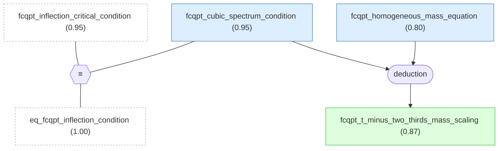

#### fcqpt_cubic_spectrum_condition

📌 `fcqpt_cubic_spectrum_condition`   |   Prior: 0.80   |   Belief: **0.95**

> At the fermion-condensation quantum phase transition point in a homogeneous heavy-fermion liquid, the first two momentum derivatives of the single-particle spectrum vanish at the Fermi momentum p_F, so the spectrum has an inflection point at p_F and the leading nonzero Taylor term is proportional to (p-p_F)^3 [@Shaginyan2009].

#### fcqpt_homogeneous_mass_equation

📌 `fcqpt_homogeneous_mass_equation`   |   Prior: 0.78   |   Belief: **0.80**

> At FCQPT, writing n_1(p,T)=n(p,T)-n(p) transforms the Landau effective-mass equation into a form where the zero-temperature inverse effective-mass term vanishes; the resulting homogeneous low-temperature equation has the solution M*(T) proportional to T^(-2/3) [@Shaginyan2009].

#### fcqpt_t_minus_two_thirds_mass_scaling ★

📌 `fcqpt_t_minus_two_thirds_mass_scaling`   |   Belief: **0.87**

> At FCQPT, where the zero-temperature effective mass diverges and the Landau effective-mass equation becomes homogeneous, the low-temperature solution for a homogeneous heavy-fermion liquid satisfies M*(T) proportional to T^(-2/3); in the non-Fermi-liquid regime near FCQPT, the quasiparticle effective mass therefore decreases with increasing temperature according to this power law [@Shaginyan2009].

🔗 **deduction**([fcqpt_cubic_spectrum_condition](#fcqpt_cubic_spectrum_condition), [fcqpt_homogeneous_mass_equation](#fcqpt_homogeneous_mass_equation))

Reasoning

1. Treat the exact inverse effective-mass relation as known and introduce the finite-temperature quasiparticle-distribution deviation n_1(p,T)=n(p,T)-n(p).
2. Invoke the FCQPT condition where the zero-temperature effective mass diverges, making the zero-temperature inverse-mass term vanish and the finite-temperature equation homogeneous.
3. Use the asymptotic low-temperature solution of the homogeneous equation, M*(T) proportional to T^(-2/3), as the non-Fermi-liquid FCQPT effective-mass law.
4. Note that away from FCQPT the system has finite-M*(0) Landau-Fermi-liquid behavior at low T, so the T^(-2/3) law identifies the FCQPT/NFL regime.

## paper_friedemann2010 -- claims and deductions from Friedemann et al. 2010.

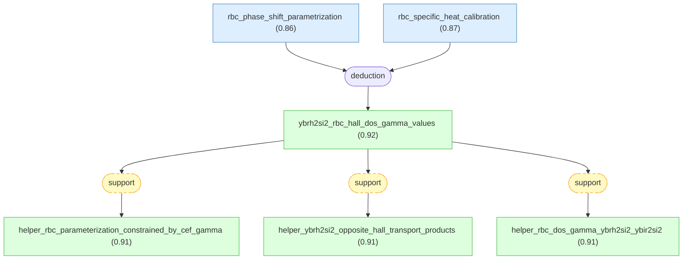

#### rbc_phase_shift_parametrization

📌 `rbc_phase_shift_parametrization`   |   Prior: 0.82   |   Belief: **0.86**

> For YbRh2Si2 heavy-fermion renormalized-band calculations, Friedemann et al. 2010 use a renormalized-band method in which the low-energy local 4f contribution is represented by resonance-type phase shifts for crystalline-electric-field eigenstates; the resonance centers are split by measured CEF excitation energies, and a single positive resonance-width parameter controls the quasiparticle mass renormalization and associated Fermi-surface and transport changes [@Friedemann2010].

#### rbc_specific_heat_calibration

📌 `rbc_specific_heat_calibration`   |   Prior: 0.76   |   Belief: **0.87**

> In the Friedemann et al. 2010 renormalized-band parametrization for YbRh2Si2 and related heavy-fermion compounds, the single resonance-width parameter is adjusted so that the computed quasiparticle density of states at the Fermi level reproduces the experimentally measured low-temperature electronic specific-heat coefficient; the LKM chain treats this thermodynamic calibration as making the calculated quasiparticle masses, Fermi-surface occupations, and reduced transport integrals reliable indicators of low-temperature transport tendencies [@Friedemann2010].

#### ybrh2si2_rbc_hall_dos_gamma_values ★

📌 `ybrh2si2_rbc_hall_dos_gamma_values`   |   Belief: **0.92**

> Renormalized-band calculations constrained by experimental CEF energies and low-temperature specific heat produce two dominant quasiparticle bands for YbRh2Si2 with opposite-sign reduced transverse transport products: band 1 (donut) remains holelike with \bar{n}(1)\bar{\sigma}_{xyz}(1)=+0.0037675, while band 2 (jungle-gym) becomes predominantly electronlike with \bar{n}(2)\bar{\sigma}_{xyz}(2)=-0.0041076, so their nearly equal magnitudes strongly cancel in the numerator of the low-field Hall coefficient. The same calculation gives N(E_F)~=290 states/(eV unit cell) and gamma~=680 mJ mol^-1 K^-2 for YbRh2Si2, and N(E_F)~=48 states/(eV unit cell) and gamma~=113 mJ mol^-1 K^-2 for YbIr2Si2 [@Friedemann2010].

🔗 **deduction**([rbc_phase_shift_parametrization](#rbc_phase_shift_parametrization), [rbc_specific_heat_calibration](#rbc_specific_heat_calibration))

Reasoning

1. Start from the established upstream result that two principal bands (donut $i=1$ and jungle-gym $i=2$) dominate the Hall transport integrals, and aim to determine how inclusion of $4f$-derived quasiparticles in a renormalized-band calculation (RBC) modifies the band-resolved transport integrals and their signs.
2. Summarize the renormalized band method inputs and parameter determination: transform the $4f$ states into crystalline-electric-field (CEF) eigenstates $|m\rangle$ and introduce resonance-type phase shifts
$\widetilde{\eta}_{f}(E)\simeq\arctan\dfrac{\widetilde{\Delta}_{f}}{E-\widetilde{\epsilon}_{f}}$,
where $\widetilde{\Delta}_{f}$ is the resonance width accounting for the renormalized quasiparticle mass and $\widetilde{\epsilon}_{f}$ the position of the $f$-derived band center; the CEF-split resonance centers are $\widetilde{\epsilon}_{fm}=\widetilde{\epsilon}_{f}+\delta_{m}$ (for the Yb hole analog the sign convention leads to $\widetilde{\epsilon}_{f}<0$ and $\widetilde{\epsilon}_{fm}=\widetilde{\epsilon}_{f}-\delta_{m}$). The single free parameter $\widetilde{\Delta}_{f}$ is fixed by reproducing the experimentally observed low-temperature linear-in-$T$ specific-heat coefficient, thereby grounding the RBC parametrization in thermodynamic data.
[24]
3. Compute the renormalized band dispersions $E(i,\mathbf{k})$ using the RBC Hamiltonian and the experimental CEF scheme and resonance widths; from these dispersions evaluate the band-resolved reduced transport integrals $\bar{\sigma}_{xx}(i)$ and $\bar{\sigma}_{xyz}(i)$ as defined by the decomposition
$\sigma_{xx}(i)=\sigma(i)\bar{\sigma}_{xx}(i)$ and $\sigma_{xyz}(i)=\sigma_{B}(i)\bar{\sigma}_{xyz}(i)$
with the prefactors $\sigma(i)=\dfrac{e^{2}}{m}\pi(i)\bar{n}(i)$ and $\sigma_{B}(i)=\dfrac{|e|^{3}}{m^{2}c}[\pi(i)]^{2}\bar{n}(i)$ and $\bar{n}(i)$ the band occupation per unit cell. This defines the reduced-transport products $\bar{n}(i)\bar{\sigma}_{xyz}(i)$ which directly enter the numerator of the Hall coefficient.
(Equations reproduced from the transport decomposition in the paper.)
4. Report the numerical RBC results for YbRh$_2$Si$_2$: the renormalized-band calculation yields for band 1 (donut) a positive reduced transverse transport product $\bar{n}(1)\bar{\sigma}_{xyz}(1)=+0.0037675$ and for band 2 (jungle-gym) a negative product $\bar{n}(2)\bar{\sigma}_{xyz}(2)=-0.0041076$ as listed in the transport-results Table I. These opposite signs indicate that band 1 remains predominantly holelike while band 2 becomes predominantly electronlike in the heavy-Fermi-liquid limit. The near equality in magnitude implies strong cancellation when summing the two contributions in the numerator of $R_{H}$.
Table I
5. State the RBC prediction for the renormalized density of states at the Fermi energy and its thermodynamic implication: for YbRh$_2$Si$_2$ the RBC yields $N(E_{F})\approx 290\ \mathrm{states/(eV\ unit\ cell)}$, which corresponds (via the standard relation between DOS and the Sommerfeld coefficient for the electronic specific heat) to a Sommerfeld coefficient $\gamma\approx680\ \mathrm{mJ\ mol^{-1}K^{-2}}$; for YbIr$_2$Si$_2$ RBC gives $N(E_{F})\approx48\ \mathrm{states/(eV\ unit\ cell)}$ and $\gamma\approx113\ \mathrm{mJ\ mol^{-1}K^{-2}}$. These values follow from the calculated renormalized quasiparticle DOS displayed in the RBC results.
Fig. 4
6. Conclude that in the heavy-Fermi-liquid limit the RBC produces two dominant bands with opposite Hall character for YbRh$_2$Si$_2$, with nearly compensating contributions to the Hall numerator (the products $\bar{n}(i)\bar{\sigma}_{xyz}(i)$ are close in magnitude and opposite in sign), thereby explaining why the total Hall coefficient is expected to be small and highly sensitive to weighting factors (such as band-dependent relaxation times). This explains the RBC-based mechanistic origin of cancellation and near-compensation observed in the numerical transport integrals.
Table I

#### helper_rbc_parameterization_constrained_by_cef_gamma

📌 `helper_rbc_parameterization_constrained_by_cef_gamma`   |   Belief: **0.91**

> In the Friedemann et al. 2010 YbRh2Si2 renormalized-band calculation, experimental CEF excitation energies set the resonance-center splittings and the single resonance-width parameter is fixed by reproducing the low-temperature specific-heat coefficient, making the calculation a material-specific thermodynamically constrained RBC parametrization [@Friedemann2010].

🔗 **support**([ybrh2si2_rbc_hall_dos_gamma_values](#ybrh2si2_rbc_hall_dos_gamma_values))

Reasoning

The root LKM claim explicitly states that the RBC incorporates CEF excitation energies from experiment and adjusts the resonance width to reproduce the low-temperature specific-heat coefficient; this helper isolates that method/parameterization component.

#### helper_ybrh2si2_opposite_hall_transport_products

📌 `helper_ybrh2si2_opposite_hall_transport_products`   |   Belief: **0.91**

> For YbRh2Si2 in the Friedemann et al. 2010 heavy-Fermi-liquid RBC calculation, the band-resolved products entering the Hall numerator have opposite signs and nearly equal magnitudes: +0.0037675 for the donut band and -0.0041076 for the jungle-gym band, implying strong cancellation in the low-field Hall coefficient numerator [@Friedemann2010].

🔗 **support**([ybrh2si2_rbc_hall_dos_gamma_values](#ybrh2si2_rbc_hall_dos_gamma_values))

Reasoning

The root LKM claim and factor step 4 explicitly give the YbRh2Si2 band-1 and band-2 reduced transverse transport products and their opposite signs; this helper isolates the Hall-cancellation component.

#### helper_rbc_dos_gamma_ybrh2si2_ybir2si2

📌 `helper_rbc_dos_gamma_ybrh2si2_ybir2si2`   |   Belief: **0.91**

> The Friedemann et al. 2010 RBC density-of-states calculation gives N(E_F)~=290 states/(eV unit cell) and gamma~=680 mJ mol^-1 K^-2 for YbRh2Si2, while the same RBC parametrization gives N(E_F)~=48 states/(eV unit cell) and gamma~=113 mJ mol^-1 K^-2 for YbIr2Si2 [@Friedemann2010].

🔗 **support**([ybrh2si2_rbc_hall_dos_gamma_values](#ybrh2si2_rbc_hall_dos_gamma_values))

Reasoning

The root LKM claim and factor step 5 explicitly give the RBC density-of-states and Sommerfeld-coefficient values for YbRh2Si2 and YbIr2Si2; this helper isolates the DOS/gamma component.

## paper_knebel2006 -- claims and deductions from Knebel et al. 2006.

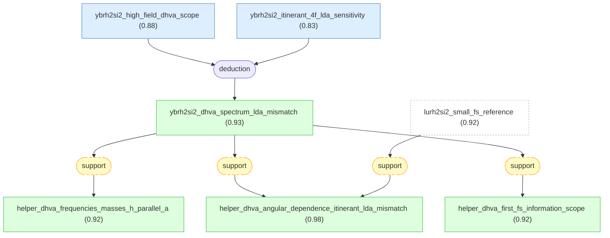

#### ybrh2si2_high_field_dhva_scope

📌 `ybrh2si2_high_field_dhva_scope`   |   Prior: 0.84   |   Belief: **0.88**

> In Knebel et al. 2006, the YbRh2Si2 de Haas-van Alphen frequencies and cyclotron masses are measured on high-quality single crystals in steady fields from 12 T to 28 T with H parallel to the crystallographic a axis; because such high fields can polarize the system, suppress correlations, or shift bands, this high-field dHvA spectrum need not coincide with the zero- or low-field Fermi surface most directly relevant to the YbRh2Si2 quantum-critical regime [@Knebel2006].

#### ybrh2si2_itinerant_4f_lda_sensitivity

📌 `ybrh2si2_itinerant_4f_lda_sensitivity`   |   Prior: 0.78   |   Belief: **0.83**

> For YbRh2Si2, Knebel et al. 2006 report that LDA/FLAPW band-structure calculations with all 4f electrons treated as itinerant are sensitive to calculational details and to the assumed 4f energy position, making the predicted 4f-derived Fermi-surface topology and angular dependence unreliable enough that an experiment-theory mismatch need not by itself prove intrinsic 4f localization [@Knebel2006].

#### ybrh2si2_dhva_spectrum_lda_mismatch ★

📌 `ybrh2si2_dhva_spectrum_lda_mismatch`   |   Belief: **0.93**

> For high-quality YbRh2Si2 single crystals measured by de Haas-van Alphen torque magnetometry in steady fields of 12-28 T with H parallel a, Knebel et al. 2006 observe four fundamental frequencies, 2730 T, 3510 T, 5370 T, and 7050 T, with cyclotron masses (15.0 +/- 0.7) m_e, (8.4 +/- 0.2) m_e, (10.1 +/- 0.2) m_e, and (14.9 +/- 0.9) m_e. The measured basal-plane angular dependence is inconsistent with itinerant-4f LDA/FLAPW calculations for YbRh2Si2 and instead qualitatively resembles LuRh2Si2 LDA calculations with 4f states below the Fermi energy, giving the first experimental Fermi-surface information for YbRh2Si2 and exposing a significant mismatch with one itinerant-4f LDA prediction set [@Knebel2006].

🔗 **deduction**([ybrh2si2_high_field_dhva_scope](#ybrh2si2_high_field_dhva_scope), [ybrh2si2_itinerant_4f_lda_sensitivity](#ybrh2si2_itinerant_4f_lda_sensitivity))

Reasoning

1. Start from the upstream established result: accept as already established the upstream conclusion that LDA band-structure calculations place significant sensitivity of predicted Fermi-surface angular dependence to the $4f$ position and that itinerant-4f LDA angular dependence does not match experiment (upstream conclusion known and available for use).
2. Define experimental method and conditions for the quantum-oscillation measurements: de Haas–van Alphen (dHvA) measurements were performed on highest-quality single crystals (RRR $\approx300$) at ambient pressure using a cantilever torque meter in steady magnetic fields between $12$ and $28\ \mathrm{T}$ with a dilution refrigerator base temperature of $30\ \mathrm{mK}$; the magnetic field was applied parallel to the crystallographic $a$ axis ($H\parallel a$) for the principal data set.
3. Report the observed dHvA frequency spectrum and its extraction: the oscillatory torque signal for $H\parallel a$ shows reproducible oscillations whose Fourier transform yields four unambiguous frequencies at $2730\ \mathrm{T}$, $3510\ \mathrm{T}$, $5370\ \mathrm{T}$, and $7050\ \mathrm{T}$ from a field window $12$–$28\ \mathrm{T}$; these frequencies correspond to extremal cross-sectional areas of Fermi-surface orbits according to the Onsager relation (frequency $F$ in tesla proportional to extremal area).
Fig.7
4. Describe how effective masses were determined and report the numerical values: the temperature dependence of each oscillation amplitude follows the Lifshitz–Kosevich thermal damping factor, and fitting that temperature dependence yields cyclotron effective masses $m^{\ast}$ of $(15.0\pm0.7)\,m_{e}$ for $2730\ \mathrm{T}$, $(8.4\pm0.2)\,m_{e}$ for $3510\ \mathrm{T}$, $(10.1\pm0.2)\,m_{e}$ for $5370\ \mathrm{T}$, and $(14.9\pm0.9)\,m_{e}$ for $7050\ \mathrm{T}$, where $m_{e}$ is the free-electron mass.
Fig.7
5. Report the angular dependence of the observed frequencies within the basal plane: the two extreme frequencies (lowest and highest) are observable over the full angular sweep in the basal plane while the two intermediate frequencies are detectable only at small angles near $H\parallel a$; the measured angular dependence of the observed dHvA frequencies in the basal plane is plotted and shows a specific angular variation that is compared to calculated angular dependencies.
Fig.8
6. Compare experimental angular dependence and frequencies with band-structure calculations and note the mismatch: the experimentally observed frequencies (all in the few-kilotesla range) and their angular evolution are inconsistent with the LDA-calculated angular dependences for $YbRh_{2}Si_{2}$ in which itinerant $4f$ electrons produce calculated frequencies mostly below $1\ \mathrm{kT}$ or above $10\ \mathrm{kT}$, and the shapes of the calculated angular dependencies differ markedly from experiment; by contrast, LDA calculations for $LuRh_{2}Si_{2}$ (where $4f$ are well below $E_{\mathrm{F}}$) produce an angular dependence that shows qualitative similarity to the measured angular dependence, indicating that the measured spectrum does not match itinerant-4f predictions but resembles a Lu-like $4f$-localized reference.
Fig.9; Fig.11
7. Conclude the significance of the dHvA measurements: these dHvA frequencies and extracted effective masses constitute the first experimental Fermi-surface information for $YbRh_{2}Si_{2}$; the measured oscillation spectrum and heavy effective masses reveal a significant mismatch with itinerant-4f LDA band-structure predictions, thereby providing experimental constraints that point to intermediate valence and sensitivity of the $4f$ contribution rather than the simple itinerant-$4f$ LDA picture.
Fig.7; Fig.8; Fig.9; Fig.11

#### helper_dhva_frequencies_masses_h_parallel_a

📌 `helper_dhva_frequencies_masses_h_parallel_a`   |   Belief: **0.92**

> For YbRh2Si2 at H parallel a in the 12-28 T dHvA window, Knebel et al. 2006 resolve four fundamental oscillation frequencies: 2730 T with m*=(15.0 +/- 0.7) m_e, 3510 T with m*=(8.4 +/- 0.2) m_e, 5370 T with m*=(10.1 +/- 0.2) m_e, and 7050 T with m*=(14.9 +/- 0.9) m_e [@Knebel2006].

🔗 **support**([ybrh2si2_dhva_spectrum_lda_mismatch](#ybrh2si2_dhva_spectrum_lda_mismatch))

Reasoning

The selected root explicitly reports the four H-parallel-a frequencies and cyclotron masses; this helper isolates the experimental quantum-oscillation measurement component without adding independent evidence.

#### helper_dhva_angular_dependence_itinerant_lda_mismatch

📌 `helper_dhva_angular_dependence_itinerant_lda_mismatch`   |   Belief: **0.98**

> For YbRh2Si2, the basal-plane angular evolution of the measured dHvA frequencies in Knebel et al. 2006 does not match the LDA/FLAPW angular dependences calculated with itinerant Yb 4f electrons, whose calculated orbits fall mostly below 1 kT or above 10 kT and have markedly different angular shapes; the measured angular dependence instead qualitatively resembles LuRh2Si2 LDA calculations where 4f states lie below the Fermi energy [@Knebel2006].

🔗 **support**([lurh2si2_small_fs_reference](#lurh2si2_small_fs_reference))

Reasoning

Friedemann 2013 LKM evidence establishes LuRh2Si2 as a small-FS reference for YbRh2Si2; Knebel 2006 LKM evidence reports that the YbRh2Si2 dHvA angular dependence resembles the LuRh2Si2 reference more than itinerant-4f YbRh2Si2 LDA. The source claims therefore connect through the same LuRh2Si2-reference comparison.

#### helper_dhva_first_fs_information_scope

📌 `helper_dhva_first_fs_information_scope`   |   Belief: **0.92**

> The Knebel et al. 2006 dHvA frequencies and heavy cyclotron masses constitute first experimental Fermi-surface information for YbRh2Si2, but the selected LKM chain also records a high-field scope caution and an itinerant-4f LDA-method sensitivity caution when using those data to infer low-field quantum-critical 4f localization [@Knebel2006].

🔗 **support**([ybrh2si2_dhva_spectrum_lda_mismatch](#ybrh2si2_dhva_spectrum_lda_mismatch))

Reasoning

The selected root says the measurements provide first experimental Fermi-surface information, while the same chain's premises caution that high-field data and itinerant-4f LDA details limit direct low-field quantum-critical interpretation.

## paper_friedemann2013 -- claims and deductions from Friedemann et al. 2013.

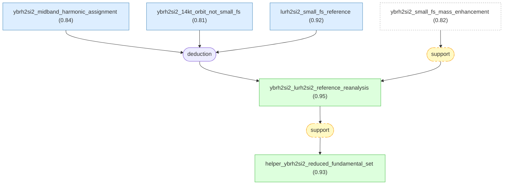

#### ybrh2si2_midband_harmonic_assignment

📌 `ybrh2si2_midband_harmonic_assignment`   |   Prior: 0.78   |   Belief: **0.84**

> In the Friedemann et al. 2013 re-examination of published field-modulation dHvA data on YbRh2Si2, if the angular dependences of observed 5-7 kT peaks match two times lower-frequency branches below 4 kT and the method preferentially enhances harmonics, then the 5-7 kT peaks can be assigned as second, and in some cases higher, harmonics of lower-frequency fundamentals rather than independent fundamental orbits; the assignment is reported as consistent with tabulated frequency and mass comparisons from the published data [@Friedemann2013].

#### ybrh2si2_14kt_orbit_not_small_fs

📌 `ybrh2si2_14kt_orbit_not_small_fs`   |   Prior: 0.74   |   Belief: **0.81**

> For YbRh2Si2 with fields along the (100) direction, Friedemann et al. 2013 define the "small" Fermi surface as an LDA/GGA band-structure calculation in which Yb 4f electrons are core-like and non-hybridizing; if the refined z_Si=0.379 c small-Fermi-surface calculation has no extremal orbit near 14 kT and the measured F_14 ~= 14 kT dHvA peak is an independent fundamental, then the observed 14 kT orbit indicates itinerant Yb 4f participation under the high-field measurement conditions, provided instrumental, magnetic-breakdown, or misassignment alternatives are unlikely [@Friedemann2013].

#### lurh2si2_small_fs_reference

📌 `lurh2si2_small_fs_reference`   |   Prior: 0.84   |   Belief: **0.92**

> Friedemann et al. 2013 treat LuRh2Si2 as an isostructural, filled-4f-shell reference for the "small" Fermi surface of YbRh2Si2 with core-like non-hybridizing Yb 4f electrons, because the Lu and Yb compounds have nearly identical lattice parameters and non-f conduction-band characters when computed and measured using the experimental z_Si=0.379 c structure [@Friedemann2013].

#### ybrh2si2_lurh2si2_reference_reanalysis ★

📌 `ybrh2si2_lurh2si2_reference_reanalysis`   |   Belief: **0.95**

> Re-examining published YbRh2Si2 de Haas-van Alphen measurements with the refined LuRh2Si2 "small" Fermi-surface reference calculated at z_Si=0.379 c supports reclassifying published 5-7 kT spectral peaks as harmonics of lower-frequency fundamentals below 4 kT, leaving independent fundamentals below 4 kT plus a distinct high-frequency fundamental near 14 kT; because the refined small-Fermi-surface LDA/GGA calculation with core-like non-hybridizing Yb 4f electrons has no (100)-field orbit near 14 kT, the independent 14 kT experimental orbit supports itinerant Yb 4f contribution to the high-field YbRh2Si2 Fermi surface rather than fully localized 4f behavior [@Friedemann2013].

🔗 **support**([ybrh2si2_small_fs_mass_enhancement](#ybrh2si2_small_fs_mass_enhancement))

Reasoning

Rourke 2008 supplies chain-backed high-field dHvA evidence that a LuRh2Si2-like small-FS D sheet matches observed YbRh2Si2 branches and implies order-ten mass enhancement. Friedemann 2013 reuses the LuRh2Si2 small-FS reference to reinterpret YbRh2Si2 dHvA branches, so the former supports the latter's reference-frame choice.

#### helper_ybrh2si2_reduced_fundamental_set

📌 `helper_ybrh2si2_reduced_fundamental_set`   |   Belief: **0.93**

> After the harmonic reassignment in Friedemann et al. 2013, the independent YbRh2Si2 dHvA frequencies retained by the analysis consist of lower-frequency fundamentals below 4 kT plus a distinct high-frequency fundamental near 14 kT [@Friedemann2013].

🔗 **support**([ybrh2si2_lurh2si2_reference_reanalysis](#ybrh2si2_lurh2si2_reference_reanalysis))

Reasoning

The root LKM claim and factor step 3 explicitly state the reduced set of independent YbRh2Si2 fundamentals after the harmonic reassignment.

## paper_tokiwa2004 -- high-field suppression of YbRh2Si2 effective mass.

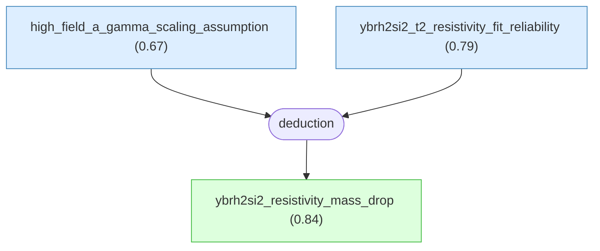

#### high_field_a_gamma_scaling_assumption

📌 `high_field_a_gamma_scaling_assumption`   |   Prior: 0.62   |   Belief: **0.67**

> For YbRh2Si2, using the low-field empirical scaling A proportional to gamma^2 to estimate gamma at 16 T assumes that the same A/gamma^2 proportionality established up to about 4 T continues to hold at much higher fields [@Tokiwa2004].

#### ybrh2si2_t2_resistivity_fit_reliability

📌 `ybrh2si2_t2_resistivity_fit_reliability`   |   Prior: 0.76   |   Belief: **0.79**

> Four-terminal AC resistivity measurements on YbRh2Si2 single crystals fit rho(T,B)=rho0(B)+A(B)T^2 over the reported low-temperature intervals; the LKM chain assumes the fitted A(B) values are reliable enough that systematic finite-temperature and sample effects are small compared with the observed step-like change across B* [@Tokiwa2004].

#### ybrh2si2_resistivity_mass_drop ★

📌 `ybrh2si2_resistivity_mass_drop`   |   Belief: **0.84**

> For YbRh2Si2 with B perpendicular to c and B>0.06 T, low-temperature resistivity follows rho(T,B)=rho0(B)+A(B)T^2; A(B) drops drastically when B crosses B*=(9.5 +/- 0.5) T, indicating a step-like effective-mass decrease in a Fermi-liquid picture, and the low-field A proportional to gamma^2 scaling estimates gamma(16 T) near 70 mJ mol^-1 K^-2 [@Tokiwa2004].

🔗 **deduction**([high_field_a_gamma_scaling_assumption](#high_field_a_gamma_scaling_assumption), [ybrh2si2_t2_resistivity_fit_reliability](#ybrh2si2_t2_resistivity_fit_reliability))

Reasoning

1. Treat the broadened anomaly at B* about 9.5 T and its susceptibility, magnetostriction, and magnetization signatures as prior context.
2. Define the Landau-Fermi-liquid resistivity form rho(T,B)=rho0+A(B)T^2 for B>0.06 T with B perpendicular to c.
3. Fit low-temperature resistivity data to extract A(B).
4. Observe a drastic step-like decrease of A(B) when B crosses B*.
5. Use the earlier empirical YbRh2Si2 relation A proportional to gamma^2.
6. Apply the same A/gamma^2 constant at high field to estimate gamma(16 T) near 70 mJ mol^-1 K^-2.
7. Conclude that the A(B) drop indicates a step-like quasiparticle effective-mass decrease in the Fermi-liquid picture.

## paper_seiro2017 -- Kondo-lattice coherence hierarchy in YbRh2Si2.

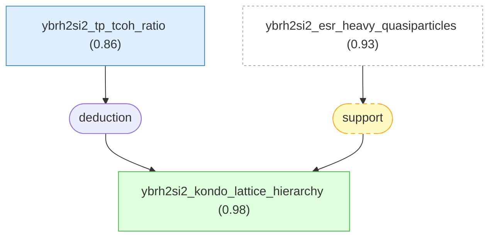

#### ybrh2si2_tp_tcoh_ratio

📌 `ybrh2si2_tp_tcoh_ratio`   |   Prior: 0.78   |   Belief: **0.86**

> For stoichiometric YbRh2Si2, assigning T_coh approximately T_K approximately 25-30 K and extracting T_P approximately 3.3 K gives T_P/T_coh approximately 0.11; the LKM chain treats this hierarchy as meaningful for separating lattice-Kondo-dominated behavior from the onset of single-ion Kondo/coherence signatures [@Seiro2017].

#### ybrh2si2_kondo_lattice_hierarchy ★

📌 `ybrh2si2_kondo_lattice_hierarchy`   |   Belief: **0.98**

> In stoichiometric YbRh2Si2, lattice Kondo correlations are detectable around T_coh approximately T_K approximately 25-30 K, but they dominate low-energy electronic properties only below T_P approximately 3.3 K, about 0.1*T_coh; single-ion Kondo effects therefore persist well below T_coh before lattice coherence enables the observed non-Fermi-liquid quantum-critical behavior [@Seiro2017].

🔗 **support**([ybrh2si2_esr_heavy_quasiparticles](#ybrh2si2_esr_heavy_quasiparticles))

Reasoning

The ESR LKM chain identifies coherent heavy quasiparticles below the single-ion Kondo scale and ties ESR observables to m*(B,T). That evidence supports Seiro 2017's chain-backed separation between Kondo onset and the lower-temperature lattice-dominated regime.

## paper_schaufuss2008 -- ESR access to YbRh2Si2 heavy quasiparticles.

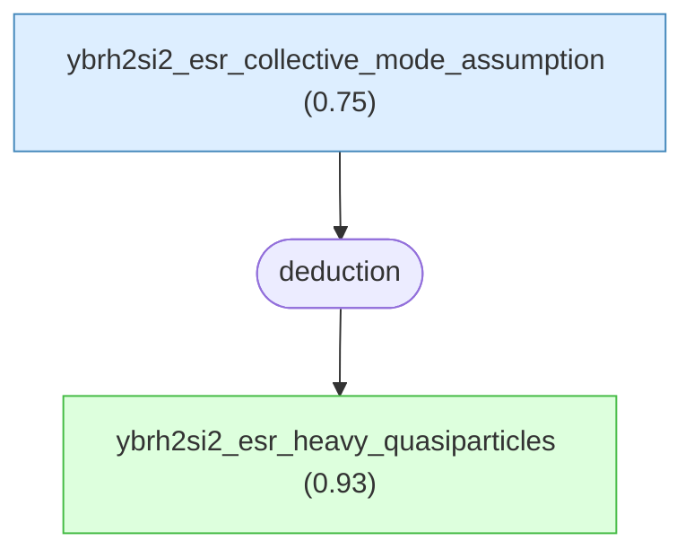

#### ybrh2si2_esr_collective_mode_assumption

📌 `ybrh2si2_esr_collective_mode_assumption`   |   Prior: 0.68   |   Belief: **0.75**

> Identifying the YbRh2Si2 ESR line as a collective heavy-quasiparticle resonance rests on empirical ESR/thermodynamic/NMR crossovers and on many-body narrowing proposals, while requiring alternatives such as residual localized Yb3+ ESR or conventional conduction-electron spin resonance to be excluded in the same temperature-field domain [@Schaufuss2008].

#### ybrh2si2_esr_heavy_quasiparticles ★

📌 `ybrh2si2_esr_heavy_quasiparticles`   |   Belief: **0.93**

> In YbRh2Si2, the anisotropic persistent ESR line, g-factor behavior tracking gamma=C_el/T and NMR observables, and low-temperature T^2 linewidth behavior show that ESR is a resonance of coherent heavy quasiparticles formed below T_K approximately T_0 approximately 25 K; ESR parameters are governed by m*(B,T), N(E_F;B,T), and quasiparticle spin relaxation, giving access to Kondo-state evolution and NFL-to-LFL crossover behavior [@Schaufuss2008].

🔗 **deduction**([ybrh2si2_esr_collective_mode_assumption](#ybrh2si2_esr_collective_mode_assumption))

Reasoning

1. Start from the observed anisotropic ESR resonance, the ESR g-factor crossover that tracks gamma and NMR quantities, and the ESR linewidth crossover to low-temperature T^2 behavior.
2. Identify ESR as a heavy-quasiparticle collective resonance below T0 about 25 K using empirical crossovers and many-body-narrowing proposals.
3. Relate resonance field/g-factor and linewidth to m*(B,T), N(E_F;B,T), and quasiparticle spin relaxation.
4. Exclude local-moment, conventional conduction-electron, and bottleneck alternatives within the same temperature-field domain.
5. Conclude that ESR probes Kondo-state evolution and the NFL-to-LFL crossover in YbRh2Si2.

## paper_pfau2013 -- high-field Kondo suppression and Lifshitz interplay.

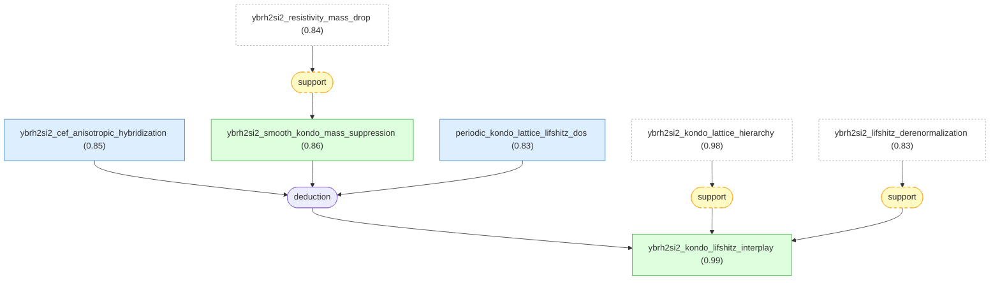

#### ybrh2si2_cef_anisotropic_hybridization

📌 `ybrh2si2_cef_anisotropic_hybridization`   |   Prior: 0.78   |   Belief: **0.85**

> In tetragonal YbRh2Si2, CEF ground-state symmetry of the Yb3+ 4f ion produces strongly anisotropic 4f-conduction hybridization and enhanced quasiparticle g-factor anisotropy, making particular f-derived bands sensitive to magnetic-field-driven Zeeman shifts [@Pfau2013].

#### ybrh2si2_smooth_kondo_mass_suppression

📌 `ybrh2si2_smooth_kondo_mass_suppression`   |   Belief: **0.86**

> For Yb-based Kondo systems in fields of order the single-ion Kondo scale, local Kondo screening is suppressed continuously with B, producing a continuous decrease of quasiparticle effective mass m*(B), so field mainly reduces Kondo correlations smoothly rather than abruptly localizing the 4f electrons [@Pfau2013].

🔗 **support**([ybrh2si2_resistivity_mass_drop](#ybrh2si2_resistivity_mass_drop))

Reasoning

Tokiwa 2004 reports a high-field reduction of the YbRh2Si2 Fermi-liquid A coefficient and the inferred effective-mass scale. Pfau 2013 uses field-driven Kondo suppression as the mass-reduction ingredient in the same material and field regime, so the transport mass evidence supports that ingredient while preserving the step-like versus smooth distinction in the audit log.

#### periodic_kondo_lattice_lifshitz_dos

📌 `periodic_kondo_lattice_lifshitz_dos`   |   Prior: 0.76   |   Belief: **0.83**

> In a periodic Kondo lattice, coherent hybridized quasiparticle bands can contain sharp van-Hove-type DOS peaks or flattened dispersions; Zeeman spin splitting can move these features through the Fermi energy and cause discrete Lifshitz transitions even while overall mass renormalization is reduced smoothly [@Pfau2013].

#### ybrh2si2_kondo_lifshitz_interplay ★

📌 `ybrh2si2_kondo_lifshitz_interplay`   |   Belief: **0.99**

> YbRh2Si2 high-field phenomenology is explained by the interplay of CEF-induced anisotropic hybridization and g-factor anisotropy, smooth field suppression of Kondo screening that reduces m*(B), and Kondo-lattice coherence that creates van-Hove-type DOS structures whose Zeeman shifts produce successive Lifshitz transitions; this accounts for continuous mass reduction plus abrupt transport/thermodynamic anomalies [@Pfau2013].

🔗 **support**([ybrh2si2_lifshitz_derenormalization](#ybrh2si2_lifshitz_derenormalization))

Reasoning

Naren 2013 separately states the same YbRh2Si2 field phenomenology in a chain-backed form: narrow Lifshitz anomalies coexist with smoother Kondo de-renormalization. This directly supports Pfau 2013's combined Kondo-suppression/Lifshitz interpretation.

## paper_naren2013 -- Lifshitz transitions and de-renormalization in YbRh2Si2.

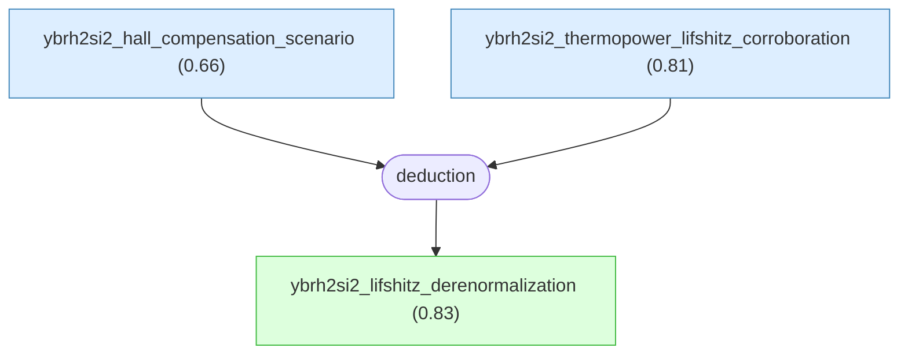

#### ybrh2si2_hall_compensation_scenario

📌 `ybrh2si2_hall_compensation_scenario`   |   Prior: 0.62   |   Belief: **0.66**

> In multiband YbRh2Si2, two Fermi-surface sheets undergoing Lifshitz transitions near similar fields can contribute Hall-coefficient changes of opposite sign and comparable magnitude, partially cancelling the total Hall response near B2; the LKM chain treats this as viable but not uniquely established by transport data [@Naren2013].

#### ybrh2si2_thermopower_lifshitz_corroboration

📌 `ybrh2si2_thermopower_lifshitz_corroboration`   |   Prior: 0.78   |   Belief: **0.81**

> Thermopower measurements on a YbRh2Si2 sample from the same growth batch as magnetotransport samples show anomalies near 9-11 T and around 9.5 T, corroborating that the magnetotransport anomalies have an electronic-structure origin such as Lifshitz transitions [@Naren2013].

#### ybrh2si2_lifshitz_derenormalization ★

📌 `ybrh2si2_lifshitz_derenormalization`   |   Belief: **0.83**

> Combining magnetoresistance and Hall data on YbRh2Si2 down to 50 mK and up to 15 T with field-dependent renormalized-band calculations assigns anomalies at B1 about 3 T, B2 about 9 T, and B3 about 11-11.5 T to Zeeman-driven Lifshitz transitions, while Kondo quasiparticle de-renormalization proceeds as a smoother crossover; sharp Fermi-surface topology changes and smooth Kondo-weight suppression therefore coexist with distinct field dependences [@Naren2013].

🔗 **deduction**([ybrh2si2_hall_compensation_scenario](#ybrh2si2_hall_compensation_scenario), [ybrh2si2_thermopower_lifshitz_corroboration](#ybrh2si2_thermopower_lifshitz_corroboration))

Reasoning

1. Use the multiband Hall-compensation scenario to explain why the intermediate B2 feature may appear weak in the total Hall coefficient.
2. Use thermopower anomalies near the same fields to corroborate the electronic-structure origin of the magnetotransport anomalies.
3. Combine magnetoresistance/Hall data with field-dependent renormalized-band calculations that track van-Hove peak positions and Fermi-surface topology.
4. Assign B1, B2, and B3 anomalies to Lifshitz transitions in heavy-fermion bands.
5. Distinguish these narrow topology changes from the broader smooth Kondo quasiparticle de-renormalization.
6. Conclude that YbRh2Si2 exhibits coexisting sharp Fermi-surface topology changes and smooth Kondo-weight suppression.

## paper_rourke2008 -- field dependence of the YbRh2Si2 Fermi surface.

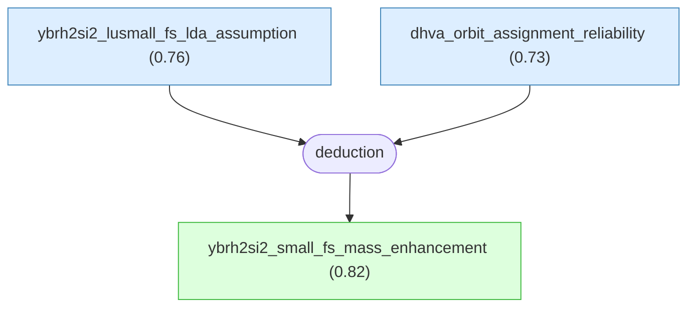

#### ybrh2si2_lusmall_fs_lda_assumption

📌 `ybrh2si2_lusmall_fs_lda_assumption`   |   Prior: 0.74   |   Belief: **0.76**

> Using LuRh2Si2 LDA+SOC Fermi-surface topology as a qualitative small-Fermi-surface guide for YbRh2Si2 assumes isostructural substitution and neglect of heavy-fermion correlations do not change the gross topology relevant to orbit identification [@Rourke2008].

#### dhva_orbit_assignment_reliability

📌 `dhva_orbit_assignment_reliability`   |   Prior: 0.70   |   Belief: **0.73**

> Assigning YbRh2Si2 observed dHvA branches to calculated small-Fermi-surface D-sheet orbits assumes the calculated angular dispersions are distinct, no unexpected pockets produce coincident frequencies, and branch visibility does not confound the mapping [@Rourke2008].

#### ybrh2si2_small_fs_mass_enhancement ★

📌 `ybrh2si2_small_fs_mass_enhancement`   |   Belief: **0.82**

> LDA+SOC calculations for LuRh2Si2 as the small-Fermi-surface analogue produce a D-sheet topology whose predicted orbits match YbRh2Si2 dHvA frequencies better than large-FS YbRh2Si2 LDA+SOC; comparing calculated band masses with measured cyclotron masses yields m*/m_b enhancements of order ten, consistent with strong many-body renormalization [@Rourke2008].

🔗 **deduction**([ybrh2si2_lusmall_fs_lda_assumption](#ybrh2si2_lusmall_fs_lda_assumption), [dhva_orbit_assignment_reliability](#dhva_orbit_assignment_reliability))

Reasoning

1. Perform all-itinerant LDA+SOC calculations for LuRh2Si2 as the small-FS analogue and YbRh2Si2 as the large-FS case.
2. Match observed YbRh2Si2 dHvA frequencies and angular dependences to calculated D-sheet hole orbits.
3. Note that the LuRh2Si2 small-FS topology matches the detected orbits better than the large-FS YbRh2Si2 calculation.
4. Compare measured cyclotron masses with calculated band masses.
5. Conclude that the observed branches carry mass enhancements of order ten, consistent with strong many-body renormalization.

## paper_friedemann2013_field -- many-body methods for YbRh2Si2 masses.

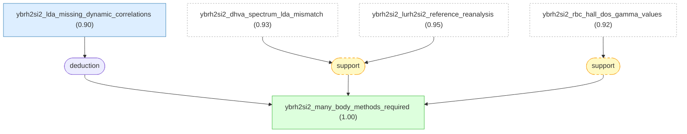

#### ybrh2si2_lda_missing_dynamic_correlations

📌 `ybrh2si2_lda_missing_dynamic_correlations`   |   Prior: 0.82   |   Belief: **0.90**

> YbRh2Si2 has strong local correlations and Kondo-driven heavy quasiparticles, seen through large Sommerfeld coefficients and strongly renormalized effective masses; conventional LDA lacks dynamic local correlations and Kondo renormalization, so many-body methods such as renormalized-band approaches or DMFT are required for quantitative Fermi-surface and mass descriptions [@Friedemann2013b].

#### ybrh2si2_many_body_methods_required ★

📌 `ybrh2si2_many_body_methods_required`   |   Belief: **1.00**

> Density-functional LDA calculations of YbRh2Si2 in both f-core small-FS and itinerant-4f large-FS variants fail to reproduce the complete set of quantum-oscillation branches and large quasiparticle masses, so quantitative YbRh2Si2 Fermi-surface and effective-mass modeling requires many-body approaches capturing local dynamic correlations and Kondo renormalization [@Friedemann2013b].

🔗 **support**([ybrh2si2_rbc_hall_dos_gamma_values](#ybrh2si2_rbc_hall_dos_gamma_values))

Reasoning

Friedemann 2010 provides LKM-backed renormalized-band calculations for YbRh2Si2 masses, DOS, and Hall transport. Friedemann 2013b concludes that quantitative YbRh2Si2 Fermi-surface and mass modeling requires many-body renormalization beyond static LDA. The RBC result is direct source evidence for the kind of many-body method named by that conclusion.

## cross_paper -- LKM-backed operators connecting the YbRh2Si2 graph.

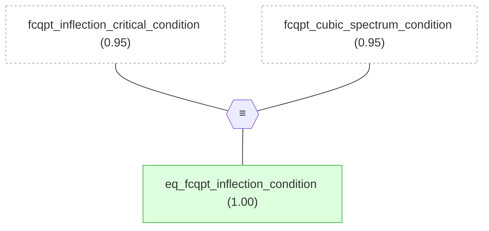

#### eq_fcqpt_inflection_condition

📌 `eq_fcqpt_inflection_condition`   |   Prior: 0.93   |   Belief: **1.00**

> same_truth(A, B)

## Inference Results

**BP converged:** True (2 iterations)

| Label | Type | Prior | Belief | Role |
|-------|------|-------|--------|------|
| [ybrh2si2_hall_compensation_scenario](#ybrh2si2_hall_compensation_scenario) | claim | 0.62 | 0.6633 | independent |
| [high_field_a_gamma_scaling_assumption](#high_field_a_gamma_scaling_assumption) | claim | 0.62 | 0.6677 | independent |
| [dhva_orbit_assignment_reliability](#dhva_orbit_assignment_reliability) | claim | 0.70 | 0.7285 | independent |
| [homogeneous_isotropic_heavy_liquid_model](#homogeneous_isotropic_heavy_liquid_model) | claim | 0.68 | 0.7375 | independent |
| [ybrh2si2_esr_collective_mode_assumption](#ybrh2si2_esr_collective_mode_assumption) | claim | 0.68 | 0.7531 | independent |
| [stable_landau_numerical_solutions](#stable_landau_numerical_solutions) | claim | 0.70 | 0.7539 | independent |
| [ybrh2si2_lusmall_fs_lda_assumption](#ybrh2si2_lusmall_fs_lda_assumption) | claim | 0.74 | 0.7647 | independent |
| [ybrh2si2_t2_resistivity_fit_reliability](#ybrh2si2_t2_resistivity_fit_reliability) | claim | 0.76 | 0.7901 | independent |
| [fcqpt_homogeneous_mass_equation](#fcqpt_homogeneous_mass_equation) | claim | 0.78 | 0.7968 | independent |
| [ybrh2si2_thermopower_lifshitz_corroboration](#ybrh2si2_thermopower_lifshitz_corroboration) | claim | 0.78 | 0.8051 | independent |
| [ybrh2si2_14kt_orbit_not_small_fs](#ybrh2si2_14kt_orbit_not_small_fs) | claim | 0.74 | 0.8101 | independent |
| [ybrh2si2_small_fs_mass_enhancement](#ybrh2si2_small_fs_mass_enhancement) | claim | — | 0.8192 | derived |
| [ybrh2si2_lifshitz_derenormalization](#ybrh2si2_lifshitz_derenormalization) | claim | — | 0.8276 | derived |
| [periodic_kondo_lattice_lifshitz_dos](#periodic_kondo_lattice_lifshitz_dos) | claim | 0.76 | 0.8310 | independent |
| [ybrh2si2_itinerant_4f_lda_sensitivity](#ybrh2si2_itinerant_4f_lda_sensitivity) | claim | 0.78 | 0.8312 | independent |
| [ybrh2si2_resistivity_mass_drop](#ybrh2si2_resistivity_mass_drop) | claim | — | 0.8360 | derived |
| [ybrh2si2_midband_harmonic_assignment](#ybrh2si2_midband_harmonic_assignment) | claim | 0.78 | 0.8393 | independent |
| [ybrh2si2_cef_anisotropic_hybridization](#ybrh2si2_cef_anisotropic_hybridization) | claim | 0.78 | 0.8451 | independent |
| [landau_mass_integral_relation](#landau_mass_integral_relation) | claim | 0.82 | 0.8523 | independent |
| [ybrh2si2_smooth_kondo_mass_suppression](#ybrh2si2_smooth_kondo_mass_suppression) | claim | — | 0.8600 | derived |
| [ybrh2si2_tp_tcoh_ratio](#ybrh2si2_tp_tcoh_ratio) | claim | 0.78 | 0.8605 | independent |
| [rbc_phase_shift_parametrization](#rbc_phase_shift_parametrization) | claim | 0.82 | 0.8644 | independent |
| [rbc_specific_heat_calibration](#rbc_specific_heat_calibration) | claim | 0.76 | 0.8672 | independent |
| [fcqpt_t_minus_two_thirds_mass_scaling](#fcqpt_t_minus_two_thirds_mass_scaling) | claim | — | 0.8730 | derived |
| [ybrh2si2_high_field_dhva_scope](#ybrh2si2_high_field_dhva_scope) | claim | 0.84 | 0.8772 | independent |
| [ybrh2si2_lda_missing_dynamic_correlations](#ybrh2si2_lda_missing_dynamic_correlations) | claim | 0.82 | 0.8960 | independent |
| [ybrh2si2_entropy_effective_mass_scheme](#ybrh2si2_entropy_effective_mass_scheme) | claim | — | 0.9101 | derived |
| [helper_rbc_dos_gamma_ybrh2si2_ybir2si2](#helper_rbc_dos_gamma_ybrh2si2_ybir2si2) | claim | — | 0.9125 | derived |
| [helper_rbc_parameterization_constrained_by_cef_gamma](#helper_rbc_parameterization_constrained_by_cef_gamma) | claim | — | 0.9125 | derived |
| [helper_ybrh2si2_opposite_hall_transport_products](#helper_ybrh2si2_opposite_hall_transport_products) | claim | — | 0.9125 | derived |
| [helper_dhva_first_fs_information_scope](#helper_dhva_first_fs_information_scope) | claim | — | 0.9157 | derived |
| [helper_dhva_frequencies_masses_h_parallel_a](#helper_dhva_frequencies_masses_h_parallel_a) | claim | — | 0.9157 | derived |
| [fermion_entropy_formula](#fermion_entropy_formula) | claim | 0.90 | 0.9180 | independent |
| [ybrh2si2_rbc_hall_dos_gamma_values](#ybrh2si2_rbc_hall_dos_gamma_values) | claim | — | 0.9186 | derived |
| [lurh2si2_small_fs_reference](#lurh2si2_small_fs_reference) | claim | 0.84 | 0.9248 | independent |
| [ybrh2si2_dhva_spectrum_lda_mismatch](#ybrh2si2_dhva_spectrum_lda_mismatch) | claim | — | 0.9257 | derived |
| [ybrh2si2_esr_heavy_quasiparticles](#ybrh2si2_esr_heavy_quasiparticles) | claim | — | 0.9259 | derived |
| [helper_ybrh2si2_reduced_fundamental_set](#helper_ybrh2si2_reduced_fundamental_set) | claim | — | 0.9284 | derived |
| [fcqpt_cubic_spectrum_condition](#fcqpt_cubic_spectrum_condition) | claim | 0.80 | 0.9456 | independent |
| [fcqpt_inflection_critical_condition](#fcqpt_inflection_critical_condition) | claim | 0.78 | 0.9456 | independent |
| [ybrh2si2_lurh2si2_reference_reanalysis](#ybrh2si2_lurh2si2_reference_reanalysis) | claim | — | 0.9539 | derived |
| [ybrh2si2_kondo_lattice_hierarchy](#ybrh2si2_kondo_lattice_hierarchy) | claim | — | 0.9818 | derived |
| [helper_dhva_angular_dependence_itinerant_lda_mismatch](#helper_dhva_angular_dependence_itinerant_lda_mismatch) | claim | — | 0.9827 | derived |
| [ybrh2si2_kondo_lifshitz_interplay](#ybrh2si2_kondo_lifshitz_interplay) | claim | — | 0.9875 | derived |
| [entropy_over_temperature_mass_proxy](#entropy_over_temperature_mass_proxy) | claim | 0.72 | 0.9940 | derived |
| [ybrh2si2_many_body_methods_required](#ybrh2si2_many_body_methods_required) | claim | — | 0.9961 | derived |
| [eq_fcqpt_inflection_condition](#eq_fcqpt_inflection_condition) | claim | 0.93 | 0.9996 | structural |
