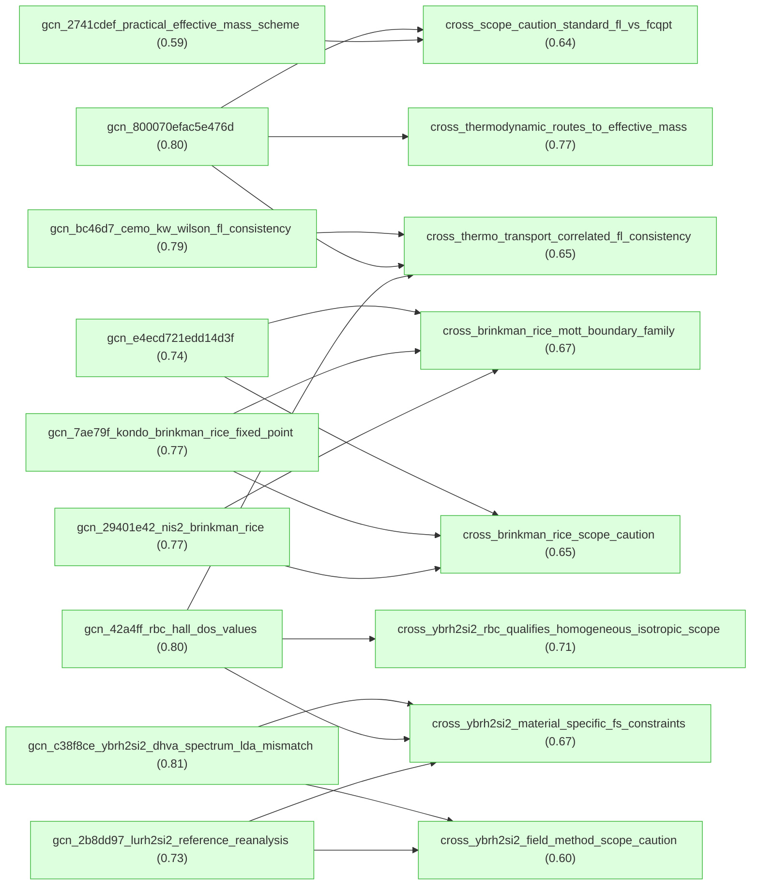
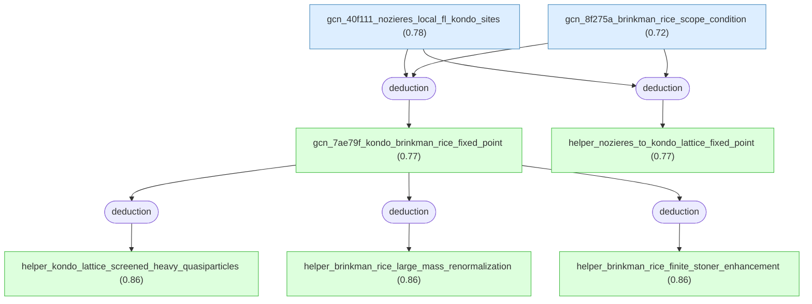
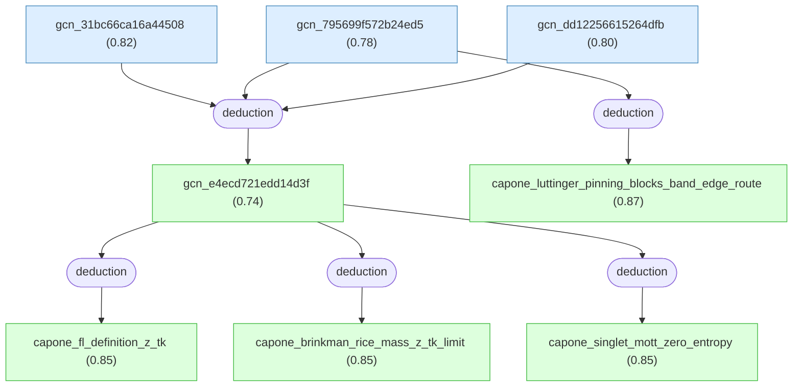
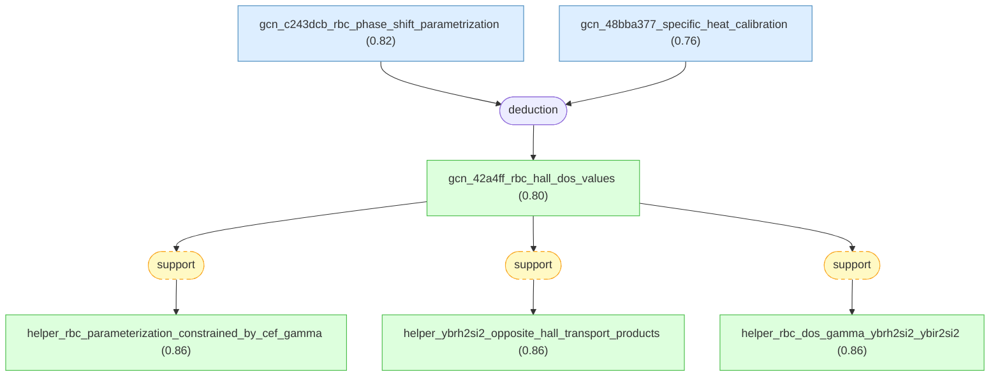
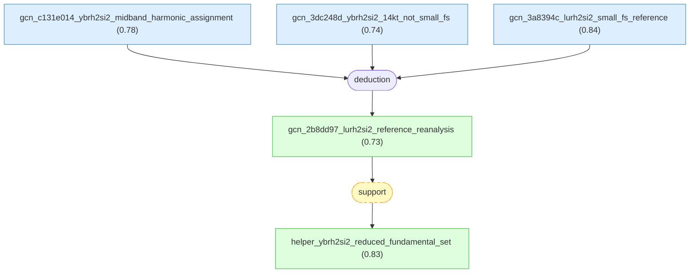
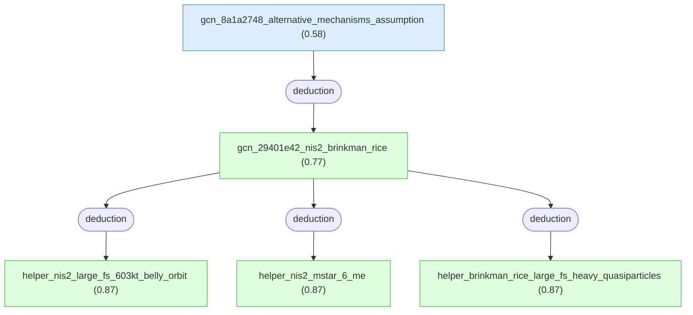
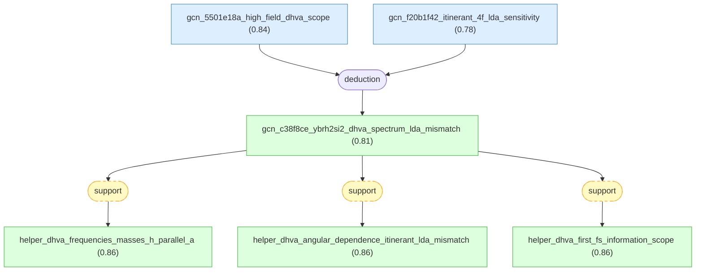
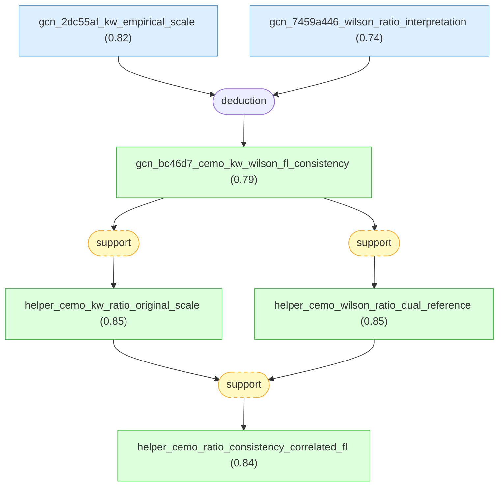

# fermi-liquid-effective-mass-gaia

Combined Gaia knowledge package for LKM roots on Fermi-liquid effective-mass, Brinkman-Rice, and correlated-FL reasoning.

## Overview

## Introduction

#### gcn_800070efac5e476d ★

📌 `gcn_800070efac5e476d`   |   Belief: **0.80**

> For the normal-state liquid He-3 setting reported by Alvesalo et al. 1979, assuming the standard Landau Fermi-liquid relation between the low-temperature linear specific-heat coefficient gamma and the quasiparticle density of states, the measured gamma = 2.11 K^-1 implies m*/m approximately 2.12 and F1 approximately 3.36 [@Alvesalo1979].

🔗 **deduction**([gcn_2ee995fe1e674e2a](#gcn_2ee995fe1e674e2a), [gcn_1587257a956f4d18](#gcn_1587257a956f4d18))

Reasoning

1. Take as given the experimentally determined normal-state coefficient $\gamma=2.11\ \mathrm{K}^{-1}$ from the preceding result (the molar specific heat coefficient in the $T\to 0$ limiting normal Fermi-liquid behavior).
2. State the assumption invoked by the authors to map $\gamma$ to quasiparticle effective mass and Landau Fermi-liquid parameters: assume that the observed linear region corresponds to the $T\to 0$ limiting behavior of a Fermi liquid (i.e., that $\gamma$ reflects the quasiparticle density of states at the Fermi surface and scales with the effective mass $m^{*}$).
3. Record the authors' asserted mapping result without reproducing an explicit derivation (the authors give the numerical mapping result directly): using $\gamma=2.11\ \mathrm{K}^{-1}$ and the assumed Fermi-liquid mapping, the inferred quasiparticle effective-mass ratio is $m^{*}/m=2.12$, and the corresponding first Landau Fermi-liquid parameter is $F_{1}=3.36$; the authors present these numerical values as the outcome of the mapping from $\gamma$ to $m^{*}/m$ and $F_{1}$.
4. Note the paper's comparison to earlier work that motivates the significance of these numbers: the reported $\gamma$ is about $30\%$ smaller than values reported earlier by Mota et al. and Abel et al., and the authors remark that around $20\ \mathrm{mK}$ where the experiments overlap the values of $C/(nR T)$ differ by about $23\%$, supporting that these inferred Fermi-liquid parameters represent a substantial revision relative to prior results. [12] [13]

#### gcn_7ae79f_kondo_brinkman_rice_fixed_point ★

📌 `gcn_7ae79f_kondo_brinkman_rice_fixed_point`   |   Belief: **0.77**

> For Anderson 1984 heavy-electron Kondo-lattice materials such as CeAl3, CeCu2Si2, UBe13, and UPt3, when localized f-ion moments are quenched by Kondo screening and inter-site collective effects do not qualitatively override the local Nozieres Fermi-liquid physics, the ground state is described as a Brinkman-Rice type Fermi-liquid fixed point: a coherent heavy-quasiparticle Fermi liquid with very large quasiparticle effective-mass renormalization and a finite, order-unity Stoner enhancement of the uniform spin susceptibility rather than a divergent almost-ferromagnetic enhancement [@Anderson1984].

🔗 **deduction**([gcn_40f111_nozieres_local_fl_kondo_sites](#gcn_40f111_nozieres_local_fl_kondo_sites), [gcn_8f275a_brinkman_rice_scope_condition](#gcn_8f275a_brinkman_rice_scope_condition))

Reasoning

1. Define "Kondo-lattice": a periodic array of magnetic $f$-ions whose local moments are quenched by Kondo screening so that the low-energy degrees of freedom form a Fermi liquid of very heavy quasiparticles; this definition is taken from the identification of certain U and Ce compounds as such systems (examples: $CeAl_{3}$, $CeCu_{2}Si_{2}$, $UBe_{13}$, $UPt_3$) which are described in the paper as "Kondo lattices".
1
2. Define "Brinkman–Rice liquid" (Brinkman–Rice Fermi-liquid fixed point): a Fermi-liquid fixed point near a Mott- or local-moment instability characterized by (a) very large effective-mass renormalization (heavy quasiparticles) and (b) a Stoner enhancement factor that attains an $O(1)$ finite constant (rather than diverging) as the paramagnetic instability is approached; this characterization is taken from the paper's discussion of Brinkman and Rice and of the Brinkman–Rice viewpoint for $^3$He analogies.
6
3. Note the empirical observation motivating the analogy: a number of U and Ce compounds appear best described as Kondo-lattice systems in which the $f$-shell magnetism is quenched by the Kondo effect, leaving a Fermi liquid of extremely heavy electrons, and several of these compounds become superconducting in a low temperature range (between 1 and 0.1 K) as listed in the paper.
1
4. Invoke the Nozières Fermi-liquid ansatz for Kondo ions: treat each Kondo ion by the Fermi-liquid representation of the single-impurity Kondo problem (the Nozières ansatz), with only slight modifications due to inter-ion interactions; the paper justifies this by stating that many Fermi-liquid parameters are fixed by general sum rules (for example the Friedel sum rule for phase shifts) and thus band formation should not strongly modify them.
9
5. Explain the characteristic Brinkman–Rice signature as used in the paper: the "Stoner enhancement" factor (the factor by which the uniform spin susceptibility is enhanced relative to the noninteracting quasiparticle density-of-states contribution) takes on a near-constant value (the paper cites an example value "near 4") across pressures rather than diverging while the effective mass appears to be increasing; this observation is described as the characteristic sign of Brinkman–Rice behavior and is used as a key empirical/theoretical signature.
7
6. Connect the Kondo-lattice picture to Brinkman–Rice behavior: using the facts that (i) the local $f$-site physics is essentially the single-impurity Kondo problem represented by the Nozières Fermi-liquid ansatz, and (ii) the Stoner enhancement in this context is controlled by an interaction effective only in the opposite-spin (antiparallel-spin) channel on a site, conclude that the same mechanism that produces a finite, substantial Stoner enhancement in the single-impurity Kondo problem should apply to the periodic Kondo lattice as well; hence the ground state should be described by the Brinkman–Rice Fermi-liquid fixed point rather than by a conventional almost-ferromagnetic spin-fluctuation fixed point.
4
7. Record the explicit statement of the claim: the appropriate fixed point to describe the ground state of the Kondo lattice is the Brinkman–Rice liquid (the paper states this assertion directly), i.e., a Fermi-liquid fixed point characterized by large mass renormalization and a finite Stoner enhancement factor.

#### gcn_e4ecd721edd14d3f ★

📌 `gcn_e4ecd721edd14d3f`   |   Belief: **0.74**

> For the Capone-Fabrizio-Tosatti 2001 Brinkman-Rice-type route toward a nondegenerate singlet Mott insulator, a normal Fermi liquid has a well-defined Fermi surface, finite quasiparticle weight Z > 0 with Z = m/m*, and coherence scale T_K ~ E_F*; as m* -> infinity, Z -> 0 and T_K -> 0, while S(T_K) remains order unity for each T_K > 0. Because the target singlet Mott insulator has a unique spin-singlet ground state, a spin gap, and zero entropy as T -> 0, a direct continuous Fermi-liquid-to-insulator crossover is impossible under fixed chemical potential and no-symmetry-breaking assumptions; an intervening thermodynamic instability or distinct intermediate phase must occur [@Capone2001].

🔗 **deduction**([gcn_31bc66ca16a44508](#gcn_31bc66ca16a44508), [gcn_795699f572b24ed5](#gcn_795699f572b24ed5), [gcn_dd12256615264dfb](#gcn_dd12256615264dfb))

Reasoning

1. Define "Fermi liquid (FL)" as a normal metallic state characterized by a finite quasiparticle weight $Z>0$, where the quasiparticle effective mass is $m_{*}$ and $Z\equiv m/m_{*}$ with $m$ the noninteracting mass; define the coherence (effective Fermi) energy scale $E_{F}^{*}$ as the width of the low-energy quasiparticle resonance and identify it later with $E_{F}^{*}\simeq ZW/2$, where $W$ is the noninteracting bandwidth.
2. State the DMFT picture for a Brinkman-Rice type Mott transition: within Dynamical Mean Field Theory (DMFT) the metal near the Mott transition is described by a narrow low-energy Kondo-like quasiparticle resonance sitting at the chemical potential together with high-energy Hubbard bands; the resonance width plays the role of an effective Kondo temperature $T_{K}$ or effective Fermi energy $E_{F}^{*}$ below which the system behaves as a FL. [1]
[1]
Fig. 1
3. Introduce the quantitative relation between the resonance width and the quasiparticle weight: the peak width is given by $E_{F}^{*}\simeq ZW/2$, where $Z\equiv m/m_{*}$ and $W$ is the bare bandwidth; consequently $T_{K}\sim E_{F}^{*}\sim ZW/2$, so that $T_{K}\to0$ as $Z\to0$ when $m_{*}\to\infty$.
4. Relate low-temperature entropy of the FL to the coherence scale: for temperature $T\leq T_{K}$ the entropy per site $S(T)/N$ behaves as $S(T)/N\sim T/T_{K}$ so that the entropy at the coherence scale, $S(T_{K})$, is of order unity (i.e., finite) for $U$ up to the critical value where $T_{K}$ vanishes; thus a FL with a finite $T_{K}$ carries a finite low-temperature entropy per site on the order of one at temperatures of order $T_{K}$.
5. Characterize the nondegenerate singlet Mott insulator targeted in the paper: the insulator is nondegenerate and a spin singlet, hence it has zero entropy at zero temperature and a finite spin gap for spin excitations.
6. Invoke the numerical/DMFT observation that, in the Brinkman-Rice scenario relevant to the models considered, $Z$ decreases continuously to zero as $U$ approaches the critical value $U_{c2}$, so that the FL coherence scale $T_{K}$ vanishes continuously at the transition (the paper reports this continuous vanishing numerically and displays the narrowing resonance in the spectral function). [2]
[2]
Fig. 1; Fig. 2(a)
7. Point out the entropy mismatch at a continuous crossover: because the FL for $U\lesssim U_{c2}$ possesses a finite low-temperature entropy on the scale $T_{K}$ and the singlet Mott insulator for $U\gtrsim U_{c2}$ has zero entropy, a continuous crossover that smoothly transforms the FL into the zero-entropy singlet insulator would require that the finite entropy of the FL be continuously removed exactly as $T_{K}\to0$ at the transition; this is incompatible with the insulator having zero entropy unless some phase transition or instability removes the entropy of the metallic solution prior to or at the MT.
8. Explain why Luttinger's theorem prevents a trivial resolution: by Luttinger's theorem the chemical potential in the interacting system must coincide with the bare chemical potential, and the spectral density at the chemical potential must be pinned to the noninteracting value; hence, within solutions obeying Luttinger theorem, the MT proceeds by narrowing of the resonance at fixed chemical potential (rather than by shifting the chemical potential to the band edge), and therefore the finite FL entropy associated with the finite $T_{K}$ cannot be transferred continuously into a zero-entropy insulator without violating this constraint. This argument relies on the DMFT/FL picture and Luttinger theorem as discussed in the paper. [2]
[2]
9. List the only possible ways out discussed in the paper and rule them out or note them as alternatives: (a) a breakdown of Luttinger's theorem before the MT could allow the chemical potential to move and connect smoothly to a zero-entropy insulator - the authors regard this as a possible but nonstandard scenario; (b) the insulator could break a symmetry (e.g., spin SU(2)), in which case the metal could break the same symmetry and the transition could be of a metal-band-insulator type - this is not the present case because the insulator under study is nondegenerate and does not break symmetry; therefore neither of these standard resolutions applies to the singlet, nondegenerate Mott insulator considered.
10. Conclude that continuity is impossible: combining the finite FL entropy at the vanishing coherence scale, the pinning enforced by Luttinger theorem, and the zero entropy of the singlet Mott insulator, the FL state characterized by finite $Z$ (for $U$ just below the MT) cannot be continuously connected, within a Brinkman-Rice type scenario where $m_{*}\to\infty$ and $Z\to0$, to a nondegenerate singlet Mott insulator; therefore some intermediate phase must intrude between the FL metal and the singlet Mott insulator rather than a direct continuous FL-insulator crossover.

#### gcn_42a4ff_rbc_hall_dos_values ★

📌 `gcn_42a4ff_rbc_hall_dos_values`   |   Belief: **0.80**

> Renormalized-band calculations constrained by experimental CEF energies and low-temperature specific heat produce two dominant quasiparticle bands for YbRh2Si2 with opposite-sign reduced transverse transport products: band 1 (donut) remains holelike with \bar{n}(1)\bar{\sigma}_{xyz}(1)=+0.0037675, while band 2 (jungle-gym) becomes predominantly electronlike with \bar{n}(2)\bar{\sigma}_{xyz}(2)=-0.0041076, so their nearly equal magnitudes strongly cancel in the numerator of the low-field Hall coefficient. The same calculation gives N(E_F)~=290 states/(eV unit cell) and gamma~=680 mJ mol^-1 K^-2 for YbRh2Si2, and N(E_F)~=48 states/(eV unit cell) and gamma~=113 mJ mol^-1 K^-2 for YbIr2Si2 [@Friedemann2010].

🔗 **deduction**([gcn_c243dcb_rbc_phase_shift_parametrization](#gcn_c243dcb_rbc_phase_shift_parametrization), [gcn_48bba377_specific_heat_calibration](#gcn_48bba377_specific_heat_calibration))

Reasoning

1. Start from the established upstream result that two principal bands (donut $i=1$ and jungle-gym $i=2$) dominate the Hall transport integrals, and aim to determine how inclusion of $4f$-derived quasiparticles in a renormalized-band calculation (RBC) modifies the band-resolved transport integrals and their signs.
2. Summarize the renormalized band method inputs and parameter determination: transform the $4f$ states into crystalline-electric-field (CEF) eigenstates $|m\rangle$ and introduce resonance-type phase shifts
$\widetilde{\eta}_{f}(E)\simeq\arctan\dfrac{\widetilde{\Delta}_{f}}{E-\widetilde{\epsilon}_{f}}$,
where $\widetilde{\Delta}_{f}$ is the resonance width accounting for the renormalized quasiparticle mass and $\widetilde{\epsilon}_{f}$ the position of the $f$-derived band center; the CEF-split resonance centers are $\widetilde{\epsilon}_{fm}=\widetilde{\epsilon}_{f}+\delta_{m}$ (for the Yb hole analog the sign convention leads to $\widetilde{\epsilon}_{f}<0$ and $\widetilde{\epsilon}_{fm}=\widetilde{\epsilon}_{f}-\delta_{m}$). The single free parameter $\widetilde{\Delta}_{f}$ is fixed by reproducing the experimentally observed low-temperature linear-in-$T$ specific-heat coefficient, thereby grounding the RBC parametrization in thermodynamic data.
[24]
3. Compute the renormalized band dispersions $E(i,\mathbf{k})$ using the RBC Hamiltonian and the experimental CEF scheme and resonance widths; from these dispersions evaluate the band-resolved reduced transport integrals $\bar{\sigma}_{xx}(i)$ and $\bar{\sigma}_{xyz}(i)$ as defined by the decomposition
$\sigma_{xx}(i)=\sigma(i)\bar{\sigma}_{xx}(i)$ and $\sigma_{xyz}(i)=\sigma_{B}(i)\bar{\sigma}_{xyz}(i)$
with the prefactors $\sigma(i)=\dfrac{e^{2}}{m}\pi(i)\bar{n}(i)$ and $\sigma_{B}(i)=\dfrac{|e|^{3}}{m^{2}c}[\pi(i)]^{2}\bar{n}(i)$ and $\bar{n}(i)$ the band occupation per unit cell. This defines the reduced-transport products $\bar{n}(i)\bar{\sigma}_{xyz}(i)$ which directly enter the numerator of the Hall coefficient.
(Equations reproduced from the transport decomposition in the paper.)
4. Report the numerical RBC results for YbRh$_2$Si$_2$: the renormalized-band calculation yields for band 1 (donut) a positive reduced transverse transport product $\bar{n}(1)\bar{\sigma}_{xyz}(1)=+0.0037675$ and for band 2 (jungle-gym) a negative product $\bar{n}(2)\bar{\sigma}_{xyz}(2)=-0.0041076$ as listed in the transport-results Table I. These opposite signs indicate that band 1 remains predominantly holelike while band 2 becomes predominantly electronlike in the heavy-Fermi-liquid limit. The near equality in magnitude implies strong cancellation when summing the two contributions in the numerator of $R_{H}$.
Table I
5. State the RBC prediction for the renormalized density of states at the Fermi energy and its thermodynamic implication: for YbRh$_2$Si$_2$ the RBC yields $N(E_{F})\approx 290\ \mathrm{states/(eV\ unit\ cell)}$, which corresponds (via the standard relation between DOS and the Sommerfeld coefficient for the electronic specific heat) to a Sommerfeld coefficient $\gamma\approx680\ \mathrm{mJ\ mol^{-1}K^{-2}}$; for YbIr$_2$Si$_2$ RBC gives $N(E_{F})\approx48\ \mathrm{states/(eV\ unit\ cell)}$ and $\gamma\approx113\ \mathrm{mJ\ mol^{-1}K^{-2}}$. These values follow from the calculated renormalized quasiparticle DOS displayed in the RBC results.
Fig. 4
6. Conclude that in the heavy-Fermi-liquid limit the RBC produces two dominant bands with opposite Hall character for YbRh$_2$Si$_2$, with nearly compensating contributions to the Hall numerator (the products $\bar{n}(i)\bar{\sigma}_{xyz}(i)$ are close in magnitude and opposite in sign), thereby explaining why the total Hall coefficient is expected to be small and highly sensitive to weighting factors (such as band-dependent relaxation times). This explains the RBC-based mechanistic origin of cancellation and near-compensation observed in the numerical transport integrals.
Table I

#### gcn_2b8dd97_lurh2si2_reference_reanalysis ★

📌 `gcn_2b8dd97_lurh2si2_reference_reanalysis`   |   Belief: **0.73**

> Re-examining published YbRh2Si2 de Haas-van Alphen measurements with the refined LuRh2Si2 "small" Fermi-surface reference calculated at z_Si=0.379 c supports reclassifying published 5-7 kT spectral peaks as harmonics of lower-frequency fundamentals below 4 kT, leaving independent fundamentals below 4 kT plus a distinct high-frequency fundamental near 14 kT; because the refined small-Fermi-surface LDA/GGA calculation with core-like non-hybridizing Yb 4f electrons has no (100)-field orbit near 14 kT, the independent 14 kT experimental orbit supports itinerant Yb 4f contribution to the high-field YbRh2Si2 Fermi surface rather than fully localized 4f behavior [@Friedemann2013].

🔗 **deduction**([gcn_c131e014_ybrh2si2_midband_harmonic_assignment](#gcn_c131e014_ybrh2si2_midband_harmonic_assignment), [gcn_3dc248d_ybrh2si2_14kt_not_small_fs](#gcn_3dc248d_ybrh2si2_14kt_not_small_fs), [gcn_3a8394c_lurh2si2_small_fs_reference](#gcn_3a8394c_lurh2si2_small_fs_reference))

Reasoning

1. Start from the refined "small" Fermi-surface reference provided by LuRh$_2$Si$_2$ calculations and from the identification that harmonics and magnetic-interaction mixing are prevalent in LuRh$_2$Si$_2$: the previously established calculated "small" Fermi surface for LuRh$_2$Si$_2$ using $z_{\text{Si}}=0.379\,c$ serves as a reference for analogous "small" Fermi-surface calculations on YbRh$_2$Si$_2$ in which the Yb $4f$ electrons are treated as core-like (non-hybridizing), and the presence of many harmonics and mixing products in LuRh$_2$Si$_2$ motivates re-examination of published de Haas-van Alphen (dHvA) data on YbRh$_2$Si$_2$ for possible harmonic assignments.
Fig. 10
[13]
2. Describe the re-analysis procedure and evidence for harmonics in YbRh$_2$Si$_2$: the dHvA frequencies reported previously for YbRh$_2$Si$_2$ were compared to calculated fundamental frequencies of the "small" Fermi-surface calculation and to integer multiples (harmonics) of the low-frequency fundamentals (below $\sim 4\ \mathrm{kT}$); the authors overlay second and higher harmonic angular dependences on the experimental dHvA frequency-versus-angle plot and find that the experimental frequencies in the range approximately $5\ \mathrm{kT}$ to $7\ \mathrm{kT}$ match the angular dependence expected for second harmonics of the lower-frequency fundamentals, as illustrated in the comparison plot and summarized in a table that compares expected harmonic values to measured frequencies and masses.
Fig. 10
Table III
3. Report the reduced set of independent fundamental frequencies implied by the harmonic reassignment: if the frequencies between $\sim 5\ \mathrm{kT}$ and $7\ \mathrm{kT}$ in the published YbRh$_2$Si$_2$ data are reinterpreted as second (or higher) harmonics of fundamentals below $4\ \mathrm{kT}$, then the number of independent fundamental frequencies in YbRh$_2$Si$_2$ is reduced to a set of fundamentals below $4\ \mathrm{kT}$ plus a distinct high-frequency fundamental near $\sim 14\ \mathrm{kT}$ (the latter is not accounted for as a harmonic of the low-frequency group).
Fig. 10
Table III
4. Contrast the high-frequency fundamental with the "small" Fermi-surface prediction and infer $f$-electron involvement: within the refined "small" Fermi-surface calculation for YbRh$_2$Si$_2$ (i.e., treating Yb $4f$ electrons as core-like), no high-frequency orbit near $\sim 14\ \mathrm{kT}$ is predicted for fields along the (100) direction; because the experimentally observed $\sim 14\ \mathrm{kT}$ frequency behaves as an independent fundamental (not a harmonic of lower frequencies) in the dHvA data, its presence indicates that the "small" $f$-core calculation does not account for this orbit, supporting the conclusion that the Yb $4f$ electrons contribute to the Fermi surface at high magnetic fields (i.e., the $4f$ electrons are at least partially itinerant under those conditions rather than fully localized).
Fig. 10
[13]
5. State the authors' interpretive conclusion and suggested further checks: the re-examination reduces the set of independent fundamentals in YbRh$_2$Si$_2$ to low-frequency fundamentals below $4\ \mathrm{kT}$ plus a single high-frequency near $\sim 14\ \mathrm{kT}$; because the refined "small" Fermi-surface calculation does not predict the $\sim 14\ \mathrm{kT}$ orbit for fields along (100), the presence of that high-frequency fundamental supports the conclusion that the Yb $4f$ electrons contribute to the Fermi surface at high magnetic fields rather than being fully localized; the authors also suggest further experimental checks (extended angular range measurements and complementary techniques) to solidify the harmonic assignments.
Fig. 10
[10]

#### gcn_29401e42_nis2_brinkman_rice ★

📌 `gcn_29401e42_nis2_brinkman_rice`   |   Belief: **0.77**

> In NiS2 pressurized to approximately 3.8 GPa, the simultaneous observation of a large Fermi-surface cross-sectional area, specifically the 6.03 kT belly orbit, and a strongly enhanced quasiparticle effective mass m* = 6(2) m_e is consistent with the Brinkman-Rice picture of a correlated Fermi liquid near a Mott insulator: coherent heavy quasiparticles retain the uncorrelated-band Fermi-surface volume while quasiparticle spectral weight Z and quasiparticle velocities are strongly reduced [@Friedemann2016].

🔗 **deduction**([gcn_8a1a2748_alternative_mechanisms_assumption](#gcn_8a1a2748_alternative_mechanisms_assumption))

Reasoning

1. Treat conclusion 2 (the metallic state has a large Fermi surface matching the uncorrelated-band prediction) and conclusion 3 (the quasiparticle effective mass is strongly enhanced to $m^* = 6(2)\ m_e$) as established upstream results to be taken as known starting points for the present reasoning.
2. Define the Brinkman-Rice picture as the theoretical framework in which, on approaching a Mott insulating state by bandwidth reduction, the quasiparticle weight $Z$ is suppressed (possibly to $Z\to 0$), quasiparticle velocities are reduced, the effective mass $m^*$ is strongly enhanced (and in some treatments can diverge), while the Fermi surface volume remains that of the corresponding uncorrelated metal as required by Luttinger's theorem; cite the original Brinkman-Rice argument and Luttinger's theorem as the conceptual bases.
[6]
[9]
3. Observe that the empirical combination established in conclusions 2 and 3 -- a large Fermi surface volume equal to the uncorrelated-band value and a strongly enhanced quasiparticle mass -- matches the key qualitative signatures of a Brinkman-Rice correlated Fermi liquid proximate to a Mott insulator, namely: preserved large Fermi volume and suppressed quasiparticle weight manifesting as heavy quasiparticles.
Fig. 5
Fig. 4
4. Note that alternative theoretical scenarios that envisage a continuous depletion of carrier concentration or Fermi-surface reconstruction on approach to the insulating state would predict a reduced Fermi surface volume or the absence of a large uncorrelated-like Fermi surface in the immediate metallic regime; because the measured experimental combination does not display such carrier depletion or reconstruction, the experimental findings are consistent with the Brinkman-Rice description rather than with those alternative scenarios.
[40]
5. Conclude that the coexistence of a large Fermi surface volume (conclusion 2) and a strongly enhanced quasiparticle mass (conclusion 3) in pressure-metalized NiS$_2$ is consistent with the Brinkman-Rice picture of a correlated Fermi liquid proximate to a Mott insulator: coherent quasiparticles form a heavy Fermi liquid whose Fermi surface volume remains that of the uncorrelated band while the quasiparticle weight $Z$ and quasiparticle velocities are reduced.
Table 1

#### gcn_c38f8ce_ybrh2si2_dhva_spectrum_lda_mismatch ★

📌 `gcn_c38f8ce_ybrh2si2_dhva_spectrum_lda_mismatch`   |   Belief: **0.81**

> For high-quality YbRh2Si2 single crystals measured by de Haas-van Alphen torque magnetometry in steady fields of 12-28 T with H parallel a, Knebel et al. 2006 observe four fundamental frequencies, 2730 T, 3510 T, 5370 T, and 7050 T, with cyclotron masses (15.0 +/- 0.7) m_e, (8.4 +/- 0.2) m_e, (10.1 +/- 0.2) m_e, and (14.9 +/- 0.9) m_e. The measured basal-plane angular dependence is inconsistent with itinerant-4f LDA/FLAPW calculations for YbRh2Si2 and instead qualitatively resembles LuRh2Si2 LDA calculations with 4f states below the Fermi energy, giving the first experimental Fermi-surface information for YbRh2Si2 and exposing a significant mismatch with one itinerant-4f LDA prediction set [@Knebel2006].

🔗 **deduction**([gcn_5501e18a_high_field_dhva_scope](#gcn_5501e18a_high_field_dhva_scope), [gcn_f20b1f42_itinerant_4f_lda_sensitivity](#gcn_f20b1f42_itinerant_4f_lda_sensitivity))

Reasoning

1. Start from the upstream established result: accept as already established the upstream conclusion that LDA band-structure calculations place significant sensitivity of predicted Fermi-surface angular dependence to the $4f$ position and that itinerant-4f LDA angular dependence does not match experiment (upstream conclusion known and available for use).
2. Define experimental method and conditions for the quantum-oscillation measurements: de Haas–van Alphen (dHvA) measurements were performed on highest-quality single crystals (RRR $\approx300$) at ambient pressure using a cantilever torque meter in steady magnetic fields between $12$ and $28\ \mathrm{T}$ with a dilution refrigerator base temperature of $30\ \mathrm{mK}$; the magnetic field was applied parallel to the crystallographic $a$ axis ($H\parallel a$) for the principal data set.
3. Report the observed dHvA frequency spectrum and its extraction: the oscillatory torque signal for $H\parallel a$ shows reproducible oscillations whose Fourier transform yields four unambiguous frequencies at $2730\ \mathrm{T}$, $3510\ \mathrm{T}$, $5370\ \mathrm{T}$, and $7050\ \mathrm{T}$ from a field window $12$–$28\ \mathrm{T}$; these frequencies correspond to extremal cross-sectional areas of Fermi-surface orbits according to the Onsager relation (frequency $F$ in tesla proportional to extremal area).
Fig.7
4. Describe how effective masses were determined and report the numerical values: the temperature dependence of each oscillation amplitude follows the Lifshitz–Kosevich thermal damping factor, and fitting that temperature dependence yields cyclotron effective masses $m^{\ast}$ of $(15.0\pm0.7)\,m_{e}$ for $2730\ \mathrm{T}$, $(8.4\pm0.2)\,m_{e}$ for $3510\ \mathrm{T}$, $(10.1\pm0.2)\,m_{e}$ for $5370\ \mathrm{T}$, and $(14.9\pm0.9)\,m_{e}$ for $7050\ \mathrm{T}$, where $m_{e}$ is the free-electron mass.
Fig.7
5. Report the angular dependence of the observed frequencies within the basal plane: the two extreme frequencies (lowest and highest) are observable over the full angular sweep in the basal plane while the two intermediate frequencies are detectable only at small angles near $H\parallel a$; the measured angular dependence of the observed dHvA frequencies in the basal plane is plotted and shows a specific angular variation that is compared to calculated angular dependencies.
Fig.8
6. Compare experimental angular dependence and frequencies with band-structure calculations and note the mismatch: the experimentally observed frequencies (all in the few-kilotesla range) and their angular evolution are inconsistent with the LDA-calculated angular dependences for $YbRh_{2}Si_{2}$ in which itinerant $4f$ electrons produce calculated frequencies mostly below $1\ \mathrm{kT}$ or above $10\ \mathrm{kT}$, and the shapes of the calculated angular dependencies differ markedly from experiment; by contrast, LDA calculations for $LuRh_{2}Si_{2}$ (where $4f$ are well below $E_{\mathrm{F}}$) produce an angular dependence that shows qualitative similarity to the measured angular dependence, indicating that the measured spectrum does not match itinerant-4f predictions but resembles a Lu-like $4f$-localized reference.
Fig.9; Fig.11
7. Conclude the significance of the dHvA measurements: these dHvA frequencies and extracted effective masses constitute the first experimental Fermi-surface information for $YbRh_{2}Si_{2}$; the measured oscillation spectrum and heavy effective masses reveal a significant mismatch with itinerant-4f LDA band-structure predictions, thereby providing experimental constraints that point to intermediate valence and sensitivity of the $4f$ contribution rather than the simple itinerant-$4f$ LDA picture.
Fig.7; Fig.8; Fig.9; Fig.11

#### gcn_bc46d7_cemo_kw_wilson_fl_consistency ★

📌 `gcn_bc46d7_cemo_kw_wilson_fl_consistency`   |   Belief: **0.79**

> For CeMo2Si2C in Paramanik et al. 2013, the experimentally determined low-temperature coefficients A=2.57e-3 muOmega cm K^-2, gamma=23.4 mJ mol^-1 K^-2, and impurity-corrected chi_FL~=5.6e-4 emu mol^-1 give A/gamma^2~=0.5e-5 muOmega cm (mol K/mJ)^2 and Wilson-Sommerfeld estimates R_W~=0.81 using mu_eff=2.54 mu_B or R_W~=1.7 using mu_eff=1.73 mu_B; the selected LKM chain concludes that these Kadowaki-Woods and Wilson/Sommerfeld ratios are consistent with correlated Fermi-liquid phenomenology in the low-temperature state [@Paramanik2013].

🔗 **deduction**([gcn_2dc55af_kw_empirical_scale](#gcn_2dc55af_kw_empirical_scale), [gcn_7459a446_wilson_ratio_interpretation](#gcn_7459a446_wilson_ratio_interpretation))

Reasoning

1. This conclusion starts from the already established low-temperature transport coefficient $A=2.57\times10^{-3}\ \mu\Omega\ \mathrm{cm\ K^{-2}}$ from the fit $\rho(T)=\rho_0+AT^2$, the Sommerfeld coefficient $\gamma=23.4\ \mathrm{mJ/mol\ K^2}$ from the fit $C(T)=\gamma T+\beta T^3$, and the impurity-corrected low-temperature susceptibility $\chi_{\mathrm{FL}}\approx5.6\times10^{-4}\ \mathrm{emu/mol}$ extracted from the corrected susceptibility curve.
Fig. 4; Fig. 6; Fig. 7
2. Within Fermi-liquid theory, the paper states that the coefficient $A$ is related to $\gamma^2$. It then invokes the empirical Kadowaki-Woods ratio
$$
\frac{A}{\gamma^2},
$$
for which heavy-fermion and valence-fluctuating systems are reported to have values of order $1\times10^{-5}\ \mu\Omega\ \mathrm{cm}\ (\mathrm{mol\ K/mJ})^2$.
[38]
3. Using the measured $A$ and $\gamma$, the paper computes
$$
\frac{A}{\gamma^2}=0.5\times10^{-5}\ \mu\Omega\ \mathrm{cm}\ (\mathrm{mol\ K/mJ})^2.
$$
This is described as being essentially the original Kadowaki-Woods value.
4. The paper also notes an alternative scaling proposed by Tsujii, Kontani, and Yoshimura, according to which the ratio scales as $2/N(N-1)$ with $N$ the orbital degeneracy of the $f$ state. For an intermediate-valent Ce system, taking $N=6$ gives $A/\gamma^2=6.7\times10^{-7}\ \mu\Omega\ \mathrm{cm}\ (\mathrm{mol\ K/mJ})^2$. This comparison is quoted, but the text emphasizes that the measured value for $CeMo_2Si_2C$ is at the original Kadowaki-Woods scale.
[39]
5. For susceptibility and specific heat, the paper uses the Wilson-Sommerfeld ratio
$$
R_W=\frac{\pi^2 k_B^2 \chi_{\mathrm{FL}}}{\gamma \mu_{\mathrm{eff}}^2},
$$
where $k_B$ is the Boltzmann constant, $\chi_{\mathrm{FL}}$ is the low-temperature Fermi-liquid susceptibility, $\gamma$ is the Sommerfeld coefficient, and $\mu_{\mathrm{eff}}$ is the effective magnetic moment used in the normalization.
6. Substituting $\chi_{\mathrm{FL}}\approx5.6\times10^{-4}\ \mathrm{emu/mol}$, $\gamma=23.4\ \mathrm{mJ/mol\ K^2}$, and $\mu_{\mathrm{eff}}=2.54\ \mu_B$ as the free $Ce^{3+}$ moment gives
$$
R_W=0.81.
$$
If instead $\mu_{\mathrm{eff}}=1.73\ \mu_B$ is used as for a free conduction electron, the paper states that one gets
$$
R_W=1.7.
$$
7. Because the Kadowaki-Woods ratio is of the expected order and the Wilson ratio is close to the range expected for correlated Fermi liquids, the paper concludes that the low-temperature susceptibility, specific heat, and resistivity are mutually consistent with Fermi-liquid behavior in $CeMo_2Si_2C$.

#### gcn_2741cdef_practical_effective_mass_scheme ★

📌 `gcn_2741cdef_practical_effective_mass_scheme`   |   Belief: **0.59**

> For YbRh2Si2 in the homogeneous isotropic heavy-electron liquid model of Shaginyan et al. 2010, a practical scheme for field- and temperature-dependent effective mass is to solve the Landau effective-mass integral equation for ε(p) and n(p,T,B), tune the Landau amplitude so ε(p) has an inflection point at p_F and realizes 1/M* = 0 at T = 0, compute entropy from the Fermi-Dirac occupation formula, and extract M*(T,B) = S(T,B)/T; this procedure yields the interpolating and scaling behavior used for the YbRh2Si2 comparison [@Shaginyan2010].

🔗 **deduction**([gcn_677c6c_landau_integral_relation](#gcn_677c6c_landau_integral_relation), [gcn_03614e9b_homogeneous_isotropic_model](#gcn_03614e9b_homogeneous_isotropic_model), [gcn_e0c364ff_inflection_fcqpt_condition](#gcn_e0c364ff_inflection_fcqpt_condition), [gcn_6bbfeb95_stable_landau_solutions](#gcn_6bbfeb95_stable_landau_solutions), [gcn_ecddfefa_fermion_entropy_formula](#gcn_ecddfefa_fermion_entropy_formula), [gcn_2e693115_entropy_over_temperature_mass](#gcn_2e693115_entropy_over_temperature_mass))

Reasoning

1. State the fundamental equation used to compute the temperature- and field-dependent quasiparticle effective mass $M^{*}(T,B)$: the Landau form relating the inverse effective mass to the bare mass $m$ and the quasiparticle distribution, written explicitly as
$$
\frac{1}{M^{*}(T)}=\frac{1}{m}+\int \frac{\mathbf{p}_{F}\cdot\mathbf{p}_1}{p_{F}^{3}}\;F(\mathbf{p}_{F},\mathbf{p}_1)\;\frac{\partial n(p_1,T)}{\partial p_1}\;\frac{d\mathbf{p}_1}{(2\pi)^3},
$$
where $M^{*}(T)$ is the quasiparticle effective mass as a function of temperature $T$, $m$ is the bare electron mass, $\mathbf{p}_F$ is the Fermi momentum vector, $p_F=|\mathbf{p}_F|$, $F(\mathbf{p}_F,\mathbf{p}_1)$ is the Landau interaction amplitude, and $n(p,T)$ is the quasiparticle occupation number. This equation is the starting point for the numerical solution described below.
2. Specify the model assumption for the calculations: use the homogeneous heavy-electron (fermion) liquid model (a spatially uniform system), thereby neglecting crystal-lattice anisotropy; this means the occupation numbers depend only on momentum magnitude $p$ and temperature $T$, $n(p,T)$, and spatial inhomogeneities and band-structure anisotropies are not included.
3. Choose a special form of the Landau interaction amplitude $F(\mathbf{p}_F,\mathbf{p}_1)$ whose coefficients are tuned so that the single-particle spectrum $\varepsilon(p)$ has an inflection point at the Fermi momentum $p_F$; concretely, impose that the first and second derivatives of $\varepsilon(p)$ with respect to $p$ vanish at $p=p_F$, i.e. $\left.\frac{d\varepsilon}{dp}\right|_{p=p_F}=0$ and $\left.\frac{d^2\varepsilon}{dp^2}\right|_{p=p_F}=0$, where $\varepsilon(p)$ is the single-particle spectrum and $p$ is momentum. The vanishing of the first derivative is equivalent to $1/M^{*}=0$ at the QCP, and the vanishing of two derivatives ensures the lowest nonzero term in the Taylor expansion of $\varepsilon(p)$ about $p_F$ is proportional to $(p-p_F)^3$. This choice enforces that the system is placed at the fermion-condensation quantum phase transition (FCQPT) critical condition for the calculation. [12][15]
[12]
4. Solve the Landau integral equation given in the first step numerically (the temperature-dependent Landau equation reproduced there) with the specially chosen Landau amplitude from the previous step. The numerical solution yields the single-particle spectrum $\varepsilon(p)$ and the temperature-dependent occupation numbers $n(p,T)$ consistent with the interaction amplitude and imposed inflection-point condition; these are obtained for given external parameters $T$ and magnetic field $B$ (with $B$ entering via Zeeman splitting and through the dependence of $n(p,T)$ and the amplitude on polarization, implemented as in the computational scheme described).
[15]
5. Compute the thermodynamic entropy $S(B,T)$ from the occupation numbers $n(p,T)$ using the combinatorial formula for the entropy of a system of fermionic quasiparticles,
$$
S=-2\int\Bigl[n(p)\ln n(p)+(1-n(p))\ln(1-n(p))\Bigr]\frac{d\mathbf{p}}{(2\pi)^3},
$$
where $S$ is the entropy at given magnetic field $B$ and temperature $T$, $n(p)=n(p,T)$ is the quasiparticle occupation number, and the factor $-2$ accounts for spin degeneracy. This formula gives $S(B,T)$ directly from the computed $n(p,T)$.
6. Extract the effective mass $M^{*}(T,B)$ from the computed entropy using the Landau relation connecting entropy and effective mass in a Fermi liquid, written explicitly as
$$
M^{*}(T,B)=\frac{S(T,B)}{T},
$$
where $S(T,B)$ is the entropy per mole (or per particle, depending on units) computed in the previous step and $T$ is temperature. This relation is applied to obtain $M^{*}(T,B)$ from the numerically computed $S(T,B)$ for each $(T,B)$ point.
7. Normalize the computed effective mass $M^{*}(T,B)$ by its maximum value $M_{M}^{*}$ occurring at the temperature $T=T_M$ for a given $B$, and introduce the normalized temperature $y=T/T_M$; the normalized effective mass is $M_N^{*}(y)=M^{*}(T,B)/M_{M}^{*}$. Use these normalized quantities to examine the interpolating/scaling properties of the computed $M^{*}(T,B)$ and to compare directly with experiment on a common dimensionless axis. The computed normalized entropy and normalized effective mass as functions of normalized variables show collapse onto single curves, corroborating the scaling picture (this computed normalized entropy behavior is presented graphically in the calculations shown).
Fig. 3
8. State the practical computational scheme in a concise sequence usable for reproducing theoretical curves and for comparison with experiments: (i) choose a Landau amplitude whose coefficients produce an inflection point in $\varepsilon(p)$ at $p_F$ (first two derivatives zero); (ii) numerically solve the temperature-dependent Landau equation reproduced above to obtain $\varepsilon(p)$ and $n(p,T)$; (iii) compute the entropy $S(B,T)$ from $n(p,T)$ using the combinatorial entropy formula reproduced above; (iv) obtain $M^{*}(T,B)$ by $M^{*}=S/T$ and construct normalized quantities $M_N^{*}=M^{*}/M_{M}^{*}$ and $y=T/T_M$ for scaling analysis. This scheme is implemented within the homogeneous heavy-electron liquid model (neglecting crystal-lattice anisotropy) and yields $M^{*}(T,B)$ exhibiting the interpolating and scaling properties used elsewhere in the paper.

#### cross_thermodynamic_routes_to_effective_mass ★

📌 `cross_thermodynamic_routes_to_effective_mass`   |   Belief: **0.77**

> Across the He-3 and Shaginyan YbRh2Si2 roots, low-energy thermodynamic quantities are used as operational routes to quasiparticle effective mass: Alvesalo et al. infer m*/m for liquid He-3 from the linear specific-heat coefficient gamma, while Shaginyan et al. extract M*(T,B) for YbRh2Si2 from S(T,B)/T within their heavy-electron Landau/FCQPT scheme.

🔗 **support**([he3_gamma_implies_mstar_ratio_2_12](#he3_gamma_implies_mstar_ratio_2_12), [gcn_2e693115_entropy_over_temperature_mass](#gcn_2e693115_entropy_over_temperature_mass))

Reasoning

The He-3 decomposition explicitly grounds gamma -> m*/m, and the YbRh2Si2 premise explicitly grounds S(T,B)/T -> M*(T,B). Together they support only the scoped meta-claim that both chains operationalize effective mass through thermodynamic low-energy quantities, not that the systems or equations are equivalent.

#### cross_scope_caution_standard_fl_vs_fcqpt ★

📌 `cross_scope_caution_standard_fl_vs_fcqpt`   |   Belief: **0.64**

> The He-3 and YbRh2Si2 effective-mass routes should not be treated as equivalent claims: the He-3 chain uses a standard low-temperature Landau Fermi-liquid mapping from gamma to m*/m, whereas the YbRh2Si2 chain uses a homogeneous isotropic heavy-electron model near FCQPT and applies S/T as an operational effective-mass measure through crossover or non-Fermi-liquid regimes.

🔗 **support**([gcn_800070efac5e476d](#gcn_800070efac5e476d), [gcn_2741cdef_practical_effective_mass_scheme](#gcn_2741cdef_practical_effective_mass_scheme), [gcn_1587257a956f4d18](#gcn_1587257a956f4d18), [gcn_03614e9b_homogeneous_isotropic_model](#gcn_03614e9b_homogeneous_isotropic_model))

Reasoning

The selected roots and mapping premises specify different systems and model scopes: standard low-temperature Landau Fermi-liquid reasoning for normal liquid He-3 versus a homogeneous isotropic heavy-electron FCQPT crossover model for YbRh2Si2. This warrants a scope-caution claim rather than equivalence or contradiction.

#### cross_ybrh2si2_rbc_qualifies_homogeneous_isotropic_scope ★

📌 `cross_ybrh2si2_rbc_qualifies_homogeneous_isotropic_scope`   |   Belief: **0.71**

> Material-specific YbRh2Si2 renormalized-band evidence from Friedemann et al. qualifies, rather than refutes, the homogeneous isotropic FCQPT premise in the Shaginyan et al. branch: the FCQPT premise is a universal-scaling approximation that deliberately omits lattice anisotropy, band topology, multiple bands, CEF splitting, and band-resolved Hall cancellations, while the RBC/Hall/DOS chain supplies those omitted material-specific details for YbRh2Si2.

🔗 **support**([gcn_03614e9b_homogeneous_isotropic_model](#gcn_03614e9b_homogeneous_isotropic_model), [gcn_42a4ff_rbc_hall_dos_values](#gcn_42a4ff_rbc_hall_dos_values), [helper_rbc_parameterization_constrained_by_cef_gamma](#helper_rbc_parameterization_constrained_by_cef_gamma), [helper_ybrh2si2_opposite_hall_transport_products](#helper_ybrh2si2_opposite_hall_transport_products), [helper_rbc_dos_gamma_ybrh2si2_ybir2si2](#helper_rbc_dos_gamma_ybrh2si2_ybir2si2))

Reasoning

The Shaginyan premise explicitly says the homogeneous isotropic model neglects crystal-lattice anisotropy, Brillouin-zone structure, multiple bands, and anisotropic effective masses for universal scaling. The Friedemann RBC root and helpers explicitly add material-specific CEF/gamma calibration, band-resolved Hall-product cancellation, and DOS/gamma values for YbRh2Si2. These facts ground a scope-qualification claim because the model scopes differ while remaining jointly satisfiable.

#### cross_ybrh2si2_material_specific_fs_constraints ★

📌 `cross_ybrh2si2_material_specific_fs_constraints`   |   Belief: **0.67**

> Within YbRh2Si2, Friedemann 2010 RBC/Hall/DOS evidence, Knebel 2006 high-field dHvA frequencies and cyclotron masses, and Friedemann 2013 LuRh2Si2 small-Fermi-surface reanalysis jointly constrain the material-specific Fermi-surface/effective-mass picture. The synthesis is a field- and method-scoped constraint claim, not an equivalence among RBC, high-field dHvA, and homogeneous FCQPT descriptions.

🔗 **support**([gcn_42a4ff_rbc_hall_dos_values](#gcn_42a4ff_rbc_hall_dos_values), [helper_rbc_parameterization_constrained_by_cef_gamma](#helper_rbc_parameterization_constrained_by_cef_gamma), [helper_dhva_frequencies_masses_h_parallel_a](#helper_dhva_frequencies_masses_h_parallel_a), [helper_dhva_angular_dependence_itinerant_lda_mismatch](#helper_dhva_angular_dependence_itinerant_lda_mismatch), [gcn_2b8dd97_lurh2si2_reference_reanalysis](#gcn_2b8dd97_lurh2si2_reference_reanalysis), [gcn_3a8394c_lurh2si2_small_fs_reference](#gcn_3a8394c_lurh2si2_small_fs_reference))

Reasoning

All premises are material-specific YbRh2Si2 or LuRh2Si2-reference constraints: RBC supplies thermodynamically calibrated band/DOS/Hall information, Knebel dHvA supplies high-field frequencies and cyclotron masses plus an LDA mismatch, and Friedemann 2013 supplies the LuRh2Si2 small-FS reanalysis. The support is scoped to joint constraints and does not assert equivalence of the methods.

#### cross_ybrh2si2_field_method_scope_caution ★

📌 `cross_ybrh2si2_field_method_scope_caution`   |   Belief: **0.60**

> The YbRh2Si2 material-specific evidence should be read with field and method scope intact: Knebel dHvA uses 12-28 T fields and reports an itinerant-4f LDA mismatch, Friedemann 2013 reassigns published mid-band peaks using a LuRh2Si2 small-FS reference, and Friedemann 2010 RBC uses thermodynamically calibrated renormalized bands. These branches qualify low-field/QCP and homogeneous isotropic claims without creating a same-condition contradiction.

🔗 **support**([gcn_5501e18a_high_field_dhva_scope](#gcn_5501e18a_high_field_dhva_scope), [gcn_f20b1f42_itinerant_4f_lda_sensitivity](#gcn_f20b1f42_itinerant_4f_lda_sensitivity), [helper_dhva_first_fs_information_scope](#helper_dhva_first_fs_information_scope), [gcn_c131e014_ybrh2si2_midband_harmonic_assignment](#gcn_c131e014_ybrh2si2_midband_harmonic_assignment), [helper_ybrh2si2_reduced_fundamental_set](#helper_ybrh2si2_reduced_fundamental_set), [gcn_3dc248d_ybrh2si2_14kt_not_small_fs](#gcn_3dc248d_ybrh2si2_14kt_not_small_fs), [gcn_03614e9b_homogeneous_isotropic_model](#gcn_03614e9b_homogeneous_isotropic_model))

Reasoning

The dHvA and reanalysis branches explicitly carry high-field, harmonic assignment, small-FS-reference, and LDA-sensitivity caveats, while the Shaginyan premise explicitly states the homogeneous isotropic model scope. Those conditions ground a caution claim rather than a contradiction.

#### cross_brinkman_rice_mott_boundary_family ★

📌 `cross_brinkman_rice_mott_boundary_family`   |   Belief: **0.67**

> The Anderson Kondo-lattice Brinkman-Rice fixed point, the Capone-Fabrizio-Tosatti Mott entropy/Z/T_K boundary argument, and the Friedemann NiS2 large-FS plus m*=6(2)m_e result form a coherent Mott-boundary/heavy-quasiparticle theme: large effective mass or suppressed Z appears near a local-moment or Mott instability while Fermi-liquid coherence remains central to the claim.

🔗 **support**([gcn_7ae79f_kondo_brinkman_rice_fixed_point](#gcn_7ae79f_kondo_brinkman_rice_fixed_point), [helper_brinkman_rice_large_mass_renormalization](#helper_brinkman_rice_large_mass_renormalization), [capone_brinkman_rice_mass_z_tk_limit](#capone_brinkman_rice_mass_z_tk_limit), [gcn_31bc66ca16a44508](#gcn_31bc66ca16a44508), [gcn_29401e42_nis2_brinkman_rice](#gcn_29401e42_nis2_brinkman_rice), [helper_nis2_large_fs_603kt_belly_orbit](#helper_nis2_large_fs_603kt_belly_orbit), [helper_nis2_mstar_6_me](#helper_nis2_mstar_6_me))

Reasoning

The three branches independently invoke heavy quasiparticles, mass enhancement or Z/T_K collapse, and proximity to a Mott or local-moment boundary. The support is thematic and mechanism-scoped, preserving the different material settings.

#### cross_brinkman_rice_scope_caution ★

📌 `cross_brinkman_rice_scope_caution`   |   Belief: **0.65**

> The Brinkman-Rice-related branches are not interchangeable: Anderson 1984 addresses a screened Kondo-lattice fixed point with finite Stoner enhancement, Capone-Fabrizio-Tosatti 2001 gives a conditional entropy obstruction for a direct Fermi-liquid to singlet-Mott crossover, and Friedemann 2016 reports NiS2 pressure-tuned quantum-oscillation evidence consistent with Brinkman-Rice large-Fermi-surface heavy quasiparticles.

🔗 **support**([helper_kondo_lattice_screened_heavy_quasiparticles](#helper_kondo_lattice_screened_heavy_quasiparticles), [helper_brinkman_rice_finite_stoner_enhancement](#helper_brinkman_rice_finite_stoner_enhancement), [gcn_8f275a_brinkman_rice_scope_condition](#gcn_8f275a_brinkman_rice_scope_condition), [gcn_e4ecd721edd14d3f](#gcn_e4ecd721edd14d3f), [gcn_dd12256615264dfb](#gcn_dd12256615264dfb), [helper_brinkman_rice_large_fs_heavy_quasiparticles](#helper_brinkman_rice_large_fs_heavy_quasiparticles))

Reasoning

The imported helpers spell out distinct scopes: screened f-ion Kondo lattices with finite Stoner enhancement, a conditional singlet-Mott entropy obstruction, and pressure-metalized NiS2 large-FS heavy quasiparticles. They justify a non-equivalence caution.

#### cross_thermo_transport_correlated_fl_consistency ★

📌 `cross_thermo_transport_correlated_fl_consistency`   |   Belief: **0.65**

> CeMo2Si2C Kadowaki-Woods and Wilson/Sommerfeld ratios extend the package's thermodynamic effective-mass theme into transport and susceptibility phenomenology: low-temperature A/gamma^2 and R_W values are used as correlated Fermi-liquid consistency checks, complementary to He-3 gamma-based mass extraction and YbRh2Si2 thermodynamic/RBC effective-mass constraints.

🔗 **support**([gcn_bc46d7_cemo_kw_wilson_fl_consistency](#gcn_bc46d7_cemo_kw_wilson_fl_consistency), [helper_cemo_kw_ratio_original_scale](#helper_cemo_kw_ratio_original_scale), [helper_cemo_wilson_ratio_dual_reference](#helper_cemo_wilson_ratio_dual_reference), [helper_cemo_ratio_consistency_correlated_fl](#helper_cemo_ratio_consistency_correlated_fl), [he3_gamma_implies_mstar_ratio_2_12](#he3_gamma_implies_mstar_ratio_2_12), [gcn_2e693115_entropy_over_temperature_mass](#gcn_2e693115_entropy_over_temperature_mass), [helper_rbc_dos_gamma_ybrh2si2_ybir2si2](#helper_rbc_dos_gamma_ybrh2si2_ybir2si2))

Reasoning

CeMo2Si2C supplies ratio-based transport/susceptibility consistency checks, while the existing He-3 and YbRh2Si2 branches supply gamma, S/T, and DOS/gamma thermodynamic effective-mass routes. Together they ground a correlated-FL phenomenology theme without equating the materials.

## paper_alvesalo1979 -- He-3 heat-capacity claims from Alvesalo et al. 1979.

#### gcn_2ee995fe1e674e2a

📌 `gcn_2ee995fe1e674e2a`   |   Prior: 0.78   |   Belief: **0.78**

> For the normal-state liquid He-3 setting reported by Alvesalo et al. 1979, the observed molar specific heat per mole is linear for T >= about 3 mK, C/(nR) = gamma T with gamma = 2.11 +/- 0.02 K^-1; this measured linear region is assumed to represent the T -> 0 Fermi-liquid specific-heat coefficient used to infer m*/m and F1 [@Alvesalo1979].

#### gcn_1587257a956f4d18

📌 `gcn_1587257a956f4d18`   |   Prior: 0.82   |   Belief: **0.82**

> For three-dimensional normal-liquid He-3 in the conventional Landau Fermi-liquid framework used by Alvesalo et al. 1979, applying the standard mapping from gamma = 2.11 K^-1 to quasiparticle effective-mass renormalization gives m*/m approximately 2.12, and using the usual relation between m*/m and the first Landau parameter gives F1 approximately 3.36 [@Alvesalo1979].

#### gcn_800070efac5e476d ★

📌 `gcn_800070efac5e476d`   |   Belief: **0.80**

> For the normal-state liquid He-3 setting reported by Alvesalo et al. 1979, assuming the standard Landau Fermi-liquid relation between the low-temperature linear specific-heat coefficient gamma and the quasiparticle density of states, the measured gamma = 2.11 K^-1 implies m*/m approximately 2.12 and F1 approximately 3.36 [@Alvesalo1979].

🔗 **deduction**([gcn_2ee995fe1e674e2a](#gcn_2ee995fe1e674e2a), [gcn_1587257a956f4d18](#gcn_1587257a956f4d18))

Reasoning

1. Take as given the experimentally determined normal-state coefficient $\gamma=2.11\ \mathrm{K}^{-1}$ from the preceding result (the molar specific heat coefficient in the $T\to 0$ limiting normal Fermi-liquid behavior).
2. State the assumption invoked by the authors to map $\gamma$ to quasiparticle effective mass and Landau Fermi-liquid parameters: assume that the observed linear region corresponds to the $T\to 0$ limiting behavior of a Fermi liquid (i.e., that $\gamma$ reflects the quasiparticle density of states at the Fermi surface and scales with the effective mass $m^{*}$).
3. Record the authors' asserted mapping result without reproducing an explicit derivation (the authors give the numerical mapping result directly): using $\gamma=2.11\ \mathrm{K}^{-1}$ and the assumed Fermi-liquid mapping, the inferred quasiparticle effective-mass ratio is $m^{*}/m=2.12$, and the corresponding first Landau Fermi-liquid parameter is $F_{1}=3.36$; the authors present these numerical values as the outcome of the mapping from $\gamma$ to $m^{*}/m$ and $F_{1}$.
4. Note the paper's comparison to earlier work that motivates the significance of these numbers: the reported $\gamma$ is about $30\%$ smaller than values reported earlier by Mota et al. and Abel et al., and the authors remark that around $20\ \mathrm{mK}$ where the experiments overlap the values of $C/(nR T)$ differ by about $23\%$, supporting that these inferred Fermi-liquid parameters represent a substantial revision relative to prior results. [12] [13]

#### he3_gamma_implies_mstar_ratio_2_12

📌 `he3_gamma_implies_mstar_ratio_2_12`   |   Belief: **0.88**

> For the normal-state liquid He-3 setting reported by Alvesalo et al. 1979, the measured gamma = 2.11 K^-1 implies a quasiparticle effective-mass ratio m*/m approximately 2.12 under the standard Landau Fermi-liquid mapping [@Alvesalo1979].

🔗 **deduction**([gcn_800070efac5e476d](#gcn_800070efac5e476d))

Reasoning

1. The LKM root explicitly contains the component assertion that gamma = 2.11 K^-1 implies m*/m approximately 2.12 for the Alvesalo et al. He-3 Fermi-liquid analysis.

#### he3_mstar_ratio_yields_f1_3_36

📌 `he3_mstar_ratio_yields_f1_3_36`   |   Belief: **0.88**

> For the normal-state liquid He-3 setting reported by Alvesalo et al. 1979, the inferred effective-mass ratio m*/m approximately 2.12 yields the first Landau Fermi-liquid parameter F1 approximately 3.36 under the usual relation between effective-mass renormalization and F1 [@Alvesalo1979].

🔗 **deduction**([gcn_800070efac5e476d](#gcn_800070efac5e476d))

Reasoning

1. The LKM root explicitly contains the component assertion that the inferred effective-mass ratio m*/m approximately 2.12 yields F1 approximately 3.36 under the usual Landau Fermi-liquid relation.

## paper_anderson1984 -- claims and deductions from Anderson 1984.

#### gcn_40f111_nozieres_local_fl_kondo_sites

📌 `gcn_40f111_nozieres_local_fl_kondo_sites`   |   Prior: 0.78   |   Belief: **0.78**

> For a metallic Kondo lattice made of a periodic subset of localized magnetic f-electron shells hybridized with conduction electrons, Anderson 1984 treats the leading low-energy local physics at each screened f-ion site as the Nozieres single-impurity Fermi-liquid representation: for energies E << T_K, scattering is described by Friedel-sum-rule phase shifts and finite analytic residual interactions, with inter-site corrections assumed small compared with the single-site Kondo scale [@Anderson1984].

#### gcn_8f275a_brinkman_rice_scope_condition

📌 `gcn_8f275a_brinkman_rice_scope_condition`   |   Prior: 0.72   |   Belief: **0.72**

> Anderson 1984 defines the relevant Brinkman-Rice Fermi-liquid fixed point for Kondo-lattice metals as a Fermi liquid proximate to a Mott or local-moment instability, with very large effective-mass renormalization but finite nondivergent Stoner enhancement; the selected chain applies this description when direct inter-site exchange, RKKY coupling, and incipient magnetic order are weak or irrelevant enough that local Nozieres-type Kondo Fermi-liquid physics remains qualitatively intact [@Anderson1984].

#### gcn_7ae79f_kondo_brinkman_rice_fixed_point ★

📌 `gcn_7ae79f_kondo_brinkman_rice_fixed_point`   |   Belief: **0.77**

> For Anderson 1984 heavy-electron Kondo-lattice materials such as CeAl3, CeCu2Si2, UBe13, and UPt3, when localized f-ion moments are quenched by Kondo screening and inter-site collective effects do not qualitatively override the local Nozieres Fermi-liquid physics, the ground state is described as a Brinkman-Rice type Fermi-liquid fixed point: a coherent heavy-quasiparticle Fermi liquid with very large quasiparticle effective-mass renormalization and a finite, order-unity Stoner enhancement of the uniform spin susceptibility rather than a divergent almost-ferromagnetic enhancement [@Anderson1984].

🔗 **deduction**([gcn_40f111_nozieres_local_fl_kondo_sites](#gcn_40f111_nozieres_local_fl_kondo_sites), [gcn_8f275a_brinkman_rice_scope_condition](#gcn_8f275a_brinkman_rice_scope_condition))

Reasoning

1. Define "Kondo-lattice": a periodic array of magnetic $f$-ions whose local moments are quenched by Kondo screening so that the low-energy degrees of freedom form a Fermi liquid of very heavy quasiparticles; this definition is taken from the identification of certain U and Ce compounds as such systems (examples: $CeAl_{3}$, $CeCu_{2}Si_{2}$, $UBe_{13}$, $UPt_3$) which are described in the paper as "Kondo lattices".
1
2. Define "Brinkman–Rice liquid" (Brinkman–Rice Fermi-liquid fixed point): a Fermi-liquid fixed point near a Mott- or local-moment instability characterized by (a) very large effective-mass renormalization (heavy quasiparticles) and (b) a Stoner enhancement factor that attains an $O(1)$ finite constant (rather than diverging) as the paramagnetic instability is approached; this characterization is taken from the paper's discussion of Brinkman and Rice and of the Brinkman–Rice viewpoint for $^3$He analogies.
6
3. Note the empirical observation motivating the analogy: a number of U and Ce compounds appear best described as Kondo-lattice systems in which the $f$-shell magnetism is quenched by the Kondo effect, leaving a Fermi liquid of extremely heavy electrons, and several of these compounds become superconducting in a low temperature range (between 1 and 0.1 K) as listed in the paper.
1
4. Invoke the Nozières Fermi-liquid ansatz for Kondo ions: treat each Kondo ion by the Fermi-liquid representation of the single-impurity Kondo problem (the Nozières ansatz), with only slight modifications due to inter-ion interactions; the paper justifies this by stating that many Fermi-liquid parameters are fixed by general sum rules (for example the Friedel sum rule for phase shifts) and thus band formation should not strongly modify them.
9
5. Explain the characteristic Brinkman–Rice signature as used in the paper: the "Stoner enhancement" factor (the factor by which the uniform spin susceptibility is enhanced relative to the noninteracting quasiparticle density-of-states contribution) takes on a near-constant value (the paper cites an example value "near 4") across pressures rather than diverging while the effective mass appears to be increasing; this observation is described as the characteristic sign of Brinkman–Rice behavior and is used as a key empirical/theoretical signature.
7
6. Connect the Kondo-lattice picture to Brinkman–Rice behavior: using the facts that (i) the local $f$-site physics is essentially the single-impurity Kondo problem represented by the Nozières Fermi-liquid ansatz, and (ii) the Stoner enhancement in this context is controlled by an interaction effective only in the opposite-spin (antiparallel-spin) channel on a site, conclude that the same mechanism that produces a finite, substantial Stoner enhancement in the single-impurity Kondo problem should apply to the periodic Kondo lattice as well; hence the ground state should be described by the Brinkman–Rice Fermi-liquid fixed point rather than by a conventional almost-ferromagnetic spin-fluctuation fixed point.
4
7. Record the explicit statement of the claim: the appropriate fixed point to describe the ground state of the Kondo lattice is the Brinkman–Rice liquid (the paper states this assertion directly), i.e., a Fermi-liquid fixed point characterized by large mass renormalization and a finite Stoner enhancement factor.

#### helper_kondo_lattice_screened_heavy_quasiparticles

📌 `helper_kondo_lattice_screened_heavy_quasiparticles`   |   Belief: **0.86**

> In the Anderson 1984 usage isolated by the LKM chain, a Kondo lattice is a periodic array of magnetic f-ions in U or Ce heavy-electron compounds whose local moments are quenched by Kondo screening, leaving coherent very-heavy quasiparticles at low energy [@Anderson1984].

🔗 **deduction**([gcn_7ae79f_kondo_brinkman_rice_fixed_point](#gcn_7ae79f_kondo_brinkman_rice_fixed_point))

Reasoning

1. The selected root and factor step 1 explicitly define the Kondo-lattice setting as a periodic array of screened f-ion moments forming very heavy low-energy quasiparticles.

#### helper_brinkman_rice_large_mass_renormalization

📌 `helper_brinkman_rice_large_mass_renormalization`   |   Belief: **0.86**

> The Brinkman-Rice liquid component in the Anderson 1984 Kondo-lattice chain asserts a strongly renormalized Fermi liquid with very large quasiparticle effective-mass enhancement near a Mott or local-moment instability [@Anderson1984].

🔗 **deduction**([gcn_7ae79f_kondo_brinkman_rice_fixed_point](#gcn_7ae79f_kondo_brinkman_rice_fixed_point))

Reasoning

1. The selected root and factor step 2 explicitly include very large effective-mass renormalization as one component of the Brinkman-Rice Fermi-liquid fixed point.

#### helper_brinkman_rice_finite_stoner_enhancement

📌 `helper_brinkman_rice_finite_stoner_enhancement`   |   Belief: **0.86**

> The Brinkman-Rice liquid component in the Anderson 1984 Kondo-lattice chain asserts that the uniform-spin susceptibility enhancement remains finite and order unity, with the paper using a near-constant Stoner enhancement factor around 4 as the characteristic sign rather than a divergent almost-ferromagnetic enhancement [@Anderson1984].

🔗 **deduction**([gcn_7ae79f_kondo_brinkman_rice_fixed_point](#gcn_7ae79f_kondo_brinkman_rice_fixed_point))

Reasoning

1. The selected root and factor step 5 explicitly state that the Stoner enhancement remains finite and near constant, rather than diverging, in the Brinkman-Rice interpretation.

#### helper_nozieres_to_kondo_lattice_fixed_point

📌 `helper_nozieres_to_kondo_lattice_fixed_point`   |   Belief: **0.77**

> The Anderson 1984 chain transfers the Nozieres single-impurity Kondo Fermi-liquid mechanism to a periodic Kondo lattice by treating inter-ion interactions as slight modifications and by using sum-rule-fixed local phase shifts and opposite-spin on-site residual interactions to motivate the same finite-Stoner, large-mass fixed-point structure [@Anderson1984].

🔗 **deduction**([gcn_40f111_nozieres_local_fl_kondo_sites](#gcn_40f111_nozieres_local_fl_kondo_sites), [gcn_8f275a_brinkman_rice_scope_condition](#gcn_8f275a_brinkman_rice_scope_condition))

Reasoning

1. Factor steps 4 and 6 explicitly transfer the Nozieres single-impurity Fermi-liquid ansatz to periodic Kondo ions under slight inter-ion modifications, then use this transfer to justify the finite-Stoner Brinkman-Rice fixed-point picture.

## paper_capone2001 -- Capone, Fabrizio, and Tosatti Mott-entropy claims.

#### gcn_31bc66ca16a44508

📌 `gcn_31bc66ca16a44508`   |   Prior: 0.82   |   Belief: **0.82**

> For the Capone-Fabrizio-Tosatti 2001 Brinkman-Rice/DMFT discussion, a Fermi-liquid metal with coherence scale T_K identified with E_F* has electronic entropy per lattice site S(T)/N ~ T/T_K for T <= T_K; therefore S(T_K) is finite and of order unity for every T_K > 0, assuming ordinary Fermi-liquid quasiparticles and no additional comparably low-energy entropy carriers [@Capone2001].

#### gcn_795699f572b24ed5

📌 `gcn_795699f572b24ed5`   |   Prior: 0.78   |   Belief: **0.78**

> For the three-orbital interacting lattice Hamiltonian considered by Capone, Fabrizio, and Tosatti 2001, if the metallic solution remains a Fermi liquid then Luttinger's theorem pins the interacting chemical potential to the noninteracting value and pins the spectral density at the chemical potential to rho_0(mu_0); the Mott transition then occurs by narrowing the quasiparticle resonance at fixed chemical potential rather than by shifting mu to a band edge [@Capone2001].

#### gcn_dd12256615264dfb

📌 `gcn_dd12256615264dfb`   |   Prior: 0.80   |   Belief: **0.80**

> In the Capone-Fabrizio-Tosatti 2001 setting, a Fermi-liquid metal with T_K > 0 and order-unity entropy near T ~ T_K cannot be continuously and adiabatically connected to a nondegenerate spin-singlet Mott insulator with zero T -> 0 entropy while Luttinger's theorem pins the chemical potential and no symmetry breaking changes the entropy accounting; absent chemical-potential motion or symmetry breaking, a thermodynamic instability or intermediate phase must intervene [@Capone2001].

#### gcn_e4ecd721edd14d3f ★

📌 `gcn_e4ecd721edd14d3f`   |   Belief: **0.74**

> For the Capone-Fabrizio-Tosatti 2001 Brinkman-Rice-type route toward a nondegenerate singlet Mott insulator, a normal Fermi liquid has a well-defined Fermi surface, finite quasiparticle weight Z > 0 with Z = m/m*, and coherence scale T_K ~ E_F*; as m* -> infinity, Z -> 0 and T_K -> 0, while S(T_K) remains order unity for each T_K > 0. Because the target singlet Mott insulator has a unique spin-singlet ground state, a spin gap, and zero entropy as T -> 0, a direct continuous Fermi-liquid-to-insulator crossover is impossible under fixed chemical potential and no-symmetry-breaking assumptions; an intervening thermodynamic instability or distinct intermediate phase must occur [@Capone2001].

🔗 **deduction**([gcn_31bc66ca16a44508](#gcn_31bc66ca16a44508), [gcn_795699f572b24ed5](#gcn_795699f572b24ed5), [gcn_dd12256615264dfb](#gcn_dd12256615264dfb))

Reasoning

1. Define "Fermi liquid (FL)" as a normal metallic state characterized by a finite quasiparticle weight $Z>0$, where the quasiparticle effective mass is $m_{*}$ and $Z\equiv m/m_{*}$ with $m$ the noninteracting mass; define the coherence (effective Fermi) energy scale $E_{F}^{*}$ as the width of the low-energy quasiparticle resonance and identify it later with $E_{F}^{*}\simeq ZW/2$, where $W$ is the noninteracting bandwidth.
2. State the DMFT picture for a Brinkman-Rice type Mott transition: within Dynamical Mean Field Theory (DMFT) the metal near the Mott transition is described by a narrow low-energy Kondo-like quasiparticle resonance sitting at the chemical potential together with high-energy Hubbard bands; the resonance width plays the role of an effective Kondo temperature $T_{K}$ or effective Fermi energy $E_{F}^{*}$ below which the system behaves as a FL. [1]
[1]
Fig. 1
3. Introduce the quantitative relation between the resonance width and the quasiparticle weight: the peak width is given by $E_{F}^{*}\simeq ZW/2$, where $Z\equiv m/m_{*}$ and $W$ is the bare bandwidth; consequently $T_{K}\sim E_{F}^{*}\sim ZW/2$, so that $T_{K}\to0$ as $Z\to0$ when $m_{*}\to\infty$.
4. Relate low-temperature entropy of the FL to the coherence scale: for temperature $T\leq T_{K}$ the entropy per site $S(T)/N$ behaves as $S(T)/N\sim T/T_{K}$ so that the entropy at the coherence scale, $S(T_{K})$, is of order unity (i.e., finite) for $U$ up to the critical value where $T_{K}$ vanishes; thus a FL with a finite $T_{K}$ carries a finite low-temperature entropy per site on the order of one at temperatures of order $T_{K}$.
5. Characterize the nondegenerate singlet Mott insulator targeted in the paper: the insulator is nondegenerate and a spin singlet, hence it has zero entropy at zero temperature and a finite spin gap for spin excitations.
6. Invoke the numerical/DMFT observation that, in the Brinkman-Rice scenario relevant to the models considered, $Z$ decreases continuously to zero as $U$ approaches the critical value $U_{c2}$, so that the FL coherence scale $T_{K}$ vanishes continuously at the transition (the paper reports this continuous vanishing numerically and displays the narrowing resonance in the spectral function). [2]
[2]
Fig. 1; Fig. 2(a)
7. Point out the entropy mismatch at a continuous crossover: because the FL for $U\lesssim U_{c2}$ possesses a finite low-temperature entropy on the scale $T_{K}$ and the singlet Mott insulator for $U\gtrsim U_{c2}$ has zero entropy, a continuous crossover that smoothly transforms the FL into the zero-entropy singlet insulator would require that the finite entropy of the FL be continuously removed exactly as $T_{K}\to0$ at the transition; this is incompatible with the insulator having zero entropy unless some phase transition or instability removes the entropy of the metallic solution prior to or at the MT.
8. Explain why Luttinger's theorem prevents a trivial resolution: by Luttinger's theorem the chemical potential in the interacting system must coincide with the bare chemical potential, and the spectral density at the chemical potential must be pinned to the noninteracting value; hence, within solutions obeying Luttinger theorem, the MT proceeds by narrowing of the resonance at fixed chemical potential (rather than by shifting the chemical potential to the band edge), and therefore the finite FL entropy associated with the finite $T_{K}$ cannot be transferred continuously into a zero-entropy insulator without violating this constraint. This argument relies on the DMFT/FL picture and Luttinger theorem as discussed in the paper. [2]
[2]
9. List the only possible ways out discussed in the paper and rule them out or note them as alternatives: (a) a breakdown of Luttinger's theorem before the MT could allow the chemical potential to move and connect smoothly to a zero-entropy insulator - the authors regard this as a possible but nonstandard scenario; (b) the insulator could break a symmetry (e.g., spin SU(2)), in which case the metal could break the same symmetry and the transition could be of a metal-band-insulator type - this is not the present case because the insulator under study is nondegenerate and does not break symmetry; therefore neither of these standard resolutions applies to the singlet, nondegenerate Mott insulator considered.
10. Conclude that continuity is impossible: combining the finite FL entropy at the vanishing coherence scale, the pinning enforced by Luttinger theorem, and the zero entropy of the singlet Mott insulator, the FL state characterized by finite $Z$ (for $U$ just below the MT) cannot be continuously connected, within a Brinkman-Rice type scenario where $m_{*}\to\infty$ and $Z\to0$, to a nondegenerate singlet Mott insulator; therefore some intermediate phase must intrude between the FL metal and the singlet Mott insulator rather than a direct continuous FL-insulator crossover.

#### capone_fl_definition_z_tk

📌 `capone_fl_definition_z_tk`   |   Belief: **0.85**

> In the Capone-Fabrizio-Tosatti 2001 root, the scoped normal Fermi liquid is a metal with a well-defined Fermi surface, finite quasiparticle weight Z > 0, Z = m/m* with m the bare band mass and m* the quasiparticle effective mass, and a low-energy coherence scale T_K identified with E_F* below which thermodynamics are Fermi-liquid-like [@Capone2001].

🔗 **deduction**([gcn_e4ecd721edd14d3f](#gcn_e4ecd721edd14d3f))

Reasoning

1. The root explicitly defines the scoped normal Fermi liquid by its Fermi surface, finite Z > 0, Z = m/m*, and coherence scale T_K.

#### capone_brinkman_rice_mass_z_tk_limit

📌 `capone_brinkman_rice_mass_z_tk_limit`   |   Belief: **0.85**

> In the Brinkman-Rice-type scenario described by Capone, Fabrizio, and Tosatti 2001, approaching the Mott transition drives m* -> infinity and Z -> 0; because the low-energy resonance width satisfies E_F* ~ ZW/2 and T_K ~ E_F*, the coherence scale T_K also tends to zero [@Capone2001].

🔗 **deduction**([gcn_e4ecd721edd14d3f](#gcn_e4ecd721edd14d3f))

Reasoning

1. The root explicitly states the Brinkman-Rice limiting behavior: m* -> infinity, Z -> 0, and T_K -> 0.

#### capone_singlet_mott_zero_entropy

📌 `capone_singlet_mott_zero_entropy`   |   Belief: **0.85**

> The target Mott insulator in the Capone-Fabrizio-Tosatti 2001 argument is nondegenerate, has a unique spin-singlet ground state and finite spin gap, and therefore has strictly zero entropy in the T -> 0 limit [@Capone2001].

🔗 **deduction**([gcn_e4ecd721edd14d3f](#gcn_e4ecd721edd14d3f))

Reasoning

1. The root explicitly defines the nondegenerate singlet Mott insulator as a unique spin-singlet, spin-gapped endpoint with zero entropy as T -> 0.

#### capone_luttinger_pinning_blocks_band_edge_route

📌 `capone_luttinger_pinning_blocks_band_edge_route`   |   Belief: **0.87**

> Within the Capone-Fabrizio-Tosatti Fermi-liquid solution obeying Luttinger's theorem, the chemical potential remains pinned to the noninteracting value, so the Mott transition cannot be converted into a trivial metal-to-band-insulator crossover by sliding the chemical potential to a band edge [@Capone2001].

🔗 **deduction**([gcn_795699f572b24ed5](#gcn_795699f572b24ed5))

Reasoning

1. Premise gcn_795699f572b24ed5 explicitly states that Luttinger's theorem pins mu to mu_0 and keeps the resonance at fixed chemical potential rather than moving to the band edge.

## paper_friedemann2010 -- claims and deductions from Friedemann et al. 2010.

#### gcn_c243dcb_rbc_phase_shift_parametrization

📌 `gcn_c243dcb_rbc_phase_shift_parametrization`   |   Prior: 0.82   |   Belief: **0.82**

> For YbRh2Si2 heavy-fermion renormalized-band calculations, Friedemann et al. 2010 use a renormalized-band method in which the low-energy local 4f contribution is represented by resonance-type phase shifts for crystalline-electric-field eigenstates; the resonance centers are split by measured CEF excitation energies, and a single positive resonance-width parameter controls the quasiparticle mass renormalization and associated Fermi-surface and transport changes [@Friedemann2010].

#### gcn_48bba377_specific_heat_calibration

📌 `gcn_48bba377_specific_heat_calibration`   |   Prior: 0.76   |   Belief: **0.76**

> In the Friedemann et al. 2010 renormalized-band parametrization for YbRh2Si2 and related heavy-fermion compounds, the single resonance-width parameter is adjusted so that the computed quasiparticle density of states at the Fermi level reproduces the experimentally measured low-temperature electronic specific-heat coefficient; the LKM chain treats this thermodynamic calibration as making the calculated quasiparticle masses, Fermi-surface occupations, and reduced transport integrals reliable indicators of low-temperature transport tendencies [@Friedemann2010].

#### gcn_42a4ff_rbc_hall_dos_values ★

📌 `gcn_42a4ff_rbc_hall_dos_values`   |   Belief: **0.80**

> Renormalized-band calculations constrained by experimental CEF energies and low-temperature specific heat produce two dominant quasiparticle bands for YbRh2Si2 with opposite-sign reduced transverse transport products: band 1 (donut) remains holelike with \bar{n}(1)\bar{\sigma}_{xyz}(1)=+0.0037675, while band 2 (jungle-gym) becomes predominantly electronlike with \bar{n}(2)\bar{\sigma}_{xyz}(2)=-0.0041076, so their nearly equal magnitudes strongly cancel in the numerator of the low-field Hall coefficient. The same calculation gives N(E_F)~=290 states/(eV unit cell) and gamma~=680 mJ mol^-1 K^-2 for YbRh2Si2, and N(E_F)~=48 states/(eV unit cell) and gamma~=113 mJ mol^-1 K^-2 for YbIr2Si2 [@Friedemann2010].

🔗 **deduction**([gcn_c243dcb_rbc_phase_shift_parametrization](#gcn_c243dcb_rbc_phase_shift_parametrization), [gcn_48bba377_specific_heat_calibration](#gcn_48bba377_specific_heat_calibration))

Reasoning

1. Start from the established upstream result that two principal bands (donut $i=1$ and jungle-gym $i=2$) dominate the Hall transport integrals, and aim to determine how inclusion of $4f$-derived quasiparticles in a renormalized-band calculation (RBC) modifies the band-resolved transport integrals and their signs.
2. Summarize the renormalized band method inputs and parameter determination: transform the $4f$ states into crystalline-electric-field (CEF) eigenstates $|m\rangle$ and introduce resonance-type phase shifts
$\widetilde{\eta}_{f}(E)\simeq\arctan\dfrac{\widetilde{\Delta}_{f}}{E-\widetilde{\epsilon}_{f}}$,
where $\widetilde{\Delta}_{f}$ is the resonance width accounting for the renormalized quasiparticle mass and $\widetilde{\epsilon}_{f}$ the position of the $f$-derived band center; the CEF-split resonance centers are $\widetilde{\epsilon}_{fm}=\widetilde{\epsilon}_{f}+\delta_{m}$ (for the Yb hole analog the sign convention leads to $\widetilde{\epsilon}_{f}<0$ and $\widetilde{\epsilon}_{fm}=\widetilde{\epsilon}_{f}-\delta_{m}$). The single free parameter $\widetilde{\Delta}_{f}$ is fixed by reproducing the experimentally observed low-temperature linear-in-$T$ specific-heat coefficient, thereby grounding the RBC parametrization in thermodynamic data.
[24]
3. Compute the renormalized band dispersions $E(i,\mathbf{k})$ using the RBC Hamiltonian and the experimental CEF scheme and resonance widths; from these dispersions evaluate the band-resolved reduced transport integrals $\bar{\sigma}_{xx}(i)$ and $\bar{\sigma}_{xyz}(i)$ as defined by the decomposition
$\sigma_{xx}(i)=\sigma(i)\bar{\sigma}_{xx}(i)$ and $\sigma_{xyz}(i)=\sigma_{B}(i)\bar{\sigma}_{xyz}(i)$
with the prefactors $\sigma(i)=\dfrac{e^{2}}{m}\pi(i)\bar{n}(i)$ and $\sigma_{B}(i)=\dfrac{|e|^{3}}{m^{2}c}[\pi(i)]^{2}\bar{n}(i)$ and $\bar{n}(i)$ the band occupation per unit cell. This defines the reduced-transport products $\bar{n}(i)\bar{\sigma}_{xyz}(i)$ which directly enter the numerator of the Hall coefficient.
(Equations reproduced from the transport decomposition in the paper.)
4. Report the numerical RBC results for YbRh$_2$Si$_2$: the renormalized-band calculation yields for band 1 (donut) a positive reduced transverse transport product $\bar{n}(1)\bar{\sigma}_{xyz}(1)=+0.0037675$ and for band 2 (jungle-gym) a negative product $\bar{n}(2)\bar{\sigma}_{xyz}(2)=-0.0041076$ as listed in the transport-results Table I. These opposite signs indicate that band 1 remains predominantly holelike while band 2 becomes predominantly electronlike in the heavy-Fermi-liquid limit. The near equality in magnitude implies strong cancellation when summing the two contributions in the numerator of $R_{H}$.
Table I
5. State the RBC prediction for the renormalized density of states at the Fermi energy and its thermodynamic implication: for YbRh$_2$Si$_2$ the RBC yields $N(E_{F})\approx 290\ \mathrm{states/(eV\ unit\ cell)}$, which corresponds (via the standard relation between DOS and the Sommerfeld coefficient for the electronic specific heat) to a Sommerfeld coefficient $\gamma\approx680\ \mathrm{mJ\ mol^{-1}K^{-2}}$; for YbIr$_2$Si$_2$ RBC gives $N(E_{F})\approx48\ \mathrm{states/(eV\ unit\ cell)}$ and $\gamma\approx113\ \mathrm{mJ\ mol^{-1}K^{-2}}$. These values follow from the calculated renormalized quasiparticle DOS displayed in the RBC results.
Fig. 4
6. Conclude that in the heavy-Fermi-liquid limit the RBC produces two dominant bands with opposite Hall character for YbRh$_2$Si$_2$, with nearly compensating contributions to the Hall numerator (the products $\bar{n}(i)\bar{\sigma}_{xyz}(i)$ are close in magnitude and opposite in sign), thereby explaining why the total Hall coefficient is expected to be small and highly sensitive to weighting factors (such as band-dependent relaxation times). This explains the RBC-based mechanistic origin of cancellation and near-compensation observed in the numerical transport integrals.
Table I

#### helper_rbc_parameterization_constrained_by_cef_gamma

📌 `helper_rbc_parameterization_constrained_by_cef_gamma`   |   Belief: **0.86**

> In the Friedemann et al. 2010 YbRh2Si2 renormalized-band calculation, experimental CEF excitation energies set the resonance-center splittings and the single resonance-width parameter is fixed by reproducing the low-temperature specific-heat coefficient, making the calculation a material-specific thermodynamically constrained RBC parametrization [@Friedemann2010].

🔗 **support**([gcn_42a4ff_rbc_hall_dos_values](#gcn_42a4ff_rbc_hall_dos_values))

Reasoning

The root LKM claim explicitly states that the RBC incorporates CEF excitation energies from experiment and adjusts the resonance width to reproduce the low-temperature specific-heat coefficient; this helper isolates that method/parameterization component.

#### helper_ybrh2si2_opposite_hall_transport_products

📌 `helper_ybrh2si2_opposite_hall_transport_products`   |   Belief: **0.86**

> For YbRh2Si2 in the Friedemann et al. 2010 heavy-Fermi-liquid RBC calculation, the band-resolved products entering the Hall numerator have opposite signs and nearly equal magnitudes: +0.0037675 for the donut band and -0.0041076 for the jungle-gym band, implying strong cancellation in the low-field Hall coefficient numerator [@Friedemann2010].

🔗 **support**([gcn_42a4ff_rbc_hall_dos_values](#gcn_42a4ff_rbc_hall_dos_values))

Reasoning

The root LKM claim and factor step 4 explicitly give the YbRh2Si2 band-1 and band-2 reduced transverse transport products and their opposite signs; this helper isolates the Hall-cancellation component.

#### helper_rbc_dos_gamma_ybrh2si2_ybir2si2

📌 `helper_rbc_dos_gamma_ybrh2si2_ybir2si2`   |   Belief: **0.86**

> The Friedemann et al. 2010 RBC density-of-states calculation gives N(E_F)~=290 states/(eV unit cell) and gamma~=680 mJ mol^-1 K^-2 for YbRh2Si2, while the same RBC parametrization gives N(E_F)~=48 states/(eV unit cell) and gamma~=113 mJ mol^-1 K^-2 for YbIr2Si2 [@Friedemann2010].

🔗 **support**([gcn_42a4ff_rbc_hall_dos_values](#gcn_42a4ff_rbc_hall_dos_values))

Reasoning

The root LKM claim and factor step 5 explicitly give the RBC density-of-states and Sommerfeld-coefficient values for YbRh2Si2 and YbIr2Si2; this helper isolates the DOS/gamma component.

## paper_friedemann2013 -- claims and deductions from Friedemann et al. 2013.

#### gcn_c131e014_ybrh2si2_midband_harmonic_assignment

📌 `gcn_c131e014_ybrh2si2_midband_harmonic_assignment`   |   Prior: 0.78   |   Belief: **0.78**

> In the Friedemann et al. 2013 re-examination of published field-modulation dHvA data on YbRh2Si2, if the angular dependences of observed 5-7 kT peaks match two times lower-frequency branches below 4 kT and the method preferentially enhances harmonics, then the 5-7 kT peaks can be assigned as second, and in some cases higher, harmonics of lower-frequency fundamentals rather than independent fundamental orbits; the assignment is reported as consistent with tabulated frequency and mass comparisons from the published data [@Friedemann2013].

#### gcn_3dc248d_ybrh2si2_14kt_not_small_fs

📌 `gcn_3dc248d_ybrh2si2_14kt_not_small_fs`   |   Prior: 0.74   |   Belief: **0.74**

> For YbRh2Si2 with fields along the (100) direction, Friedemann et al. 2013 define the "small" Fermi surface as an LDA/GGA band-structure calculation in which Yb 4f electrons are core-like and non-hybridizing; if the refined z_Si=0.379 c small-Fermi-surface calculation has no extremal orbit near 14 kT and the measured F_14 ~= 14 kT dHvA peak is an independent fundamental, then the observed 14 kT orbit indicates itinerant Yb 4f participation under the high-field measurement conditions, provided instrumental, magnetic-breakdown, or misassignment alternatives are unlikely [@Friedemann2013].

#### gcn_3a8394c_lurh2si2_small_fs_reference

📌 `gcn_3a8394c_lurh2si2_small_fs_reference`   |   Prior: 0.84   |   Belief: **0.84**

> Friedemann et al. 2013 treat LuRh2Si2 as an isostructural, filled-4f-shell reference for the "small" Fermi surface of YbRh2Si2 with core-like non-hybridizing Yb 4f electrons, because the Lu and Yb compounds have nearly identical lattice parameters and non-f conduction-band characters when computed and measured using the experimental z_Si=0.379 c structure [@Friedemann2013].

#### gcn_2b8dd97_lurh2si2_reference_reanalysis ★

📌 `gcn_2b8dd97_lurh2si2_reference_reanalysis`   |   Belief: **0.73**

> Re-examining published YbRh2Si2 de Haas-van Alphen measurements with the refined LuRh2Si2 "small" Fermi-surface reference calculated at z_Si=0.379 c supports reclassifying published 5-7 kT spectral peaks as harmonics of lower-frequency fundamentals below 4 kT, leaving independent fundamentals below 4 kT plus a distinct high-frequency fundamental near 14 kT; because the refined small-Fermi-surface LDA/GGA calculation with core-like non-hybridizing Yb 4f electrons has no (100)-field orbit near 14 kT, the independent 14 kT experimental orbit supports itinerant Yb 4f contribution to the high-field YbRh2Si2 Fermi surface rather than fully localized 4f behavior [@Friedemann2013].

🔗 **deduction**([gcn_c131e014_ybrh2si2_midband_harmonic_assignment](#gcn_c131e014_ybrh2si2_midband_harmonic_assignment), [gcn_3dc248d_ybrh2si2_14kt_not_small_fs](#gcn_3dc248d_ybrh2si2_14kt_not_small_fs), [gcn_3a8394c_lurh2si2_small_fs_reference](#gcn_3a8394c_lurh2si2_small_fs_reference))

Reasoning

1. Start from the refined "small" Fermi-surface reference provided by LuRh$_2$Si$_2$ calculations and from the identification that harmonics and magnetic-interaction mixing are prevalent in LuRh$_2$Si$_2$: the previously established calculated "small" Fermi surface for LuRh$_2$Si$_2$ using $z_{\text{Si}}=0.379\,c$ serves as a reference for analogous "small" Fermi-surface calculations on YbRh$_2$Si$_2$ in which the Yb $4f$ electrons are treated as core-like (non-hybridizing), and the presence of many harmonics and mixing products in LuRh$_2$Si$_2$ motivates re-examination of published de Haas-van Alphen (dHvA) data on YbRh$_2$Si$_2$ for possible harmonic assignments.
Fig. 10
[13]
2. Describe the re-analysis procedure and evidence for harmonics in YbRh$_2$Si$_2$: the dHvA frequencies reported previously for YbRh$_2$Si$_2$ were compared to calculated fundamental frequencies of the "small" Fermi-surface calculation and to integer multiples (harmonics) of the low-frequency fundamentals (below $\sim 4\ \mathrm{kT}$); the authors overlay second and higher harmonic angular dependences on the experimental dHvA frequency-versus-angle plot and find that the experimental frequencies in the range approximately $5\ \mathrm{kT}$ to $7\ \mathrm{kT}$ match the angular dependence expected for second harmonics of the lower-frequency fundamentals, as illustrated in the comparison plot and summarized in a table that compares expected harmonic values to measured frequencies and masses.
Fig. 10
Table III
3. Report the reduced set of independent fundamental frequencies implied by the harmonic reassignment: if the frequencies between $\sim 5\ \mathrm{kT}$ and $7\ \mathrm{kT}$ in the published YbRh$_2$Si$_2$ data are reinterpreted as second (or higher) harmonics of fundamentals below $4\ \mathrm{kT}$, then the number of independent fundamental frequencies in YbRh$_2$Si$_2$ is reduced to a set of fundamentals below $4\ \mathrm{kT}$ plus a distinct high-frequency fundamental near $\sim 14\ \mathrm{kT}$ (the latter is not accounted for as a harmonic of the low-frequency group).
Fig. 10
Table III
4. Contrast the high-frequency fundamental with the "small" Fermi-surface prediction and infer $f$-electron involvement: within the refined "small" Fermi-surface calculation for YbRh$_2$Si$_2$ (i.e., treating Yb $4f$ electrons as core-like), no high-frequency orbit near $\sim 14\ \mathrm{kT}$ is predicted for fields along the (100) direction; because the experimentally observed $\sim 14\ \mathrm{kT}$ frequency behaves as an independent fundamental (not a harmonic of lower frequencies) in the dHvA data, its presence indicates that the "small" $f$-core calculation does not account for this orbit, supporting the conclusion that the Yb $4f$ electrons contribute to the Fermi surface at high magnetic fields (i.e., the $4f$ electrons are at least partially itinerant under those conditions rather than fully localized).
Fig. 10
[13]
5. State the authors' interpretive conclusion and suggested further checks: the re-examination reduces the set of independent fundamentals in YbRh$_2$Si$_2$ to low-frequency fundamentals below $4\ \mathrm{kT}$ plus a single high-frequency near $\sim 14\ \mathrm{kT}$; because the refined "small" Fermi-surface calculation does not predict the $\sim 14\ \mathrm{kT}$ orbit for fields along (100), the presence of that high-frequency fundamental supports the conclusion that the Yb $4f$ electrons contribute to the Fermi surface at high magnetic fields rather than being fully localized; the authors also suggest further experimental checks (extended angular range measurements and complementary techniques) to solidify the harmonic assignments.
Fig. 10
[10]

#### helper_ybrh2si2_reduced_fundamental_set

📌 `helper_ybrh2si2_reduced_fundamental_set`   |   Belief: **0.83**

> After the harmonic reassignment in Friedemann et al. 2013, the independent YbRh2Si2 dHvA frequencies retained by the analysis consist of lower-frequency fundamentals below 4 kT plus a distinct high-frequency fundamental near 14 kT [@Friedemann2013].

🔗 **support**([gcn_2b8dd97_lurh2si2_reference_reanalysis](#gcn_2b8dd97_lurh2si2_reference_reanalysis))

Reasoning

The root LKM claim and factor step 3 explicitly state the reduced set of independent YbRh2Si2 fundamentals after the harmonic reassignment.

## paper_friedemann2016 -- NiS2 quantum-oscillation Brinkman-Rice claims.

#### gcn_8a1a2748_alternative_mechanisms_assumption

📌 `gcn_8a1a2748_alternative_mechanisms_assumption`   |   Prior: 0.58   |   Belief: **0.58**

> For pressure-metalized NiS2 near 3.8 GPa, interpreting the coexistence of a large Fermi-surface extremal area and enhanced quasiparticle effective mass as realization of the Brinkman-Rice correlated-metal scenario relies on the assumption that spin-fluctuation renormalization, enhanced electron-phonon coupling, or Fermi-surface reconstruction from proximate magnetic order cannot produce the same pair of observations without Brinkman-Rice physics [@Friedemann2016].

#### gcn_29401e42_nis2_brinkman_rice ★

📌 `gcn_29401e42_nis2_brinkman_rice`   |   Belief: **0.77**

> In NiS2 pressurized to approximately 3.8 GPa, the simultaneous observation of a large Fermi-surface cross-sectional area, specifically the 6.03 kT belly orbit, and a strongly enhanced quasiparticle effective mass m* = 6(2) m_e is consistent with the Brinkman-Rice picture of a correlated Fermi liquid near a Mott insulator: coherent heavy quasiparticles retain the uncorrelated-band Fermi-surface volume while quasiparticle spectral weight Z and quasiparticle velocities are strongly reduced [@Friedemann2016].

🔗 **deduction**([gcn_8a1a2748_alternative_mechanisms_assumption](#gcn_8a1a2748_alternative_mechanisms_assumption))

Reasoning

1. Treat conclusion 2 (the metallic state has a large Fermi surface matching the uncorrelated-band prediction) and conclusion 3 (the quasiparticle effective mass is strongly enhanced to $m^* = 6(2)\ m_e$) as established upstream results to be taken as known starting points for the present reasoning.
2. Define the Brinkman-Rice picture as the theoretical framework in which, on approaching a Mott insulating state by bandwidth reduction, the quasiparticle weight $Z$ is suppressed (possibly to $Z\to 0$), quasiparticle velocities are reduced, the effective mass $m^*$ is strongly enhanced (and in some treatments can diverge), while the Fermi surface volume remains that of the corresponding uncorrelated metal as required by Luttinger's theorem; cite the original Brinkman-Rice argument and Luttinger's theorem as the conceptual bases.
[6]
[9]
3. Observe that the empirical combination established in conclusions 2 and 3 -- a large Fermi surface volume equal to the uncorrelated-band value and a strongly enhanced quasiparticle mass -- matches the key qualitative signatures of a Brinkman-Rice correlated Fermi liquid proximate to a Mott insulator, namely: preserved large Fermi volume and suppressed quasiparticle weight manifesting as heavy quasiparticles.
Fig. 5
Fig. 4
4. Note that alternative theoretical scenarios that envisage a continuous depletion of carrier concentration or Fermi-surface reconstruction on approach to the insulating state would predict a reduced Fermi surface volume or the absence of a large uncorrelated-like Fermi surface in the immediate metallic regime; because the measured experimental combination does not display such carrier depletion or reconstruction, the experimental findings are consistent with the Brinkman-Rice description rather than with those alternative scenarios.
[40]
5. Conclude that the coexistence of a large Fermi surface volume (conclusion 2) and a strongly enhanced quasiparticle mass (conclusion 3) in pressure-metalized NiS$_2$ is consistent with the Brinkman-Rice picture of a correlated Fermi liquid proximate to a Mott insulator: coherent quasiparticles form a heavy Fermi liquid whose Fermi surface volume remains that of the uncorrelated band while the quasiparticle weight $Z$ and quasiparticle velocities are reduced.
Table 1

#### helper_nis2_large_fs_603kt_belly_orbit

📌 `helper_nis2_large_fs_603kt_belly_orbit`   |   Belief: **0.87**

> For NiS2 pressurized to approximately 3.8 GPa, the selected LKM root treats the 6.03 kT belly quantum-oscillation orbit as a large Fermi-surface cross-sectional area matching the uncorrelated-band large-Fermi-surface expectation [@Friedemann2016].

🔗 **deduction**([gcn_29401e42_nis2_brinkman_rice](#gcn_29401e42_nis2_brinkman_rice))

Reasoning

1. The LKM root explicitly contains the component assertion that NiS2 at approximately 3.8 GPa shows a large Fermi-surface cross-sectional area, identified as the 6.03 kT belly orbit.

#### helper_nis2_mstar_6_me

📌 `helper_nis2_mstar_6_me`   |   Belief: **0.87**

> For the same pressure-metalized NiS2 setting, the selected LKM root reports a strongly enhanced quasiparticle effective mass m* = 6(2) m_e for the observed Fermi-liquid quasiparticles [@Friedemann2016].

🔗 **deduction**([gcn_29401e42_nis2_brinkman_rice](#gcn_29401e42_nis2_brinkman_rice))

Reasoning

1. The LKM root explicitly contains the component assertion that pressure-metalized NiS2 has a strongly enhanced quasiparticle effective mass m* = 6(2) m_e.

#### helper_brinkman_rice_large_fs_heavy_quasiparticles

📌 `helper_brinkman_rice_large_fs_heavy_quasiparticles`   |   Belief: **0.87**

> In the Brinkman-Rice picture invoked by the selected LKM factor, approaching a Mott insulating state by bandwidth reduction suppresses quasiparticle weight Z and quasiparticle velocities, strongly enhances m*, and preserves the large Fermi-surface volume of the corresponding uncorrelated metal [@Friedemann2016].

🔗 **deduction**([gcn_29401e42_nis2_brinkman_rice](#gcn_29401e42_nis2_brinkman_rice))

Reasoning

1. The LKM factor step defining the Brinkman-Rice picture explicitly links preserved Fermi volume with reduced Z, reduced quasiparticle velocities, and enhanced effective mass near the Mott boundary.

## paper_knebel2006 -- claims and deductions from Knebel et al. 2006.

#### gcn_5501e18a_high_field_dhva_scope

📌 `gcn_5501e18a_high_field_dhva_scope`   |   Prior: 0.84   |   Belief: **0.84**

> In Knebel et al. 2006, the YbRh2Si2 de Haas-van Alphen frequencies and cyclotron masses are measured on high-quality single crystals in steady fields from 12 T to 28 T with H parallel to the crystallographic a axis; because such high fields can polarize the system, suppress correlations, or shift bands, this high-field dHvA spectrum need not coincide with the zero- or low-field Fermi surface most directly relevant to the YbRh2Si2 quantum-critical regime [@Knebel2006].

#### gcn_f20b1f42_itinerant_4f_lda_sensitivity

📌 `gcn_f20b1f42_itinerant_4f_lda_sensitivity`   |   Prior: 0.78   |   Belief: **0.78**

> For YbRh2Si2, Knebel et al. 2006 report that LDA/FLAPW band-structure calculations with all 4f electrons treated as itinerant are sensitive to calculational details and to the assumed 4f energy position, making the predicted 4f-derived Fermi-surface topology and angular dependence unreliable enough that an experiment-theory mismatch need not by itself prove intrinsic 4f localization [@Knebel2006].

#### gcn_c38f8ce_ybrh2si2_dhva_spectrum_lda_mismatch ★

📌 `gcn_c38f8ce_ybrh2si2_dhva_spectrum_lda_mismatch`   |   Belief: **0.81**

> For high-quality YbRh2Si2 single crystals measured by de Haas-van Alphen torque magnetometry in steady fields of 12-28 T with H parallel a, Knebel et al. 2006 observe four fundamental frequencies, 2730 T, 3510 T, 5370 T, and 7050 T, with cyclotron masses (15.0 +/- 0.7) m_e, (8.4 +/- 0.2) m_e, (10.1 +/- 0.2) m_e, and (14.9 +/- 0.9) m_e. The measured basal-plane angular dependence is inconsistent with itinerant-4f LDA/FLAPW calculations for YbRh2Si2 and instead qualitatively resembles LuRh2Si2 LDA calculations with 4f states below the Fermi energy, giving the first experimental Fermi-surface information for YbRh2Si2 and exposing a significant mismatch with one itinerant-4f LDA prediction set [@Knebel2006].

🔗 **deduction**([gcn_5501e18a_high_field_dhva_scope](#gcn_5501e18a_high_field_dhva_scope), [gcn_f20b1f42_itinerant_4f_lda_sensitivity](#gcn_f20b1f42_itinerant_4f_lda_sensitivity))

Reasoning

1. Start from the upstream established result: accept as already established the upstream conclusion that LDA band-structure calculations place significant sensitivity of predicted Fermi-surface angular dependence to the $4f$ position and that itinerant-4f LDA angular dependence does not match experiment (upstream conclusion known and available for use).
2. Define experimental method and conditions for the quantum-oscillation measurements: de Haas–van Alphen (dHvA) measurements were performed on highest-quality single crystals (RRR $\approx300$) at ambient pressure using a cantilever torque meter in steady magnetic fields between $12$ and $28\ \mathrm{T}$ with a dilution refrigerator base temperature of $30\ \mathrm{mK}$; the magnetic field was applied parallel to the crystallographic $a$ axis ($H\parallel a$) for the principal data set.
3. Report the observed dHvA frequency spectrum and its extraction: the oscillatory torque signal for $H\parallel a$ shows reproducible oscillations whose Fourier transform yields four unambiguous frequencies at $2730\ \mathrm{T}$, $3510\ \mathrm{T}$, $5370\ \mathrm{T}$, and $7050\ \mathrm{T}$ from a field window $12$–$28\ \mathrm{T}$; these frequencies correspond to extremal cross-sectional areas of Fermi-surface orbits according to the Onsager relation (frequency $F$ in tesla proportional to extremal area).
Fig.7
4. Describe how effective masses were determined and report the numerical values: the temperature dependence of each oscillation amplitude follows the Lifshitz–Kosevich thermal damping factor, and fitting that temperature dependence yields cyclotron effective masses $m^{\ast}$ of $(15.0\pm0.7)\,m_{e}$ for $2730\ \mathrm{T}$, $(8.4\pm0.2)\,m_{e}$ for $3510\ \mathrm{T}$, $(10.1\pm0.2)\,m_{e}$ for $5370\ \mathrm{T}$, and $(14.9\pm0.9)\,m_{e}$ for $7050\ \mathrm{T}$, where $m_{e}$ is the free-electron mass.
Fig.7
5. Report the angular dependence of the observed frequencies within the basal plane: the two extreme frequencies (lowest and highest) are observable over the full angular sweep in the basal plane while the two intermediate frequencies are detectable only at small angles near $H\parallel a$; the measured angular dependence of the observed dHvA frequencies in the basal plane is plotted and shows a specific angular variation that is compared to calculated angular dependencies.
Fig.8
6. Compare experimental angular dependence and frequencies with band-structure calculations and note the mismatch: the experimentally observed frequencies (all in the few-kilotesla range) and their angular evolution are inconsistent with the LDA-calculated angular dependences for $YbRh_{2}Si_{2}$ in which itinerant $4f$ electrons produce calculated frequencies mostly below $1\ \mathrm{kT}$ or above $10\ \mathrm{kT}$, and the shapes of the calculated angular dependencies differ markedly from experiment; by contrast, LDA calculations for $LuRh_{2}Si_{2}$ (where $4f$ are well below $E_{\mathrm{F}}$) produce an angular dependence that shows qualitative similarity to the measured angular dependence, indicating that the measured spectrum does not match itinerant-4f predictions but resembles a Lu-like $4f$-localized reference.
Fig.9; Fig.11
7. Conclude the significance of the dHvA measurements: these dHvA frequencies and extracted effective masses constitute the first experimental Fermi-surface information for $YbRh_{2}Si_{2}$; the measured oscillation spectrum and heavy effective masses reveal a significant mismatch with itinerant-4f LDA band-structure predictions, thereby providing experimental constraints that point to intermediate valence and sensitivity of the $4f$ contribution rather than the simple itinerant-$4f$ LDA picture.
Fig.7; Fig.8; Fig.9; Fig.11

#### helper_dhva_frequencies_masses_h_parallel_a

📌 `helper_dhva_frequencies_masses_h_parallel_a`   |   Belief: **0.86**

> For YbRh2Si2 at H parallel a in the 12-28 T dHvA window, Knebel et al. 2006 resolve four fundamental oscillation frequencies: 2730 T with m*=(15.0 +/- 0.7) m_e, 3510 T with m*=(8.4 +/- 0.2) m_e, 5370 T with m*=(10.1 +/- 0.2) m_e, and 7050 T with m*=(14.9 +/- 0.9) m_e [@Knebel2006].

🔗 **support**([gcn_c38f8ce_ybrh2si2_dhva_spectrum_lda_mismatch](#gcn_c38f8ce_ybrh2si2_dhva_spectrum_lda_mismatch))

Reasoning

The selected root explicitly reports the four H-parallel-a frequencies and cyclotron masses; this helper isolates the experimental quantum-oscillation measurement component without adding independent evidence.

#### helper_dhva_angular_dependence_itinerant_lda_mismatch

📌 `helper_dhva_angular_dependence_itinerant_lda_mismatch`   |   Belief: **0.86**

> For YbRh2Si2, the basal-plane angular evolution of the measured dHvA frequencies in Knebel et al. 2006 does not match the LDA/FLAPW angular dependences calculated with itinerant Yb 4f electrons, whose calculated orbits fall mostly below 1 kT or above 10 kT and have markedly different angular shapes; the measured angular dependence instead qualitatively resembles LuRh2Si2 LDA calculations where 4f states lie below the Fermi energy [@Knebel2006].

🔗 **support**([gcn_c38f8ce_ybrh2si2_dhva_spectrum_lda_mismatch](#gcn_c38f8ce_ybrh2si2_dhva_spectrum_lda_mismatch))

Reasoning

The selected root and LKM factor step 6 explicitly compare the observed basal-plane angular dependence with itinerant-4f YbRh2Si2 LDA/FLAPW and LuRh2Si2 reference calculations; this helper isolates the experiment-theory mismatch component.

#### helper_dhva_first_fs_information_scope

📌 `helper_dhva_first_fs_information_scope`   |   Belief: **0.86**

> The Knebel et al. 2006 dHvA frequencies and heavy cyclotron masses constitute first experimental Fermi-surface information for YbRh2Si2, but the selected LKM chain also records a high-field scope caution and an itinerant-4f LDA-method sensitivity caution when using those data to infer low-field quantum-critical 4f localization [@Knebel2006].

🔗 **support**([gcn_c38f8ce_ybrh2si2_dhva_spectrum_lda_mismatch](#gcn_c38f8ce_ybrh2si2_dhva_spectrum_lda_mismatch))

Reasoning

The selected root says the measurements provide first experimental Fermi-surface information, while the same chain's premises caution that high-field data and itinerant-4f LDA details limit direct low-field quantum-critical interpretation.

## paper_paramanik2013 -- claims and deductions from Paramanik et al. 2013.

#### gcn_2dc55af_kw_empirical_scale

📌 `gcn_2dc55af_kw_empirical_scale`   |   Prior: 0.82   |   Belief: **0.82**

> For low-temperature correlated metals, the empirical Kadowaki-Woods diagnostic compares the resistivity coefficient A from rho(T)=rho_0 + A T^2 with the Sommerfeld coefficient gamma from C(T)=gamma T+..., and A/gamma^2 near 1e-5 muOmega cm (mol K/mJ)^2 is treated by the selected LKM chain as evidence for standard correlated Fermi-liquid phenomenology in heavy-fermion and valence-fluctuating materials [@Paramanik2013].

#### gcn_7459a446_wilson_ratio_interpretation

📌 `gcn_7459a446_wilson_ratio_interpretation`   |   Prior: 0.74   |   Belief: **0.74**

> For a metal with temperature-independent low-temperature molar susceptibility chi_FL and Sommerfeld coefficient gamma, the selected LKM chain treats the Wilson-Sommerfeld ratio R_W=(pi^2 k_B^2 chi_FL)/(gamma mu_eff^2) as a correlated-Fermi-liquid consistency check when mu_eff is normalized either to the Ce3+ free-ion moment 2.54 mu_B or to the conduction-electron reference value 1.73 mu_B [@Paramanik2013].

#### gcn_bc46d7_cemo_kw_wilson_fl_consistency ★

📌 `gcn_bc46d7_cemo_kw_wilson_fl_consistency`   |   Belief: **0.79**

> For CeMo2Si2C in Paramanik et al. 2013, the experimentally determined low-temperature coefficients A=2.57e-3 muOmega cm K^-2, gamma=23.4 mJ mol^-1 K^-2, and impurity-corrected chi_FL~=5.6e-4 emu mol^-1 give A/gamma^2~=0.5e-5 muOmega cm (mol K/mJ)^2 and Wilson-Sommerfeld estimates R_W~=0.81 using mu_eff=2.54 mu_B or R_W~=1.7 using mu_eff=1.73 mu_B; the selected LKM chain concludes that these Kadowaki-Woods and Wilson/Sommerfeld ratios are consistent with correlated Fermi-liquid phenomenology in the low-temperature state [@Paramanik2013].

🔗 **deduction**([gcn_2dc55af_kw_empirical_scale](#gcn_2dc55af_kw_empirical_scale), [gcn_7459a446_wilson_ratio_interpretation](#gcn_7459a446_wilson_ratio_interpretation))

Reasoning

1. This conclusion starts from the already established low-temperature transport coefficient $A=2.57\times10^{-3}\ \mu\Omega\ \mathrm{cm\ K^{-2}}$ from the fit $\rho(T)=\rho_0+AT^2$, the Sommerfeld coefficient $\gamma=23.4\ \mathrm{mJ/mol\ K^2}$ from the fit $C(T)=\gamma T+\beta T^3$, and the impurity-corrected low-temperature susceptibility $\chi_{\mathrm{FL}}\approx5.6\times10^{-4}\ \mathrm{emu/mol}$ extracted from the corrected susceptibility curve.
Fig. 4; Fig. 6; Fig. 7
2. Within Fermi-liquid theory, the paper states that the coefficient $A$ is related to $\gamma^2$. It then invokes the empirical Kadowaki-Woods ratio
$$
\frac{A}{\gamma^2},
$$
for which heavy-fermion and valence-fluctuating systems are reported to have values of order $1\times10^{-5}\ \mu\Omega\ \mathrm{cm}\ (\mathrm{mol\ K/mJ})^2$.
[38]
3. Using the measured $A$ and $\gamma$, the paper computes
$$
\frac{A}{\gamma^2}=0.5\times10^{-5}\ \mu\Omega\ \mathrm{cm}\ (\mathrm{mol\ K/mJ})^2.
$$
This is described as being essentially the original Kadowaki-Woods value.
4. The paper also notes an alternative scaling proposed by Tsujii, Kontani, and Yoshimura, according to which the ratio scales as $2/N(N-1)$ with $N$ the orbital degeneracy of the $f$ state. For an intermediate-valent Ce system, taking $N=6$ gives $A/\gamma^2=6.7\times10^{-7}\ \mu\Omega\ \mathrm{cm}\ (\mathrm{mol\ K/mJ})^2$. This comparison is quoted, but the text emphasizes that the measured value for $CeMo_2Si_2C$ is at the original Kadowaki-Woods scale.
[39]
5. For susceptibility and specific heat, the paper uses the Wilson-Sommerfeld ratio
$$
R_W=\frac{\pi^2 k_B^2 \chi_{\mathrm{FL}}}{\gamma \mu_{\mathrm{eff}}^2},
$$
where $k_B$ is the Boltzmann constant, $\chi_{\mathrm{FL}}$ is the low-temperature Fermi-liquid susceptibility, $\gamma$ is the Sommerfeld coefficient, and $\mu_{\mathrm{eff}}$ is the effective magnetic moment used in the normalization.
6. Substituting $\chi_{\mathrm{FL}}\approx5.6\times10^{-4}\ \mathrm{emu/mol}$, $\gamma=23.4\ \mathrm{mJ/mol\ K^2}$, and $\mu_{\mathrm{eff}}=2.54\ \mu_B$ as the free $Ce^{3+}$ moment gives
$$
R_W=0.81.
$$
If instead $\mu_{\mathrm{eff}}=1.73\ \mu_B$ is used as for a free conduction electron, the paper states that one gets
$$
R_W=1.7.
$$
7. Because the Kadowaki-Woods ratio is of the expected order and the Wilson ratio is close to the range expected for correlated Fermi liquids, the paper concludes that the low-temperature susceptibility, specific heat, and resistivity are mutually consistent with Fermi-liquid behavior in $CeMo_2Si_2C$.

#### helper_cemo_kw_ratio_original_scale

📌 `helper_cemo_kw_ratio_original_scale`   |   Belief: **0.85**

> For CeMo2Si2C in Paramanik et al. 2013, substituting A=2.57e-3 muOmega cm K^-2 and gamma=23.4 mJ mol^-1 K^-2 gives A/gamma^2~=0.5e-5 muOmega cm (mol K/mJ)^2, which the selected LKM chain describes as essentially the original Kadowaki-Woods scale for heavy-fermion and valence-fluctuating systems [@Paramanik2013].

🔗 **support**([gcn_bc46d7_cemo_kw_wilson_fl_consistency](#gcn_bc46d7_cemo_kw_wilson_fl_consistency))

Reasoning

The selected LKM root and factor steps 1-4 explicitly give A, gamma, the computed A/gamma^2 value, and the comparison to the original Kadowaki-Woods scale; this helper isolates only that grounded component.

#### helper_cemo_wilson_ratio_dual_reference

📌 `helper_cemo_wilson_ratio_dual_reference`   |   Belief: **0.85**

> For CeMo2Si2C in Paramanik et al. 2013, using chi_FL~=5.6e-4 emu mol^-1 and gamma=23.4 mJ mol^-1 K^-2 in R_W=(pi^2 k_B^2 chi_FL)/(gamma mu_eff^2) gives R_W~=0.81 for mu_eff=2.54 mu_B and R_W~=1.7 for mu_eff=1.73 mu_B, and the selected LKM chain treats both normalizations as physically interpretable correlated-Fermi-liquid estimates [@Paramanik2013].

🔗 **support**([gcn_bc46d7_cemo_kw_wilson_fl_consistency](#gcn_bc46d7_cemo_kw_wilson_fl_consistency))

Reasoning

The selected LKM root and factor steps 5-6 explicitly define the Wilson-Sommerfeld ratio and report the two mu_eff-normalized values; this helper isolates only that grounded component.

#### helper_cemo_ratio_consistency_correlated_fl

📌 `helper_cemo_ratio_consistency_correlated_fl`   |   Belief: **0.84**

> For CeMo2Si2C, the selected LKM chain uses agreement of both empirical diagnostics--A/gamma^2 near the original Kadowaki-Woods scale and Wilson-Sommerfeld ratios of order unity under the two stated mu_eff normalizations--to support the narrower conclusion that low-temperature susceptibility, specific heat, and T^2 resistivity are mutually consistent with correlated Fermi-liquid phenomenology [@Paramanik2013].

🔗 **support**([helper_cemo_kw_ratio_original_scale](#helper_cemo_kw_ratio_original_scale), [helper_cemo_wilson_ratio_dual_reference](#helper_cemo_wilson_ratio_dual_reference))

Reasoning

The selected LKM root and factor step 7 explicitly combine the KW and Wilson/Sommerfeld diagnostics to conclude mutual consistency among low-temperature susceptibility, specific heat, and resistivity.

## paper_shaginyan2010 -- claims and deductions from Shaginyan et al. 2010.

```mermaid
graph TD
    gcn_677c6c_landau_integral_relation["gcn_677c6c_landau_integral_relation (0.82)"]:::premise
    gcn_03614e9b_homogeneous_isotropic_model["gcn_03614e9b_homogeneous_isotropic_model (0.68)"]:::premise
    gcn_e0c364ff_inflection_fcqpt_condition["gcn_e0c364ff_inflection_fcqpt_condition (0.78)"]:::premise
    gcn_6bbfeb95_stable_landau_solutions["gcn_6bbfeb95_stable_landau_solutions (0.70)"]:::premise
    gcn_ecddfefa_fermion_entropy_formula["gcn_ecddfefa_fermion_entropy_formula (0.90)"]:::premise
    gcn_2e693115_entropy_over_temperature_mass["gcn_2e693115_entropy_over_temperature_mass (0.72)"]:::premise
    gcn_2741cdef_practical_effective_mass_scheme["gcn_2741cdef_practical_effective_mass_scheme (0.59)"]:::derived
    strat_31(["deduction"])
    gcn_677c6c_landau_integral_relation --> strat_31
    gcn_03614e9b_homogeneous_isotropic_model --> strat_31
    gcn_e0c364ff_inflection_fcqpt_condition --> strat_31
    gcn_6bbfeb95_stable_landau_solutions --> strat_31
    gcn_ecddfefa_fermion_entropy_formula --> strat_31
    gcn_2e693115_entropy_over_temperature_mass --> strat_31
    strat_31 --> gcn_2741cdef_practical_effective_mass_scheme

    classDef setting fill:#f0f0f0,stroke:#999,color:#333
    classDef premise fill:#ddeeff,stroke:#4488bb,color:#333
    classDef derived fill:#ddffdd,stroke:#44bb44,color:#333
    classDef question fill:#fff3dd,stroke:#cc9944,color:#333
    classDef background fill:#f5f5f5,stroke:#bbb,stroke-dasharray: 5 5,color:#333
    classDef orphan fill:#fff,stroke:#ccc,stroke-dasharray: 5 5,color:#333
    classDef external fill:#fff,stroke:#aaa,stroke-dasharray: 3 3,color:#333
    classDef weak fill:#fff9c4,stroke:#f9a825,stroke-dasharray: 5 5,color:#333
    classDef contra fill:#ffebee,stroke:#c62828,color:#333
```

#### gcn_677c6c_landau_integral_relation

📌 `gcn_677c6c_landau_integral_relation`   |   Prior: 0.82   |   Belief: **0.82**

> For a homogeneous three-dimensional interacting-fermion system near FCQPT, the temperature-dependent Landau integral relation defines the quasiparticle effective mass M*(T) from the bare mass, Fermi momentum, Landau interaction amplitude, quasiparticle occupation derivative, and a three-dimensional momentum integral; in Shaginyan et al. 2010 this phenomenological equation is used as the numerical starting point when a Landau amplitude exists, quasiparticles remain reasonably well defined, and n(p,T) correctly represents the distribution [@Shaginyan2010].

#### gcn_03614e9b_homogeneous_isotropic_model

📌 `gcn_03614e9b_homogeneous_isotropic_model`   |   Prior: 0.68   |   Belief: **0.68**

> Shaginyan et al. 2010 model YbRh2Si2 and related heavy-fermion compounds by a spatially uniform, isotropic three-dimensional heavy-electron liquid in which quasiparticle quantities depend only on |p| and T; the model deliberately neglects crystal-lattice anisotropy, Brillouin-zone structure, multiple bands, and anisotropic effective masses while treating the approximation as adequate for universal scaling of M*(T,B) and normalized thermodynamic or transport functions [@Shaginyan2010].

#### gcn_e0c364ff_inflection_fcqpt_condition

📌 `gcn_e0c364ff_inflection_fcqpt_condition`   |   Prior: 0.78   |   Belief: **0.78**

> In the homogeneous isotropic Landau model used by Shaginyan et al. 2010, the Landau interaction amplitude can be tuned so that the self-consistent single-particle spectrum ε(p) has both dε/dp and d²ε/dp² equal to zero at p = p_F, leaving a cubic leading term near p_F and enforcing the FCQPT critical condition 1/M* = 0 at T = 0 [@Shaginyan2010].

#### gcn_6bbfeb95_stable_landau_solutions

📌 `gcn_6bbfeb95_stable_landau_solutions`   |   Prior: 0.70   |   Belief: **0.70**

> For the temperature and magnetic-field ranges considered by Shaginyan et al. 2010 for YbRh2Si2, including fields up to about 1.5 T, the homogeneous isotropic Landau integral equation with an inflection-point-enforcing amplitude admits stable numerical solutions for ε(p) and n(p,T) that are robust enough to compute entropy with controlled numerical error [@Shaginyan2010].

#### gcn_ecddfefa_fermion_entropy_formula

📌 `gcn_ecddfefa_fermion_entropy_formula`   |   Prior: 0.90   |   Belief: **0.90**

> For fermionic quasiparticle excitations whose occupation numbers n(p,T) encode the low-energy statistical state, the entropy per unit volume is given by the Fermi-Dirac combinatorial expression S(T) = -2 ∫[n ln n + (1-n) ln(1-n)] dp/(2π)^3, with spin degeneracy 2 and a three-dimensional momentum integral [@Shaginyan2010].

#### gcn_2e693115_entropy_over_temperature_mass

📌 `gcn_2e693115_entropy_over_temperature_mass`   |   Prior: 0.72   |   Belief: **0.72**

> Shaginyan et al. 2010 operationally estimate the quasiparticle effective mass M*(T,B) from entropy by M*(T,B) = S(T,B)/T, using consistent units, as a density-of-states-like effective mass measure even in FCQPT crossover or non-Fermi-liquid regimes where the system is not strictly in the low-temperature Landau Fermi-liquid limit [@Shaginyan2010].

#### gcn_2741cdef_practical_effective_mass_scheme ★

📌 `gcn_2741cdef_practical_effective_mass_scheme`   |   Belief: **0.59**

> For YbRh2Si2 in the homogeneous isotropic heavy-electron liquid model of Shaginyan et al. 2010, a practical scheme for field- and temperature-dependent effective mass is to solve the Landau effective-mass integral equation for ε(p) and n(p,T,B), tune the Landau amplitude so ε(p) has an inflection point at p_F and realizes 1/M* = 0 at T = 0, compute entropy from the Fermi-Dirac occupation formula, and extract M*(T,B) = S(T,B)/T; this procedure yields the interpolating and scaling behavior used for the YbRh2Si2 comparison [@Shaginyan2010].

🔗 **deduction**([gcn_677c6c_landau_integral_relation](#gcn_677c6c_landau_integral_relation), [gcn_03614e9b_homogeneous_isotropic_model](#gcn_03614e9b_homogeneous_isotropic_model), [gcn_e0c364ff_inflection_fcqpt_condition](#gcn_e0c364ff_inflection_fcqpt_condition), [gcn_6bbfeb95_stable_landau_solutions](#gcn_6bbfeb95_stable_landau_solutions), [gcn_ecddfefa_fermion_entropy_formula](#gcn_ecddfefa_fermion_entropy_formula), [gcn_2e693115_entropy_over_temperature_mass](#gcn_2e693115_entropy_over_temperature_mass))

Reasoning

1. State the fundamental equation used to compute the temperature- and field-dependent quasiparticle effective mass $M^{*}(T,B)$: the Landau form relating the inverse effective mass to the bare mass $m$ and the quasiparticle distribution, written explicitly as
$$
\frac{1}{M^{*}(T)}=\frac{1}{m}+\int \frac{\mathbf{p}_{F}\cdot\mathbf{p}_1}{p_{F}^{3}}\;F(\mathbf{p}_{F},\mathbf{p}_1)\;\frac{\partial n(p_1,T)}{\partial p_1}\;\frac{d\mathbf{p}_1}{(2\pi)^3},
$$
where $M^{*}(T)$ is the quasiparticle effective mass as a function of temperature $T$, $m$ is the bare electron mass, $\mathbf{p}_F$ is the Fermi momentum vector, $p_F=|\mathbf{p}_F|$, $F(\mathbf{p}_F,\mathbf{p}_1)$ is the Landau interaction amplitude, and $n(p,T)$ is the quasiparticle occupation number. This equation is the starting point for the numerical solution described below.
2. Specify the model assumption for the calculations: use the homogeneous heavy-electron (fermion) liquid model (a spatially uniform system), thereby neglecting crystal-lattice anisotropy; this means the occupation numbers depend only on momentum magnitude $p$ and temperature $T$, $n(p,T)$, and spatial inhomogeneities and band-structure anisotropies are not included.
3. Choose a special form of the Landau interaction amplitude $F(\mathbf{p}_F,\mathbf{p}_1)$ whose coefficients are tuned so that the single-particle spectrum $\varepsilon(p)$ has an inflection point at the Fermi momentum $p_F$; concretely, impose that the first and second derivatives of $\varepsilon(p)$ with respect to $p$ vanish at $p=p_F$, i.e. $\left.\frac{d\varepsilon}{dp}\right|_{p=p_F}=0$ and $\left.\frac{d^2\varepsilon}{dp^2}\right|_{p=p_F}=0$, where $\varepsilon(p)$ is the single-particle spectrum and $p$ is momentum. The vanishing of the first derivative is equivalent to $1/M^{*}=0$ at the QCP, and the vanishing of two derivatives ensures the lowest nonzero term in the Taylor expansion of $\varepsilon(p)$ about $p_F$ is proportional to $(p-p_F)^3$. This choice enforces that the system is placed at the fermion-condensation quantum phase transition (FCQPT) critical condition for the calculation. [12][15]
[12]
4. Solve the Landau integral equation given in the first step numerically (the temperature-dependent Landau equation reproduced there) with the specially chosen Landau amplitude from the previous step. The numerical solution yields the single-particle spectrum $\varepsilon(p)$ and the temperature-dependent occupation numbers $n(p,T)$ consistent with the interaction amplitude and imposed inflection-point condition; these are obtained for given external parameters $T$ and magnetic field $B$ (with $B$ entering via Zeeman splitting and through the dependence of $n(p,T)$ and the amplitude on polarization, implemented as in the computational scheme described).
[15]
5. Compute the thermodynamic entropy $S(B,T)$ from the occupation numbers $n(p,T)$ using the combinatorial formula for the entropy of a system of fermionic quasiparticles,
$$
S=-2\int\Bigl[n(p)\ln n(p)+(1-n(p))\ln(1-n(p))\Bigr]\frac{d\mathbf{p}}{(2\pi)^3},
$$
where $S$ is the entropy at given magnetic field $B$ and temperature $T$, $n(p)=n(p,T)$ is the quasiparticle occupation number, and the factor $-2$ accounts for spin degeneracy. This formula gives $S(B,T)$ directly from the computed $n(p,T)$.
6. Extract the effective mass $M^{*}(T,B)$ from the computed entropy using the Landau relation connecting entropy and effective mass in a Fermi liquid, written explicitly as
$$
M^{*}(T,B)=\frac{S(T,B)}{T},
$$
where $S(T,B)$ is the entropy per mole (or per particle, depending on units) computed in the previous step and $T$ is temperature. This relation is applied to obtain $M^{*}(T,B)$ from the numerically computed $S(T,B)$ for each $(T,B)$ point.
7. Normalize the computed effective mass $M^{*}(T,B)$ by its maximum value $M_{M}^{*}$ occurring at the temperature $T=T_M$ for a given $B$, and introduce the normalized temperature $y=T/T_M$; the normalized effective mass is $M_N^{*}(y)=M^{*}(T,B)/M_{M}^{*}$. Use these normalized quantities to examine the interpolating/scaling properties of the computed $M^{*}(T,B)$ and to compare directly with experiment on a common dimensionless axis. The computed normalized entropy and normalized effective mass as functions of normalized variables show collapse onto single curves, corroborating the scaling picture (this computed normalized entropy behavior is presented graphically in the calculations shown).
Fig. 3
8. State the practical computational scheme in a concise sequence usable for reproducing theoretical curves and for comparison with experiments: (i) choose a Landau amplitude whose coefficients produce an inflection point in $\varepsilon(p)$ at $p_F$ (first two derivatives zero); (ii) numerically solve the temperature-dependent Landau equation reproduced above to obtain $\varepsilon(p)$ and $n(p,T)$; (iii) compute the entropy $S(B,T)$ from $n(p,T)$ using the combinatorial entropy formula reproduced above; (iv) obtain $M^{*}(T,B)$ by $M^{*}=S/T$ and construct normalized quantities $M_N^{*}=M^{*}/M_{M}^{*}$ and $y=T/T_M$ for scaling analysis. This scheme is implemented within the homogeneous heavy-electron liquid model (neglecting crystal-lattice anisotropy) and yields $M^{*}(T,B)$ exhibiting the interpolating and scaling properties used elsewhere in the paper.

## cross_paper -- cautious synthesis across the selected LKM roots.

```mermaid
graph TD
    gcn_1587257a956f4d18["gcn_1587257a956f4d18 (0.82)"]:::external
    gcn_800070efac5e476d["gcn_800070efac5e476d (0.80)"]:::external
    he3_gamma_implies_mstar_ratio_2_12["he3_gamma_implies_mstar_ratio_2_12 (0.88)"]:::external
    gcn_8f275a_brinkman_rice_scope_condition["gcn_8f275a_brinkman_rice_scope_condition (0.72)"]:::external
    gcn_7ae79f_kondo_brinkman_rice_fixed_point["gcn_7ae79f_kondo_brinkman_rice_fixed_point (0.77)"]:::external
    helper_kondo_lattice_screened_heavy_quasiparticles["helper_kondo_lattice_screened_heavy_quasiparticles (0.86)"]:::external
    helper_brinkman_rice_large_mass_renormalization["helper_brinkman_rice_large_mass_renormalization (0.86)"]:::external
    helper_brinkman_rice_finite_stoner_enhancement["helper_brinkman_rice_finite_stoner_enhancement (0.86)"]:::external
    gcn_31bc66ca16a44508["gcn_31bc66ca16a44508 (0.82)"]:::external
    gcn_dd12256615264dfb["gcn_dd12256615264dfb (0.80)"]:::external
    gcn_e4ecd721edd14d3f["gcn_e4ecd721edd14d3f (0.74)"]:::external
    capone_brinkman_rice_mass_z_tk_limit["capone_brinkman_rice_mass_z_tk_limit (0.85)"]:::external
    gcn_42a4ff_rbc_hall_dos_values["gcn_42a4ff_rbc_hall_dos_values (0.80)"]:::external
    helper_rbc_parameterization_constrained_by_cef_gamma["helper_rbc_parameterization_constrained_by_cef_gamma (0.86)"]:::external
    helper_ybrh2si2_opposite_hall_transport_products["helper_ybrh2si2_opposite_hall_transport_products (0.86)"]:::external
    helper_rbc_dos_gamma_ybrh2si2_ybir2si2["helper_rbc_dos_gamma_ybrh2si2_ybir2si2 (0.86)"]:::external
    gcn_c131e014_ybrh2si2_midband_harmonic_assignment["gcn_c131e014_ybrh2si2_midband_harmonic_assignment (0.78)"]:::external
    gcn_3dc248d_ybrh2si2_14kt_not_small_fs["gcn_3dc248d_ybrh2si2_14kt_not_small_fs (0.74)"]:::external
    gcn_3a8394c_lurh2si2_small_fs_reference["gcn_3a8394c_lurh2si2_small_fs_reference (0.84)"]:::external
    gcn_2b8dd97_lurh2si2_reference_reanalysis["gcn_2b8dd97_lurh2si2_reference_reanalysis (0.73)"]:::external
    helper_ybrh2si2_reduced_fundamental_set["helper_ybrh2si2_reduced_fundamental_set (0.83)"]:::external
    gcn_29401e42_nis2_brinkman_rice["gcn_29401e42_nis2_brinkman_rice (0.77)"]:::external
    helper_nis2_large_fs_603kt_belly_orbit["helper_nis2_large_fs_603kt_belly_orbit (0.87)"]:::external
    helper_nis2_mstar_6_me["helper_nis2_mstar_6_me (0.87)"]:::external
    helper_brinkman_rice_large_fs_heavy_quasiparticles["helper_brinkman_rice_large_fs_heavy_quasiparticles (0.87)"]:::external
    gcn_5501e18a_high_field_dhva_scope["gcn_5501e18a_high_field_dhva_scope (0.84)"]:::external
    gcn_f20b1f42_itinerant_4f_lda_sensitivity["gcn_f20b1f42_itinerant_4f_lda_sensitivity (0.78)"]:::external
    helper_dhva_frequencies_masses_h_parallel_a["helper_dhva_frequencies_masses_h_parallel_a (0.86)"]:::external
    helper_dhva_angular_dependence_itinerant_lda_mismatch["helper_dhva_angular_dependence_itinerant_lda_mismatch (0.86)"]:::external
    helper_dhva_first_fs_information_scope["helper_dhva_first_fs_information_scope (0.86)"]:::external
    gcn_bc46d7_cemo_kw_wilson_fl_consistency["gcn_bc46d7_cemo_kw_wilson_fl_consistency (0.79)"]:::external
    helper_cemo_kw_ratio_original_scale["helper_cemo_kw_ratio_original_scale (0.85)"]:::external
    helper_cemo_wilson_ratio_dual_reference["helper_cemo_wilson_ratio_dual_reference (0.85)"]:::external
    helper_cemo_ratio_consistency_correlated_fl["helper_cemo_ratio_consistency_correlated_fl (0.84)"]:::external
    gcn_03614e9b_homogeneous_isotropic_model["gcn_03614e9b_homogeneous_isotropic_model (0.68)"]:::external
    gcn_2e693115_entropy_over_temperature_mass["gcn_2e693115_entropy_over_temperature_mass (0.72)"]:::external
    gcn_2741cdef_practical_effective_mass_scheme["gcn_2741cdef_practical_effective_mass_scheme (0.59)"]:::external
    cross_thermodynamic_routes_to_effective_mass["cross_thermodynamic_routes_to_effective_mass (0.77)"]:::derived
    cross_scope_caution_standard_fl_vs_fcqpt["cross_scope_caution_standard_fl_vs_fcqpt (0.64)"]:::derived
    cross_ybrh2si2_rbc_qualifies_homogeneous_isotropic_scope["cross_ybrh2si2_rbc_qualifies_homogeneous_isotropic_scope (0.71)"]:::derived
    cross_ybrh2si2_material_specific_fs_constraints["cross_ybrh2si2_material_specific_fs_constraints (0.67)"]:::derived
    cross_ybrh2si2_field_method_scope_caution["cross_ybrh2si2_field_method_scope_caution (0.60)"]:::derived
    cross_brinkman_rice_mott_boundary_family["cross_brinkman_rice_mott_boundary_family (0.67)"]:::derived
    cross_brinkman_rice_scope_caution["cross_brinkman_rice_scope_caution (0.65)"]:::derived
    cross_thermo_transport_correlated_fl_consistency["cross_thermo_transport_correlated_fl_consistency (0.65)"]:::derived
    strat_0(["deduction"])
    gcn_1587257a956f4d18 --> strat_0
    strat_0 --> gcn_800070efac5e476d
    strat_1(["deduction"])
    gcn_800070efac5e476d --> strat_1
    strat_1 --> he3_gamma_implies_mstar_ratio_2_12
    strat_3(["deduction"])
    gcn_8f275a_brinkman_rice_scope_condition --> strat_3
    strat_3 --> gcn_7ae79f_kondo_brinkman_rice_fixed_point
    strat_4(["deduction"])
    gcn_7ae79f_kondo_brinkman_rice_fixed_point --> strat_4
    strat_4 --> helper_kondo_lattice_screened_heavy_quasiparticles
    strat_5(["deduction"])
    gcn_7ae79f_kondo_brinkman_rice_fixed_point --> strat_5
    strat_5 --> helper_brinkman_rice_large_mass_renormalization
    strat_6(["deduction"])
    gcn_7ae79f_kondo_brinkman_rice_fixed_point --> strat_6
    strat_6 --> helper_brinkman_rice_finite_stoner_enhancement
    strat_8(["deduction"])
    gcn_31bc66ca16a44508 --> strat_8
    gcn_dd12256615264dfb --> strat_8
    strat_8 --> gcn_e4ecd721edd14d3f
    strat_10(["deduction"])
    gcn_e4ecd721edd14d3f --> strat_10
    strat_10 --> capone_brinkman_rice_mass_z_tk_limit
    strat_14(["support"]):::weak
    gcn_42a4ff_rbc_hall_dos_values --> strat_14
    strat_14 --> helper_rbc_parameterization_constrained_by_cef_gamma
    strat_15(["support"]):::weak
    gcn_42a4ff_rbc_hall_dos_values --> strat_15
    strat_15 --> helper_ybrh2si2_opposite_hall_transport_products
    strat_16(["support"]):::weak
    gcn_42a4ff_rbc_hall_dos_values --> strat_16
    strat_16 --> helper_rbc_dos_gamma_ybrh2si2_ybir2si2
    strat_17(["deduction"])
    gcn_c131e014_ybrh2si2_midband_harmonic_assignment --> strat_17
    gcn_3dc248d_ybrh2si2_14kt_not_small_fs --> strat_17
    gcn_3a8394c_lurh2si2_small_fs_reference --> strat_17
    strat_17 --> gcn_2b8dd97_lurh2si2_reference_reanalysis
    strat_18(["support"]):::weak
    gcn_2b8dd97_lurh2si2_reference_reanalysis --> strat_18
    strat_18 --> helper_ybrh2si2_reduced_fundamental_set
    strat_20(["deduction"])
    gcn_29401e42_nis2_brinkman_rice --> strat_20
    strat_20 --> helper_nis2_large_fs_603kt_belly_orbit
    strat_21(["deduction"])
    gcn_29401e42_nis2_brinkman_rice --> strat_21
    strat_21 --> helper_nis2_mstar_6_me
    strat_22(["deduction"])
    gcn_29401e42_nis2_brinkman_rice --> strat_22
    strat_22 --> helper_brinkman_rice_large_fs_heavy_quasiparticles
    strat_28(["support"]):::weak
    gcn_bc46d7_cemo_kw_wilson_fl_consistency --> strat_28
    strat_28 --> helper_cemo_kw_ratio_original_scale
    strat_29(["support"]):::weak
    gcn_bc46d7_cemo_kw_wilson_fl_consistency --> strat_29
    strat_29 --> helper_cemo_wilson_ratio_dual_reference
    strat_30(["support"]):::weak
    helper_cemo_kw_ratio_original_scale --> strat_30
    helper_cemo_wilson_ratio_dual_reference --> strat_30
    strat_30 --> helper_cemo_ratio_consistency_correlated_fl
    strat_31(["deduction"])
    gcn_03614e9b_homogeneous_isotropic_model --> strat_31
    gcn_2e693115_entropy_over_temperature_mass --> strat_31
    strat_31 --> gcn_2741cdef_practical_effective_mass_scheme
    strat_32(["support"]):::weak
    he3_gamma_implies_mstar_ratio_2_12 --> strat_32
    gcn_2e693115_entropy_over_temperature_mass --> strat_32
    strat_32 --> cross_thermodynamic_routes_to_effective_mass
    strat_33(["support"]):::weak
    gcn_800070efac5e476d --> strat_33
    gcn_2741cdef_practical_effective_mass_scheme --> strat_33
    gcn_1587257a956f4d18 --> strat_33
    gcn_03614e9b_homogeneous_isotropic_model --> strat_33
    strat_33 --> cross_scope_caution_standard_fl_vs_fcqpt
    strat_34(["support"]):::weak
    gcn_03614e9b_homogeneous_isotropic_model --> strat_34
    gcn_42a4ff_rbc_hall_dos_values --> strat_34
    helper_rbc_parameterization_constrained_by_cef_gamma --> strat_34
    helper_ybrh2si2_opposite_hall_transport_products --> strat_34
    helper_rbc_dos_gamma_ybrh2si2_ybir2si2 --> strat_34
    strat_34 --> cross_ybrh2si2_rbc_qualifies_homogeneous_isotropic_scope
    strat_35(["support"]):::weak
    gcn_42a4ff_rbc_hall_dos_values --> strat_35
    helper_rbc_parameterization_constrained_by_cef_gamma --> strat_35
    helper_dhva_frequencies_masses_h_parallel_a --> strat_35
    helper_dhva_angular_dependence_itinerant_lda_mismatch --> strat_35
    gcn_2b8dd97_lurh2si2_reference_reanalysis --> strat_35
    gcn_3a8394c_lurh2si2_small_fs_reference --> strat_35
    strat_35 --> cross_ybrh2si2_material_specific_fs_constraints
    strat_36(["support"]):::weak
    gcn_5501e18a_high_field_dhva_scope --> strat_36
    gcn_f20b1f42_itinerant_4f_lda_sensitivity --> strat_36
    helper_dhva_first_fs_information_scope --> strat_36
    gcn_c131e014_ybrh2si2_midband_harmonic_assignment --> strat_36
    helper_ybrh2si2_reduced_fundamental_set --> strat_36
    gcn_3dc248d_ybrh2si2_14kt_not_small_fs --> strat_36
    gcn_03614e9b_homogeneous_isotropic_model --> strat_36
    strat_36 --> cross_ybrh2si2_field_method_scope_caution
    strat_37(["support"]):::weak
    gcn_7ae79f_kondo_brinkman_rice_fixed_point --> strat_37
    helper_brinkman_rice_large_mass_renormalization --> strat_37
    capone_brinkman_rice_mass_z_tk_limit --> strat_37
    gcn_31bc66ca16a44508 --> strat_37
    gcn_29401e42_nis2_brinkman_rice --> strat_37
    helper_nis2_large_fs_603kt_belly_orbit --> strat_37
    helper_nis2_mstar_6_me --> strat_37
    strat_37 --> cross_brinkman_rice_mott_boundary_family
    strat_38(["support"]):::weak
    helper_kondo_lattice_screened_heavy_quasiparticles --> strat_38
    helper_brinkman_rice_finite_stoner_enhancement --> strat_38
    gcn_8f275a_brinkman_rice_scope_condition --> strat_38
    gcn_e4ecd721edd14d3f --> strat_38
    gcn_dd12256615264dfb --> strat_38
    helper_brinkman_rice_large_fs_heavy_quasiparticles --> strat_38
    strat_38 --> cross_brinkman_rice_scope_caution
    strat_39(["support"]):::weak
    gcn_bc46d7_cemo_kw_wilson_fl_consistency --> strat_39
    helper_cemo_kw_ratio_original_scale --> strat_39
    helper_cemo_wilson_ratio_dual_reference --> strat_39
    helper_cemo_ratio_consistency_correlated_fl --> strat_39
    he3_gamma_implies_mstar_ratio_2_12 --> strat_39
    gcn_2e693115_entropy_over_temperature_mass --> strat_39
    helper_rbc_dos_gamma_ybrh2si2_ybir2si2 --> strat_39
    strat_39 --> cross_thermo_transport_correlated_fl_consistency

    classDef setting fill:#f0f0f0,stroke:#999,color:#333
    classDef premise fill:#ddeeff,stroke:#4488bb,color:#333
    classDef derived fill:#ddffdd,stroke:#44bb44,color:#333
    classDef question fill:#fff3dd,stroke:#cc9944,color:#333
    classDef background fill:#f5f5f5,stroke:#bbb,stroke-dasharray: 5 5,color:#333
    classDef orphan fill:#fff,stroke:#ccc,stroke-dasharray: 5 5,color:#333
    classDef external fill:#fff,stroke:#aaa,stroke-dasharray: 3 3,color:#333
    classDef weak fill:#fff9c4,stroke:#f9a825,stroke-dasharray: 5 5,color:#333
    classDef contra fill:#ffebee,stroke:#c62828,color:#333
```

#### cross_thermodynamic_routes_to_effective_mass ★

📌 `cross_thermodynamic_routes_to_effective_mass`   |   Belief: **0.77**

> Across the He-3 and Shaginyan YbRh2Si2 roots, low-energy thermodynamic quantities are used as operational routes to quasiparticle effective mass: Alvesalo et al. infer m*/m for liquid He-3 from the linear specific-heat coefficient gamma, while Shaginyan et al. extract M*(T,B) for YbRh2Si2 from S(T,B)/T within their heavy-electron Landau/FCQPT scheme.

🔗 **support**([he3_gamma_implies_mstar_ratio_2_12](#he3_gamma_implies_mstar_ratio_2_12), [gcn_2e693115_entropy_over_temperature_mass](#gcn_2e693115_entropy_over_temperature_mass))

Reasoning

The He-3 decomposition explicitly grounds gamma -> m*/m, and the YbRh2Si2 premise explicitly grounds S(T,B)/T -> M*(T,B). Together they support only the scoped meta-claim that both chains operationalize effective mass through thermodynamic low-energy quantities, not that the systems or equations are equivalent.

#### cross_scope_caution_standard_fl_vs_fcqpt ★

📌 `cross_scope_caution_standard_fl_vs_fcqpt`   |   Belief: **0.64**

> The He-3 and YbRh2Si2 effective-mass routes should not be treated as equivalent claims: the He-3 chain uses a standard low-temperature Landau Fermi-liquid mapping from gamma to m*/m, whereas the YbRh2Si2 chain uses a homogeneous isotropic heavy-electron model near FCQPT and applies S/T as an operational effective-mass measure through crossover or non-Fermi-liquid regimes.

🔗 **support**([gcn_800070efac5e476d](#gcn_800070efac5e476d), [gcn_2741cdef_practical_effective_mass_scheme](#gcn_2741cdef_practical_effective_mass_scheme), [gcn_1587257a956f4d18](#gcn_1587257a956f4d18), [gcn_03614e9b_homogeneous_isotropic_model](#gcn_03614e9b_homogeneous_isotropic_model))

Reasoning

The selected roots and mapping premises specify different systems and model scopes: standard low-temperature Landau Fermi-liquid reasoning for normal liquid He-3 versus a homogeneous isotropic heavy-electron FCQPT crossover model for YbRh2Si2. This warrants a scope-caution claim rather than equivalence or contradiction.

#### cross_ybrh2si2_rbc_qualifies_homogeneous_isotropic_scope ★

📌 `cross_ybrh2si2_rbc_qualifies_homogeneous_isotropic_scope`   |   Belief: **0.71**

> Material-specific YbRh2Si2 renormalized-band evidence from Friedemann et al. qualifies, rather than refutes, the homogeneous isotropic FCQPT premise in the Shaginyan et al. branch: the FCQPT premise is a universal-scaling approximation that deliberately omits lattice anisotropy, band topology, multiple bands, CEF splitting, and band-resolved Hall cancellations, while the RBC/Hall/DOS chain supplies those omitted material-specific details for YbRh2Si2.

🔗 **support**([gcn_03614e9b_homogeneous_isotropic_model](#gcn_03614e9b_homogeneous_isotropic_model), [gcn_42a4ff_rbc_hall_dos_values](#gcn_42a4ff_rbc_hall_dos_values), [helper_rbc_parameterization_constrained_by_cef_gamma](#helper_rbc_parameterization_constrained_by_cef_gamma), [helper_ybrh2si2_opposite_hall_transport_products](#helper_ybrh2si2_opposite_hall_transport_products), [helper_rbc_dos_gamma_ybrh2si2_ybir2si2](#helper_rbc_dos_gamma_ybrh2si2_ybir2si2))

Reasoning

The Shaginyan premise explicitly says the homogeneous isotropic model neglects crystal-lattice anisotropy, Brillouin-zone structure, multiple bands, and anisotropic effective masses for universal scaling. The Friedemann RBC root and helpers explicitly add material-specific CEF/gamma calibration, band-resolved Hall-product cancellation, and DOS/gamma values for YbRh2Si2. These facts ground a scope-qualification claim because the model scopes differ while remaining jointly satisfiable.

#### cross_ybrh2si2_material_specific_fs_constraints ★

📌 `cross_ybrh2si2_material_specific_fs_constraints`   |   Belief: **0.67**

> Within YbRh2Si2, Friedemann 2010 RBC/Hall/DOS evidence, Knebel 2006 high-field dHvA frequencies and cyclotron masses, and Friedemann 2013 LuRh2Si2 small-Fermi-surface reanalysis jointly constrain the material-specific Fermi-surface/effective-mass picture. The synthesis is a field- and method-scoped constraint claim, not an equivalence among RBC, high-field dHvA, and homogeneous FCQPT descriptions.

🔗 **support**([gcn_42a4ff_rbc_hall_dos_values](#gcn_42a4ff_rbc_hall_dos_values), [helper_rbc_parameterization_constrained_by_cef_gamma](#helper_rbc_parameterization_constrained_by_cef_gamma), [helper_dhva_frequencies_masses_h_parallel_a](#helper_dhva_frequencies_masses_h_parallel_a), [helper_dhva_angular_dependence_itinerant_lda_mismatch](#helper_dhva_angular_dependence_itinerant_lda_mismatch), [gcn_2b8dd97_lurh2si2_reference_reanalysis](#gcn_2b8dd97_lurh2si2_reference_reanalysis), [gcn_3a8394c_lurh2si2_small_fs_reference](#gcn_3a8394c_lurh2si2_small_fs_reference))

Reasoning

All premises are material-specific YbRh2Si2 or LuRh2Si2-reference constraints: RBC supplies thermodynamically calibrated band/DOS/Hall information, Knebel dHvA supplies high-field frequencies and cyclotron masses plus an LDA mismatch, and Friedemann 2013 supplies the LuRh2Si2 small-FS reanalysis. The support is scoped to joint constraints and does not assert equivalence of the methods.

#### cross_ybrh2si2_field_method_scope_caution ★

📌 `cross_ybrh2si2_field_method_scope_caution`   |   Belief: **0.60**

> The YbRh2Si2 material-specific evidence should be read with field and method scope intact: Knebel dHvA uses 12-28 T fields and reports an itinerant-4f LDA mismatch, Friedemann 2013 reassigns published mid-band peaks using a LuRh2Si2 small-FS reference, and Friedemann 2010 RBC uses thermodynamically calibrated renormalized bands. These branches qualify low-field/QCP and homogeneous isotropic claims without creating a same-condition contradiction.

🔗 **support**([gcn_5501e18a_high_field_dhva_scope](#gcn_5501e18a_high_field_dhva_scope), [gcn_f20b1f42_itinerant_4f_lda_sensitivity](#gcn_f20b1f42_itinerant_4f_lda_sensitivity), [helper_dhva_first_fs_information_scope](#helper_dhva_first_fs_information_scope), [gcn_c131e014_ybrh2si2_midband_harmonic_assignment](#gcn_c131e014_ybrh2si2_midband_harmonic_assignment), [helper_ybrh2si2_reduced_fundamental_set](#helper_ybrh2si2_reduced_fundamental_set), [gcn_3dc248d_ybrh2si2_14kt_not_small_fs](#gcn_3dc248d_ybrh2si2_14kt_not_small_fs), [gcn_03614e9b_homogeneous_isotropic_model](#gcn_03614e9b_homogeneous_isotropic_model))

Reasoning

The dHvA and reanalysis branches explicitly carry high-field, harmonic assignment, small-FS-reference, and LDA-sensitivity caveats, while the Shaginyan premise explicitly states the homogeneous isotropic model scope. Those conditions ground a caution claim rather than a contradiction.

#### cross_brinkman_rice_mott_boundary_family ★

📌 `cross_brinkman_rice_mott_boundary_family`   |   Belief: **0.67**

> The Anderson Kondo-lattice Brinkman-Rice fixed point, the Capone-Fabrizio-Tosatti Mott entropy/Z/T_K boundary argument, and the Friedemann NiS2 large-FS plus m*=6(2)m_e result form a coherent Mott-boundary/heavy-quasiparticle theme: large effective mass or suppressed Z appears near a local-moment or Mott instability while Fermi-liquid coherence remains central to the claim.

🔗 **support**([gcn_7ae79f_kondo_brinkman_rice_fixed_point](#gcn_7ae79f_kondo_brinkman_rice_fixed_point), [helper_brinkman_rice_large_mass_renormalization](#helper_brinkman_rice_large_mass_renormalization), [capone_brinkman_rice_mass_z_tk_limit](#capone_brinkman_rice_mass_z_tk_limit), [gcn_31bc66ca16a44508](#gcn_31bc66ca16a44508), [gcn_29401e42_nis2_brinkman_rice](#gcn_29401e42_nis2_brinkman_rice), [helper_nis2_large_fs_603kt_belly_orbit](#helper_nis2_large_fs_603kt_belly_orbit), [helper_nis2_mstar_6_me](#helper_nis2_mstar_6_me))

Reasoning

The three branches independently invoke heavy quasiparticles, mass enhancement or Z/T_K collapse, and proximity to a Mott or local-moment boundary. The support is thematic and mechanism-scoped, preserving the different material settings.

#### cross_brinkman_rice_scope_caution ★

📌 `cross_brinkman_rice_scope_caution`   |   Belief: **0.65**

> The Brinkman-Rice-related branches are not interchangeable: Anderson 1984 addresses a screened Kondo-lattice fixed point with finite Stoner enhancement, Capone-Fabrizio-Tosatti 2001 gives a conditional entropy obstruction for a direct Fermi-liquid to singlet-Mott crossover, and Friedemann 2016 reports NiS2 pressure-tuned quantum-oscillation evidence consistent with Brinkman-Rice large-Fermi-surface heavy quasiparticles.

🔗 **support**([helper_kondo_lattice_screened_heavy_quasiparticles](#helper_kondo_lattice_screened_heavy_quasiparticles), [helper_brinkman_rice_finite_stoner_enhancement](#helper_brinkman_rice_finite_stoner_enhancement), [gcn_8f275a_brinkman_rice_scope_condition](#gcn_8f275a_brinkman_rice_scope_condition), [gcn_e4ecd721edd14d3f](#gcn_e4ecd721edd14d3f), [gcn_dd12256615264dfb](#gcn_dd12256615264dfb), [helper_brinkman_rice_large_fs_heavy_quasiparticles](#helper_brinkman_rice_large_fs_heavy_quasiparticles))

Reasoning

The imported helpers spell out distinct scopes: screened f-ion Kondo lattices with finite Stoner enhancement, a conditional singlet-Mott entropy obstruction, and pressure-metalized NiS2 large-FS heavy quasiparticles. They justify a non-equivalence caution.

#### cross_thermo_transport_correlated_fl_consistency ★

📌 `cross_thermo_transport_correlated_fl_consistency`   |   Belief: **0.65**

> CeMo2Si2C Kadowaki-Woods and Wilson/Sommerfeld ratios extend the package's thermodynamic effective-mass theme into transport and susceptibility phenomenology: low-temperature A/gamma^2 and R_W values are used as correlated Fermi-liquid consistency checks, complementary to He-3 gamma-based mass extraction and YbRh2Si2 thermodynamic/RBC effective-mass constraints.

🔗 **support**([gcn_bc46d7_cemo_kw_wilson_fl_consistency](#gcn_bc46d7_cemo_kw_wilson_fl_consistency), [helper_cemo_kw_ratio_original_scale](#helper_cemo_kw_ratio_original_scale), [helper_cemo_wilson_ratio_dual_reference](#helper_cemo_wilson_ratio_dual_reference), [helper_cemo_ratio_consistency_correlated_fl](#helper_cemo_ratio_consistency_correlated_fl), [he3_gamma_implies_mstar_ratio_2_12](#he3_gamma_implies_mstar_ratio_2_12), [gcn_2e693115_entropy_over_temperature_mass](#gcn_2e693115_entropy_over_temperature_mass), [helper_rbc_dos_gamma_ybrh2si2_ybir2si2](#helper_rbc_dos_gamma_ybrh2si2_ybir2si2))

Reasoning

CeMo2Si2C supplies ratio-based transport/susceptibility consistency checks, while the existing He-3 and YbRh2Si2 branches supply gamma, S/T, and DOS/gamma thermodynamic effective-mass routes. Together they ground a correlated-FL phenomenology theme without equating the materials.

## Inference Results

**BP converged:** True (2 iterations)

| Label | Type | Prior | Belief | Role |
|-------|------|-------|--------|------|
| [gcn_8a1a2748_alternative_mechanisms_assumption](#gcn_8a1a2748_alternative_mechanisms_assumption) | claim | 0.58 | 0.5800 | independent |
| [gcn_2741cdef_practical_effective_mass_scheme](#gcn_2741cdef_practical_effective_mass_scheme) | claim | — | 0.5938 | derived |
| [cross_ybrh2si2_field_method_scope_caution](#cross_ybrh2si2_field_method_scope_caution) | claim | — | 0.5980 | derived |
| [cross_scope_caution_standard_fl_vs_fcqpt](#cross_scope_caution_standard_fl_vs_fcqpt) | claim | — | 0.6359 | derived |
| [cross_brinkman_rice_scope_caution](#cross_brinkman_rice_scope_caution) | claim | — | 0.6529 | derived |
| [cross_thermo_transport_correlated_fl_consistency](#cross_thermo_transport_correlated_fl_consistency) | claim | — | 0.6534 | derived |
| [cross_ybrh2si2_material_specific_fs_constraints](#cross_ybrh2si2_material_specific_fs_constraints) | claim | — | 0.6675 | derived |
| [cross_brinkman_rice_mott_boundary_family](#cross_brinkman_rice_mott_boundary_family) | claim | — | 0.6695 | derived |
| [gcn_03614e9b_homogeneous_isotropic_model](#gcn_03614e9b_homogeneous_isotropic_model) | claim | 0.68 | 0.6800 | independent |
| [gcn_6bbfeb95_stable_landau_solutions](#gcn_6bbfeb95_stable_landau_solutions) | claim | 0.70 | 0.7000 | independent |
| [cross_ybrh2si2_rbc_qualifies_homogeneous_isotropic_scope](#cross_ybrh2si2_rbc_qualifies_homogeneous_isotropic_scope) | claim | — | 0.7077 | derived |
| [gcn_2e693115_entropy_over_temperature_mass](#gcn_2e693115_entropy_over_temperature_mass) | claim | 0.72 | 0.7200 | independent |
| [gcn_8f275a_brinkman_rice_scope_condition](#gcn_8f275a_brinkman_rice_scope_condition) | claim | 0.72 | 0.7200 | independent |
| [gcn_2b8dd97_lurh2si2_reference_reanalysis](#gcn_2b8dd97_lurh2si2_reference_reanalysis) | claim | — | 0.7299 | derived |
| [gcn_3dc248d_ybrh2si2_14kt_not_small_fs](#gcn_3dc248d_ybrh2si2_14kt_not_small_fs) | claim | 0.74 | 0.7400 | independent |
| [gcn_7459a446_wilson_ratio_interpretation](#gcn_7459a446_wilson_ratio_interpretation) | claim | 0.74 | 0.7400 | independent |
| [gcn_e4ecd721edd14d3f](#gcn_e4ecd721edd14d3f) | claim | — | 0.7426 | derived |
| [gcn_48bba377_specific_heat_calibration](#gcn_48bba377_specific_heat_calibration) | claim | 0.76 | 0.7600 | independent |
| [cross_thermodynamic_routes_to_effective_mass](#cross_thermodynamic_routes_to_effective_mass) | claim | — | 0.7657 | derived |
| [helper_nozieres_to_kondo_lattice_fixed_point](#helper_nozieres_to_kondo_lattice_fixed_point) | claim | — | 0.7662 | derived |
| [gcn_7ae79f_kondo_brinkman_rice_fixed_point](#gcn_7ae79f_kondo_brinkman_rice_fixed_point) | claim | — | 0.7662 | derived |
| [gcn_29401e42_nis2_brinkman_rice](#gcn_29401e42_nis2_brinkman_rice) | claim | — | 0.7749 | derived |
| [gcn_795699f572b24ed5](#gcn_795699f572b24ed5) | claim | 0.78 | 0.7800 | independent |
| [gcn_2ee995fe1e674e2a](#gcn_2ee995fe1e674e2a) | claim | 0.78 | 0.7800 | independent |
| [gcn_40f111_nozieres_local_fl_kondo_sites](#gcn_40f111_nozieres_local_fl_kondo_sites) | claim | 0.78 | 0.7800 | independent |
| [gcn_c131e014_ybrh2si2_midband_harmonic_assignment](#gcn_c131e014_ybrh2si2_midband_harmonic_assignment) | claim | 0.78 | 0.7800 | independent |
| [gcn_e0c364ff_inflection_fcqpt_condition](#gcn_e0c364ff_inflection_fcqpt_condition) | claim | 0.78 | 0.7800 | independent |
| [gcn_f20b1f42_itinerant_4f_lda_sensitivity](#gcn_f20b1f42_itinerant_4f_lda_sensitivity) | claim | 0.78 | 0.7800 | independent |
| [gcn_bc46d7_cemo_kw_wilson_fl_consistency](#gcn_bc46d7_cemo_kw_wilson_fl_consistency) | claim | — | 0.7876 | derived |
| [gcn_42a4ff_rbc_hall_dos_values](#gcn_42a4ff_rbc_hall_dos_values) | claim | — | 0.7953 | derived |
| [gcn_dd12256615264dfb](#gcn_dd12256615264dfb) | claim | 0.80 | 0.8000 | independent |
| [gcn_800070efac5e476d](#gcn_800070efac5e476d) | claim | — | 0.8031 | derived |
| [gcn_c38f8ce_ybrh2si2_dhva_spectrum_lda_mismatch](#gcn_c38f8ce_ybrh2si2_dhva_spectrum_lda_mismatch) | claim | — | 0.8105 | derived |
| [gcn_1587257a956f4d18](#gcn_1587257a956f4d18) | claim | 0.82 | 0.8200 | independent |
| [gcn_2dc55af_kw_empirical_scale](#gcn_2dc55af_kw_empirical_scale) | claim | 0.82 | 0.8200 | independent |
| [gcn_31bc66ca16a44508](#gcn_31bc66ca16a44508) | claim | 0.82 | 0.8200 | independent |
| [gcn_677c6c_landau_integral_relation](#gcn_677c6c_landau_integral_relation) | claim | 0.82 | 0.8200 | independent |
| [gcn_c243dcb_rbc_phase_shift_parametrization](#gcn_c243dcb_rbc_phase_shift_parametrization) | claim | 0.82 | 0.8200 | independent |
| [helper_ybrh2si2_reduced_fundamental_set](#helper_ybrh2si2_reduced_fundamental_set) | claim | — | 0.8278 | derived |
| [gcn_3a8394c_lurh2si2_small_fs_reference](#gcn_3a8394c_lurh2si2_small_fs_reference) | claim | 0.84 | 0.8400 | independent |
| [gcn_5501e18a_high_field_dhva_scope](#gcn_5501e18a_high_field_dhva_scope) | claim | 0.84 | 0.8400 | independent |
| [helper_cemo_ratio_consistency_correlated_fl](#helper_cemo_ratio_consistency_correlated_fl) | claim | — | 0.8422 | derived |
| [capone_brinkman_rice_mass_z_tk_limit](#capone_brinkman_rice_mass_z_tk_limit) | claim | — | 0.8520 | derived |
| [capone_fl_definition_z_tk](#capone_fl_definition_z_tk) | claim | — | 0.8520 | derived |
| [capone_singlet_mott_zero_entropy](#capone_singlet_mott_zero_entropy) | claim | — | 0.8520 | derived |
| [helper_cemo_kw_ratio_original_scale](#helper_cemo_kw_ratio_original_scale) | claim | — | 0.8537 | derived |
| [helper_cemo_wilson_ratio_dual_reference](#helper_cemo_wilson_ratio_dual_reference) | claim | — | 0.8537 | derived |
| [helper_rbc_dos_gamma_ybrh2si2_ybir2si2](#helper_rbc_dos_gamma_ybrh2si2_ybir2si2) | claim | — | 0.8572 | derived |
| [helper_rbc_parameterization_constrained_by_cef_gamma](#helper_rbc_parameterization_constrained_by_cef_gamma) | claim | — | 0.8572 | derived |
| [helper_ybrh2si2_opposite_hall_transport_products](#helper_ybrh2si2_opposite_hall_transport_products) | claim | — | 0.8572 | derived |
| [helper_brinkman_rice_finite_stoner_enhancement](#helper_brinkman_rice_finite_stoner_enhancement) | claim | — | 0.8632 | derived |
| [helper_kondo_lattice_screened_heavy_quasiparticles](#helper_kondo_lattice_screened_heavy_quasiparticles) | claim | — | 0.8632 | derived |
| [helper_brinkman_rice_large_mass_renormalization](#helper_brinkman_rice_large_mass_renormalization) | claim | — | 0.8632 | derived |
| [helper_dhva_first_fs_information_scope](#helper_dhva_first_fs_information_scope) | claim | — | 0.8640 | derived |
| [helper_dhva_angular_dependence_itinerant_lda_mismatch](#helper_dhva_angular_dependence_itinerant_lda_mismatch) | claim | — | 0.8640 | derived |
| [helper_dhva_frequencies_masses_h_parallel_a](#helper_dhva_frequencies_masses_h_parallel_a) | claim | — | 0.8640 | derived |
| [helper_brinkman_rice_large_fs_heavy_quasiparticles](#helper_brinkman_rice_large_fs_heavy_quasiparticles) | claim | — | 0.8674 | derived |
| [helper_nis2_large_fs_603kt_belly_orbit](#helper_nis2_large_fs_603kt_belly_orbit) | claim | — | 0.8674 | derived |
| [helper_nis2_mstar_6_me](#helper_nis2_mstar_6_me) | claim | — | 0.8674 | derived |
| [capone_luttinger_pinning_blocks_band_edge_route](#capone_luttinger_pinning_blocks_band_edge_route) | claim | — | 0.8698 | derived |
| [he3_mstar_ratio_yields_f1_3_36](#he3_mstar_ratio_yields_f1_3_36) | claim | — | 0.8807 | derived |
| [he3_gamma_implies_mstar_ratio_2_12](#he3_gamma_implies_mstar_ratio_2_12) | claim | — | 0.8807 | derived |
| [gcn_ecddfefa_fermion_entropy_formula](#gcn_ecddfefa_fermion_entropy_formula) | claim | 0.90 | 0.9000 | independent |
