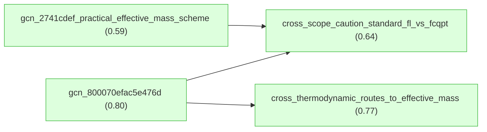
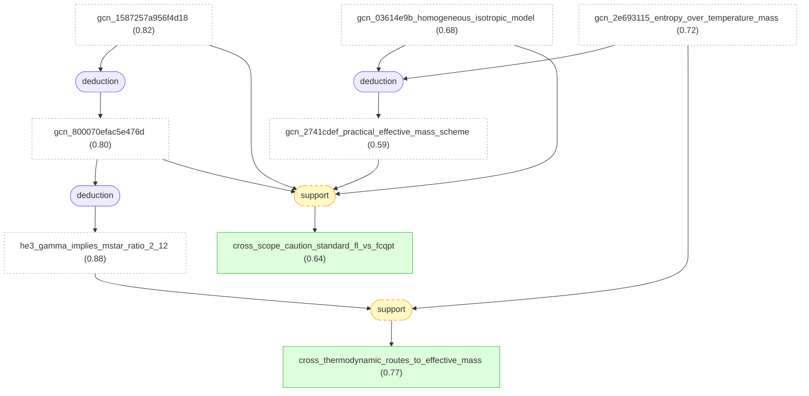

# fermi-liquid-effective-mass-gaia

Combined Gaia knowledge package for two LKM roots on Fermi-liquid effective-mass reasoning.

## Overview

## Introduction

#### gcn_800070efac5e476d ★

📌 `gcn_800070efac5e476d`   |   Belief: **0.80**

> For the normal-state liquid He-3 setting reported by Alvesalo et al. 1979, assuming the standard Landau Fermi-liquid relation between the low-temperature linear specific-heat coefficient gamma and the quasiparticle density of states, the measured gamma = 2.11 K^-1 implies m*/m approximately 2.12 and F1 approximately 3.36 [@Alvesalo1979].

🔗 **deduction**([gcn_2ee995fe1e674e2a](#gcn_2ee995fe1e674e2a), [gcn_1587257a956f4d18](#gcn_1587257a956f4d18))

Reasoning

1. Take as given the experimentally determined normal-state coefficient $\gamma=2.11\ \mathrm{K}^{-1}$ from the preceding result (the molar specific heat coefficient in the $T\to 0$ limiting normal Fermi-liquid behavior).
2. State the assumption invoked by the authors to map $\gamma$ to quasiparticle effective mass and Landau Fermi-liquid parameters: assume that the observed linear region corresponds to the $T\to 0$ limiting behavior of a Fermi liquid (i.e., that $\gamma$ reflects the quasiparticle density of states at the Fermi surface and scales with the effective mass $m^{*}$).
3. Record the authors' asserted mapping result without reproducing an explicit derivation (the authors give the numerical mapping result directly): using $\gamma=2.11\ \mathrm{K}^{-1}$ and the assumed Fermi-liquid mapping, the inferred quasiparticle effective-mass ratio is $m^{*}/m=2.12$, and the corresponding first Landau Fermi-liquid parameter is $F_{1}=3.36$; the authors present these numerical values as the outcome of the mapping from $\gamma$ to $m^{*}/m$ and $F_{1}$.
4. Note the paper's comparison to earlier work that motivates the significance of these numbers: the reported $\gamma$ is about $30\%$ smaller than values reported earlier by Mota et al. and Abel et al., and the authors remark that around $20\ \mathrm{mK}$ where the experiments overlap the values of $C/(nR T)$ differ by about $23\%$, supporting that these inferred Fermi-liquid parameters represent a substantial revision relative to prior results. [12] [13]

#### gcn_2741cdef_practical_effective_mass_scheme ★

📌 `gcn_2741cdef_practical_effective_mass_scheme`   |   Belief: **0.59**

> For YbRh2Si2 in the homogeneous isotropic heavy-electron liquid model of Shaginyan et al. 2010, a practical scheme for field- and temperature-dependent effective mass is to solve the Landau effective-mass integral equation for ε(p) and n(p,T,B), tune the Landau amplitude so ε(p) has an inflection point at p_F and realizes 1/M* = 0 at T = 0, compute entropy from the Fermi-Dirac occupation formula, and extract M*(T,B) = S(T,B)/T; this procedure yields the interpolating and scaling behavior used for the YbRh2Si2 comparison [@Shaginyan2010].

🔗 **deduction**([gcn_677c6c_landau_integral_relation](#gcn_677c6c_landau_integral_relation), [gcn_03614e9b_homogeneous_isotropic_model](#gcn_03614e9b_homogeneous_isotropic_model), [gcn_e0c364ff_inflection_fcqpt_condition](#gcn_e0c364ff_inflection_fcqpt_condition), [gcn_6bbfeb95_stable_landau_solutions](#gcn_6bbfeb95_stable_landau_solutions), [gcn_ecddfefa_fermion_entropy_formula](#gcn_ecddfefa_fermion_entropy_formula), [gcn_2e693115_entropy_over_temperature_mass](#gcn_2e693115_entropy_over_temperature_mass))

Reasoning

1. State the fundamental equation used to compute the temperature- and field-dependent quasiparticle effective mass $M^{*}(T,B)$: the Landau form relating the inverse effective mass to the bare mass $m$ and the quasiparticle distribution, written explicitly as
$$
\frac{1}{M^{*}(T)}=\frac{1}{m}+\int \frac{\mathbf{p}_{F}\cdot\mathbf{p}_1}{p_{F}^{3}}\;F(\mathbf{p}_{F},\mathbf{p}_1)\;\frac{\partial n(p_1,T)}{\partial p_1}\;\frac{d\mathbf{p}_1}{(2\pi)^3},
$$
where $M^{*}(T)$ is the quasiparticle effective mass as a function of temperature $T$, $m$ is the bare electron mass, $\mathbf{p}_F$ is the Fermi momentum vector, $p_F=|\mathbf{p}_F|$, $F(\mathbf{p}_F,\mathbf{p}_1)$ is the Landau interaction amplitude, and $n(p,T)$ is the quasiparticle occupation number. This equation is the starting point for the numerical solution described below.
2. Specify the model assumption for the calculations: use the homogeneous heavy-electron (fermion) liquid model (a spatially uniform system), thereby neglecting crystal-lattice anisotropy; this means the occupation numbers depend only on momentum magnitude $p$ and temperature $T$, $n(p,T)$, and spatial inhomogeneities and band-structure anisotropies are not included.
3. Choose a special form of the Landau interaction amplitude $F(\mathbf{p}_F,\mathbf{p}_1)$ whose coefficients are tuned so that the single-particle spectrum $\varepsilon(p)$ has an inflection point at the Fermi momentum $p_F$; concretely, impose that the first and second derivatives of $\varepsilon(p)$ with respect to $p$ vanish at $p=p_F$, i.e. $\left.\frac{d\varepsilon}{dp}\right|_{p=p_F}=0$ and $\left.\frac{d^2\varepsilon}{dp^2}\right|_{p=p_F}=0$, where $\varepsilon(p)$ is the single-particle spectrum and $p$ is momentum. The vanishing of the first derivative is equivalent to $1/M^{*}=0$ at the QCP, and the vanishing of two derivatives ensures the lowest nonzero term in the Taylor expansion of $\varepsilon(p)$ about $p_F$ is proportional to $(p-p_F)^3$. This choice enforces that the system is placed at the fermion-condensation quantum phase transition (FCQPT) critical condition for the calculation. [12][15]
[12]
4. Solve the Landau integral equation given in the first step numerically (the temperature-dependent Landau equation reproduced there) with the specially chosen Landau amplitude from the previous step. The numerical solution yields the single-particle spectrum $\varepsilon(p)$ and the temperature-dependent occupation numbers $n(p,T)$ consistent with the interaction amplitude and imposed inflection-point condition; these are obtained for given external parameters $T$ and magnetic field $B$ (with $B$ entering via Zeeman splitting and through the dependence of $n(p,T)$ and the amplitude on polarization, implemented as in the computational scheme described).
[15]
5. Compute the thermodynamic entropy $S(B,T)$ from the occupation numbers $n(p,T)$ using the combinatorial formula for the entropy of a system of fermionic quasiparticles,
$$
S=-2\int\Bigl[n(p)\ln n(p)+(1-n(p))\ln(1-n(p))\Bigr]\frac{d\mathbf{p}}{(2\pi)^3},
$$
where $S$ is the entropy at given magnetic field $B$ and temperature $T$, $n(p)=n(p,T)$ is the quasiparticle occupation number, and the factor $-2$ accounts for spin degeneracy. This formula gives $S(B,T)$ directly from the computed $n(p,T)$.
6. Extract the effective mass $M^{*}(T,B)$ from the computed entropy using the Landau relation connecting entropy and effective mass in a Fermi liquid, written explicitly as
$$
M^{*}(T,B)=\frac{S(T,B)}{T},
$$
where $S(T,B)$ is the entropy per mole (or per particle, depending on units) computed in the previous step and $T$ is temperature. This relation is applied to obtain $M^{*}(T,B)$ from the numerically computed $S(T,B)$ for each $(T,B)$ point.
7. Normalize the computed effective mass $M^{*}(T,B)$ by its maximum value $M_{M}^{*}$ occurring at the temperature $T=T_M$ for a given $B$, and introduce the normalized temperature $y=T/T_M$; the normalized effective mass is $M_N^{*}(y)=M^{*}(T,B)/M_{M}^{*}$. Use these normalized quantities to examine the interpolating/scaling properties of the computed $M^{*}(T,B)$ and to compare directly with experiment on a common dimensionless axis. The computed normalized entropy and normalized effective mass as functions of normalized variables show collapse onto single curves, corroborating the scaling picture (this computed normalized entropy behavior is presented graphically in the calculations shown).
Fig. 3
8. State the practical computational scheme in a concise sequence usable for reproducing theoretical curves and for comparison with experiments: (i) choose a Landau amplitude whose coefficients produce an inflection point in $\varepsilon(p)$ at $p_F$ (first two derivatives zero); (ii) numerically solve the temperature-dependent Landau equation reproduced above to obtain $\varepsilon(p)$ and $n(p,T)$; (iii) compute the entropy $S(B,T)$ from $n(p,T)$ using the combinatorial entropy formula reproduced above; (iv) obtain $M^{*}(T,B)$ by $M^{*}=S/T$ and construct normalized quantities $M_N^{*}=M^{*}/M_{M}^{*}$ and $y=T/T_M$ for scaling analysis. This scheme is implemented within the homogeneous heavy-electron liquid model (neglecting crystal-lattice anisotropy) and yields $M^{*}(T,B)$ exhibiting the interpolating and scaling properties used elsewhere in the paper.

#### cross_thermodynamic_routes_to_effective_mass ★

📌 `cross_thermodynamic_routes_to_effective_mass`   |   Belief: **0.77**

> Across the two selected LKM roots, low-energy thermodynamic quantities are used as operational routes to quasiparticle effective mass: Alvesalo et al. infer m*/m for liquid He-3 from the linear specific-heat coefficient gamma, while Shaginyan et al. extract M*(T,B) for YbRh2Si2 from S(T,B)/T within their heavy-electron Landau/FCQPT scheme.

🔗 **support**([he3_gamma_implies_mstar_ratio_2_12](#he3_gamma_implies_mstar_ratio_2_12), [gcn_2e693115_entropy_over_temperature_mass](#gcn_2e693115_entropy_over_temperature_mass))

Reasoning

The He-3 decomposition explicitly grounds gamma -> m*/m, and the YbRh2Si2 premise explicitly grounds S(T,B)/T -> M*(T,B). Together they support only the scoped meta-claim that both chains operationalize effective mass through thermodynamic low-energy quantities, not that the systems or equations are equivalent.

#### cross_scope_caution_standard_fl_vs_fcqpt ★

📌 `cross_scope_caution_standard_fl_vs_fcqpt`   |   Belief: **0.64**

> The He-3 and YbRh2Si2 effective-mass routes should not be treated as equivalent claims: the He-3 chain uses a standard low-temperature Landau Fermi-liquid mapping from gamma to m*/m, whereas the YbRh2Si2 chain uses a homogeneous isotropic heavy-electron model near FCQPT and applies S/T as an operational effective-mass measure through crossover or non-Fermi-liquid regimes.

🔗 **support**([gcn_800070efac5e476d](#gcn_800070efac5e476d), [gcn_2741cdef_practical_effective_mass_scheme](#gcn_2741cdef_practical_effective_mass_scheme), [gcn_1587257a956f4d18](#gcn_1587257a956f4d18), [gcn_03614e9b_homogeneous_isotropic_model](#gcn_03614e9b_homogeneous_isotropic_model))

Reasoning

The selected roots and mapping premises specify different systems and model scopes: standard low-temperature Landau Fermi-liquid reasoning for normal liquid He-3 versus a homogeneous isotropic heavy-electron FCQPT crossover model for YbRh2Si2. This warrants a scope-caution claim rather than equivalence or contradiction.

## paper_alvesalo1979 -- He-3 heat-capacity claims from Alvesalo et al. 1979.

#### gcn_2ee995fe1e674e2a

📌 `gcn_2ee995fe1e674e2a`   |   Prior: 0.78   |   Belief: **0.78**

> For the normal-state liquid He-3 setting reported by Alvesalo et al. 1979, the observed molar specific heat per mole is linear for T >= about 3 mK, C/(nR) = gamma T with gamma = 2.11 +/- 0.02 K^-1; this measured linear region is assumed to represent the T -> 0 Fermi-liquid specific-heat coefficient used to infer m*/m and F1 [@Alvesalo1979].

#### gcn_1587257a956f4d18

📌 `gcn_1587257a956f4d18`   |   Prior: 0.82   |   Belief: **0.82**

> For three-dimensional normal-liquid He-3 in the conventional Landau Fermi-liquid framework used by Alvesalo et al. 1979, applying the standard mapping from gamma = 2.11 K^-1 to quasiparticle effective-mass renormalization gives m*/m approximately 2.12, and using the usual relation between m*/m and the first Landau parameter gives F1 approximately 3.36 [@Alvesalo1979].

#### gcn_800070efac5e476d ★

📌 `gcn_800070efac5e476d`   |   Belief: **0.80**

> For the normal-state liquid He-3 setting reported by Alvesalo et al. 1979, assuming the standard Landau Fermi-liquid relation between the low-temperature linear specific-heat coefficient gamma and the quasiparticle density of states, the measured gamma = 2.11 K^-1 implies m*/m approximately 2.12 and F1 approximately 3.36 [@Alvesalo1979].

🔗 **deduction**([gcn_2ee995fe1e674e2a](#gcn_2ee995fe1e674e2a), [gcn_1587257a956f4d18](#gcn_1587257a956f4d18))

Reasoning

1. Take as given the experimentally determined normal-state coefficient $\gamma=2.11\ \mathrm{K}^{-1}$ from the preceding result (the molar specific heat coefficient in the $T\to 0$ limiting normal Fermi-liquid behavior).
2. State the assumption invoked by the authors to map $\gamma$ to quasiparticle effective mass and Landau Fermi-liquid parameters: assume that the observed linear region corresponds to the $T\to 0$ limiting behavior of a Fermi liquid (i.e., that $\gamma$ reflects the quasiparticle density of states at the Fermi surface and scales with the effective mass $m^{*}$).
3. Record the authors' asserted mapping result without reproducing an explicit derivation (the authors give the numerical mapping result directly): using $\gamma=2.11\ \mathrm{K}^{-1}$ and the assumed Fermi-liquid mapping, the inferred quasiparticle effective-mass ratio is $m^{*}/m=2.12$, and the corresponding first Landau Fermi-liquid parameter is $F_{1}=3.36$; the authors present these numerical values as the outcome of the mapping from $\gamma$ to $m^{*}/m$ and $F_{1}$.
4. Note the paper's comparison to earlier work that motivates the significance of these numbers: the reported $\gamma$ is about $30\%$ smaller than values reported earlier by Mota et al. and Abel et al., and the authors remark that around $20\ \mathrm{mK}$ where the experiments overlap the values of $C/(nR T)$ differ by about $23\%$, supporting that these inferred Fermi-liquid parameters represent a substantial revision relative to prior results. [12] [13]

#### he3_gamma_implies_mstar_ratio_2_12

📌 `he3_gamma_implies_mstar_ratio_2_12`   |   Belief: **0.88**

> For the normal-state liquid He-3 setting reported by Alvesalo et al. 1979, the measured gamma = 2.11 K^-1 implies a quasiparticle effective-mass ratio m*/m approximately 2.12 under the standard Landau Fermi-liquid mapping [@Alvesalo1979].

🔗 **deduction**([gcn_800070efac5e476d](#gcn_800070efac5e476d))

Reasoning

1. The LKM root explicitly contains the component assertion that gamma = 2.11 K^-1 implies m*/m approximately 2.12 for the Alvesalo et al. He-3 Fermi-liquid analysis.

#### he3_mstar_ratio_yields_f1_3_36

📌 `he3_mstar_ratio_yields_f1_3_36`   |   Belief: **0.88**

> For the normal-state liquid He-3 setting reported by Alvesalo et al. 1979, the inferred effective-mass ratio m*/m approximately 2.12 yields the first Landau Fermi-liquid parameter F1 approximately 3.36 under the usual relation between effective-mass renormalization and F1 [@Alvesalo1979].

🔗 **deduction**([gcn_800070efac5e476d](#gcn_800070efac5e476d))

Reasoning

1. The LKM root explicitly contains the component assertion that the inferred effective-mass ratio m*/m approximately 2.12 yields F1 approximately 3.36 under the usual Landau Fermi-liquid relation.

## paper_shaginyan2010 -- claims and deductions from Shaginyan et al. 2010.

#### gcn_677c6c_landau_integral_relation

📌 `gcn_677c6c_landau_integral_relation`   |   Prior: 0.82   |   Belief: **0.82**

> For a homogeneous three-dimensional interacting-fermion system near FCQPT, the temperature-dependent Landau integral relation defines the quasiparticle effective mass M*(T) from the bare mass, Fermi momentum, Landau interaction amplitude, quasiparticle occupation derivative, and a three-dimensional momentum integral; in Shaginyan et al. 2010 this phenomenological equation is used as the numerical starting point when a Landau amplitude exists, quasiparticles remain reasonably well defined, and n(p,T) correctly represents the distribution [@Shaginyan2010].

#### gcn_03614e9b_homogeneous_isotropic_model

📌 `gcn_03614e9b_homogeneous_isotropic_model`   |   Prior: 0.68   |   Belief: **0.68**

> Shaginyan et al. 2010 model YbRh2Si2 and related heavy-fermion compounds by a spatially uniform, isotropic three-dimensional heavy-electron liquid in which quasiparticle quantities depend only on |p| and T; the model deliberately neglects crystal-lattice anisotropy, Brillouin-zone structure, multiple bands, and anisotropic effective masses while treating the approximation as adequate for universal scaling of M*(T,B) and normalized thermodynamic or transport functions [@Shaginyan2010].

#### gcn_e0c364ff_inflection_fcqpt_condition

📌 `gcn_e0c364ff_inflection_fcqpt_condition`   |   Prior: 0.78   |   Belief: **0.78**

> In the homogeneous isotropic Landau model used by Shaginyan et al. 2010, the Landau interaction amplitude can be tuned so that the self-consistent single-particle spectrum ε(p) has both dε/dp and d²ε/dp² equal to zero at p = p_F, leaving a cubic leading term near p_F and enforcing the FCQPT critical condition 1/M* = 0 at T = 0 [@Shaginyan2010].

#### gcn_6bbfeb95_stable_landau_solutions

📌 `gcn_6bbfeb95_stable_landau_solutions`   |   Prior: 0.70   |   Belief: **0.70**

> For the temperature and magnetic-field ranges considered by Shaginyan et al. 2010 for YbRh2Si2, including fields up to about 1.5 T, the homogeneous isotropic Landau integral equation with an inflection-point-enforcing amplitude admits stable numerical solutions for ε(p) and n(p,T) that are robust enough to compute entropy with controlled numerical error [@Shaginyan2010].

#### gcn_ecddfefa_fermion_entropy_formula

📌 `gcn_ecddfefa_fermion_entropy_formula`   |   Prior: 0.90   |   Belief: **0.90**

> For fermionic quasiparticle excitations whose occupation numbers n(p,T) encode the low-energy statistical state, the entropy per unit volume is given by the Fermi-Dirac combinatorial expression S(T) = -2 ∫[n ln n + (1-n) ln(1-n)] dp/(2π)^3, with spin degeneracy 2 and a three-dimensional momentum integral [@Shaginyan2010].

#### gcn_2e693115_entropy_over_temperature_mass

📌 `gcn_2e693115_entropy_over_temperature_mass`   |   Prior: 0.72   |   Belief: **0.72**

> Shaginyan et al. 2010 operationally estimate the quasiparticle effective mass M*(T,B) from entropy by M*(T,B) = S(T,B)/T, using consistent units, as a density-of-states-like effective mass measure even in FCQPT crossover or non-Fermi-liquid regimes where the system is not strictly in the low-temperature Landau Fermi-liquid limit [@Shaginyan2010].

#### gcn_2741cdef_practical_effective_mass_scheme ★

📌 `gcn_2741cdef_practical_effective_mass_scheme`   |   Belief: **0.59**

> For YbRh2Si2 in the homogeneous isotropic heavy-electron liquid model of Shaginyan et al. 2010, a practical scheme for field- and temperature-dependent effective mass is to solve the Landau effective-mass integral equation for ε(p) and n(p,T,B), tune the Landau amplitude so ε(p) has an inflection point at p_F and realizes 1/M* = 0 at T = 0, compute entropy from the Fermi-Dirac occupation formula, and extract M*(T,B) = S(T,B)/T; this procedure yields the interpolating and scaling behavior used for the YbRh2Si2 comparison [@Shaginyan2010].

🔗 **deduction**([gcn_677c6c_landau_integral_relation](#gcn_677c6c_landau_integral_relation), [gcn_03614e9b_homogeneous_isotropic_model](#gcn_03614e9b_homogeneous_isotropic_model), [gcn_e0c364ff_inflection_fcqpt_condition](#gcn_e0c364ff_inflection_fcqpt_condition), [gcn_6bbfeb95_stable_landau_solutions](#gcn_6bbfeb95_stable_landau_solutions), [gcn_ecddfefa_fermion_entropy_formula](#gcn_ecddfefa_fermion_entropy_formula), [gcn_2e693115_entropy_over_temperature_mass](#gcn_2e693115_entropy_over_temperature_mass))

Reasoning

1. State the fundamental equation used to compute the temperature- and field-dependent quasiparticle effective mass $M^{*}(T,B)$: the Landau form relating the inverse effective mass to the bare mass $m$ and the quasiparticle distribution, written explicitly as
$$
\frac{1}{M^{*}(T)}=\frac{1}{m}+\int \frac{\mathbf{p}_{F}\cdot\mathbf{p}_1}{p_{F}^{3}}\;F(\mathbf{p}_{F},\mathbf{p}_1)\;\frac{\partial n(p_1,T)}{\partial p_1}\;\frac{d\mathbf{p}_1}{(2\pi)^3},
$$
where $M^{*}(T)$ is the quasiparticle effective mass as a function of temperature $T$, $m$ is the bare electron mass, $\mathbf{p}_F$ is the Fermi momentum vector, $p_F=|\mathbf{p}_F|$, $F(\mathbf{p}_F,\mathbf{p}_1)$ is the Landau interaction amplitude, and $n(p,T)$ is the quasiparticle occupation number. This equation is the starting point for the numerical solution described below.
2. Specify the model assumption for the calculations: use the homogeneous heavy-electron (fermion) liquid model (a spatially uniform system), thereby neglecting crystal-lattice anisotropy; this means the occupation numbers depend only on momentum magnitude $p$ and temperature $T$, $n(p,T)$, and spatial inhomogeneities and band-structure anisotropies are not included.
3. Choose a special form of the Landau interaction amplitude $F(\mathbf{p}_F,\mathbf{p}_1)$ whose coefficients are tuned so that the single-particle spectrum $\varepsilon(p)$ has an inflection point at the Fermi momentum $p_F$; concretely, impose that the first and second derivatives of $\varepsilon(p)$ with respect to $p$ vanish at $p=p_F$, i.e. $\left.\frac{d\varepsilon}{dp}\right|_{p=p_F}=0$ and $\left.\frac{d^2\varepsilon}{dp^2}\right|_{p=p_F}=0$, where $\varepsilon(p)$ is the single-particle spectrum and $p$ is momentum. The vanishing of the first derivative is equivalent to $1/M^{*}=0$ at the QCP, and the vanishing of two derivatives ensures the lowest nonzero term in the Taylor expansion of $\varepsilon(p)$ about $p_F$ is proportional to $(p-p_F)^3$. This choice enforces that the system is placed at the fermion-condensation quantum phase transition (FCQPT) critical condition for the calculation. [12][15]
[12]
4. Solve the Landau integral equation given in the first step numerically (the temperature-dependent Landau equation reproduced there) with the specially chosen Landau amplitude from the previous step. The numerical solution yields the single-particle spectrum $\varepsilon(p)$ and the temperature-dependent occupation numbers $n(p,T)$ consistent with the interaction amplitude and imposed inflection-point condition; these are obtained for given external parameters $T$ and magnetic field $B$ (with $B$ entering via Zeeman splitting and through the dependence of $n(p,T)$ and the amplitude on polarization, implemented as in the computational scheme described).
[15]
5. Compute the thermodynamic entropy $S(B,T)$ from the occupation numbers $n(p,T)$ using the combinatorial formula for the entropy of a system of fermionic quasiparticles,
$$
S=-2\int\Bigl[n(p)\ln n(p)+(1-n(p))\ln(1-n(p))\Bigr]\frac{d\mathbf{p}}{(2\pi)^3},
$$
where $S$ is the entropy at given magnetic field $B$ and temperature $T$, $n(p)=n(p,T)$ is the quasiparticle occupation number, and the factor $-2$ accounts for spin degeneracy. This formula gives $S(B,T)$ directly from the computed $n(p,T)$.
6. Extract the effective mass $M^{*}(T,B)$ from the computed entropy using the Landau relation connecting entropy and effective mass in a Fermi liquid, written explicitly as
$$
M^{*}(T,B)=\frac{S(T,B)}{T},
$$
where $S(T,B)$ is the entropy per mole (or per particle, depending on units) computed in the previous step and $T$ is temperature. This relation is applied to obtain $M^{*}(T,B)$ from the numerically computed $S(T,B)$ for each $(T,B)$ point.
7. Normalize the computed effective mass $M^{*}(T,B)$ by its maximum value $M_{M}^{*}$ occurring at the temperature $T=T_M$ for a given $B$, and introduce the normalized temperature $y=T/T_M$; the normalized effective mass is $M_N^{*}(y)=M^{*}(T,B)/M_{M}^{*}$. Use these normalized quantities to examine the interpolating/scaling properties of the computed $M^{*}(T,B)$ and to compare directly with experiment on a common dimensionless axis. The computed normalized entropy and normalized effective mass as functions of normalized variables show collapse onto single curves, corroborating the scaling picture (this computed normalized entropy behavior is presented graphically in the calculations shown).
Fig. 3
8. State the practical computational scheme in a concise sequence usable for reproducing theoretical curves and for comparison with experiments: (i) choose a Landau amplitude whose coefficients produce an inflection point in $\varepsilon(p)$ at $p_F$ (first two derivatives zero); (ii) numerically solve the temperature-dependent Landau equation reproduced above to obtain $\varepsilon(p)$ and $n(p,T)$; (iii) compute the entropy $S(B,T)$ from $n(p,T)$ using the combinatorial entropy formula reproduced above; (iv) obtain $M^{*}(T,B)$ by $M^{*}=S/T$ and construct normalized quantities $M_N^{*}=M^{*}/M_{M}^{*}$ and $y=T/T_M$ for scaling analysis. This scheme is implemented within the homogeneous heavy-electron liquid model (neglecting crystal-lattice anisotropy) and yields $M^{*}(T,B)$ exhibiting the interpolating and scaling properties used elsewhere in the paper.

## cross_paper -- cautious synthesis across the two selected LKM roots.

#### cross_thermodynamic_routes_to_effective_mass ★

📌 `cross_thermodynamic_routes_to_effective_mass`   |   Belief: **0.77**

> Across the two selected LKM roots, low-energy thermodynamic quantities are used as operational routes to quasiparticle effective mass: Alvesalo et al. infer m*/m for liquid He-3 from the linear specific-heat coefficient gamma, while Shaginyan et al. extract M*(T,B) for YbRh2Si2 from S(T,B)/T within their heavy-electron Landau/FCQPT scheme.

🔗 **support**([he3_gamma_implies_mstar_ratio_2_12](#he3_gamma_implies_mstar_ratio_2_12), [gcn_2e693115_entropy_over_temperature_mass](#gcn_2e693115_entropy_over_temperature_mass))

Reasoning

The He-3 decomposition explicitly grounds gamma -> m*/m, and the YbRh2Si2 premise explicitly grounds S(T,B)/T -> M*(T,B). Together they support only the scoped meta-claim that both chains operationalize effective mass through thermodynamic low-energy quantities, not that the systems or equations are equivalent.

#### cross_scope_caution_standard_fl_vs_fcqpt ★

📌 `cross_scope_caution_standard_fl_vs_fcqpt`   |   Belief: **0.64**

> The He-3 and YbRh2Si2 effective-mass routes should not be treated as equivalent claims: the He-3 chain uses a standard low-temperature Landau Fermi-liquid mapping from gamma to m*/m, whereas the YbRh2Si2 chain uses a homogeneous isotropic heavy-electron model near FCQPT and applies S/T as an operational effective-mass measure through crossover or non-Fermi-liquid regimes.

🔗 **support**([gcn_800070efac5e476d](#gcn_800070efac5e476d), [gcn_2741cdef_practical_effective_mass_scheme](#gcn_2741cdef_practical_effective_mass_scheme), [gcn_1587257a956f4d18](#gcn_1587257a956f4d18), [gcn_03614e9b_homogeneous_isotropic_model](#gcn_03614e9b_homogeneous_isotropic_model))

Reasoning

The selected roots and mapping premises specify different systems and model scopes: standard low-temperature Landau Fermi-liquid reasoning for normal liquid He-3 versus a homogeneous isotropic heavy-electron FCQPT crossover model for YbRh2Si2. This warrants a scope-caution claim rather than equivalence or contradiction.

## Inference Results

**BP converged:** True (2 iterations)

| Label | Type | Prior | Belief | Role |
|-------|------|-------|--------|------|
| [gcn_2741cdef_practical_effective_mass_scheme](#gcn_2741cdef_practical_effective_mass_scheme) | claim | — | 0.5938 | derived |
| [cross_scope_caution_standard_fl_vs_fcqpt](#cross_scope_caution_standard_fl_vs_fcqpt) | claim | — | 0.6359 | derived |
| [gcn_03614e9b_homogeneous_isotropic_model](#gcn_03614e9b_homogeneous_isotropic_model) | claim | 0.68 | 0.6800 | independent |
| [gcn_6bbfeb95_stable_landau_solutions](#gcn_6bbfeb95_stable_landau_solutions) | claim | 0.70 | 0.7000 | independent |
| [gcn_2e693115_entropy_over_temperature_mass](#gcn_2e693115_entropy_over_temperature_mass) | claim | 0.72 | 0.7200 | independent |
| [cross_thermodynamic_routes_to_effective_mass](#cross_thermodynamic_routes_to_effective_mass) | claim | — | 0.7657 | derived |
| [gcn_2ee995fe1e674e2a](#gcn_2ee995fe1e674e2a) | claim | 0.78 | 0.7800 | independent |
| [gcn_e0c364ff_inflection_fcqpt_condition](#gcn_e0c364ff_inflection_fcqpt_condition) | claim | 0.78 | 0.7800 | independent |
| [gcn_800070efac5e476d](#gcn_800070efac5e476d) | claim | — | 0.8031 | derived |
| [gcn_1587257a956f4d18](#gcn_1587257a956f4d18) | claim | 0.82 | 0.8200 | independent |
| [gcn_677c6c_landau_integral_relation](#gcn_677c6c_landau_integral_relation) | claim | 0.82 | 0.8200 | independent |
| [he3_mstar_ratio_yields_f1_3_36](#he3_mstar_ratio_yields_f1_3_36) | claim | — | 0.8807 | derived |
| [he3_gamma_implies_mstar_ratio_2_12](#he3_gamma_implies_mstar_ratio_2_12) | claim | — | 0.8807 | derived |
| [gcn_ecddfefa_fermion_entropy_formula](#gcn_ecddfefa_fermion_entropy_formula) | claim | 0.90 | 0.9000 | independent |
